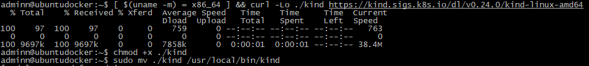
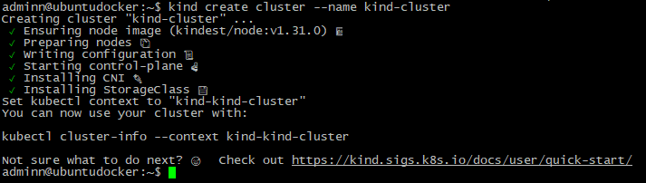
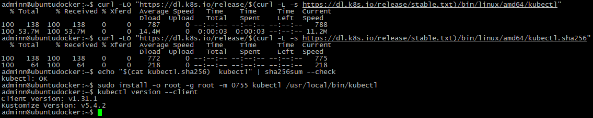
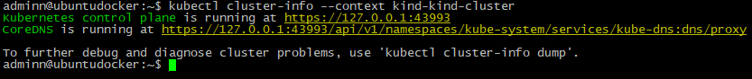
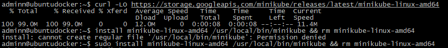
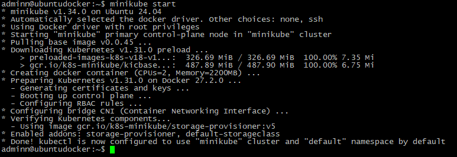
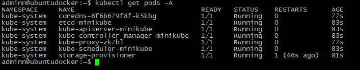
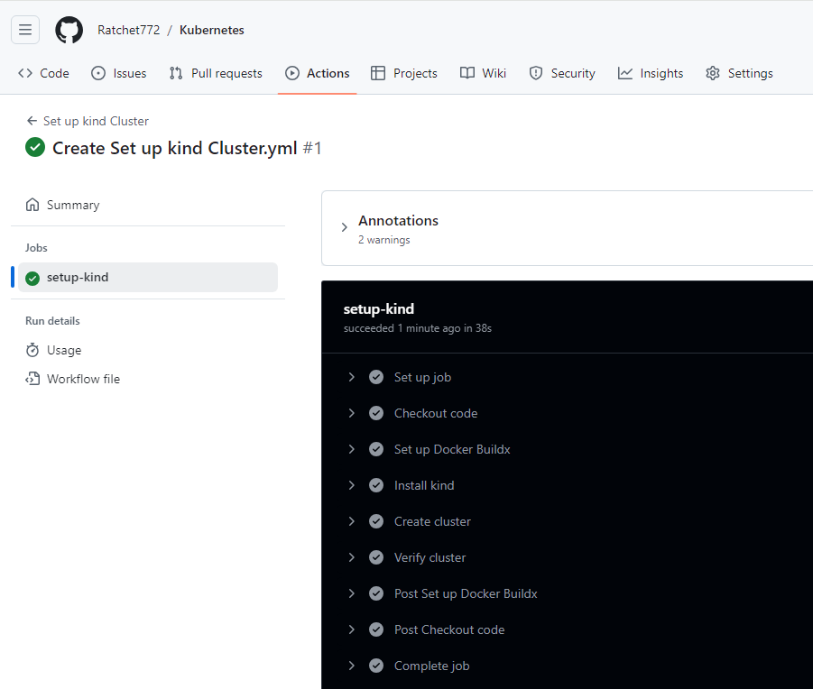
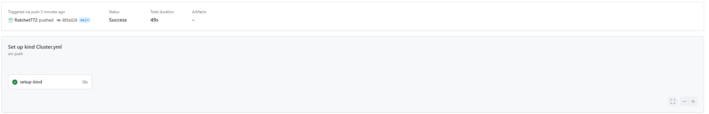
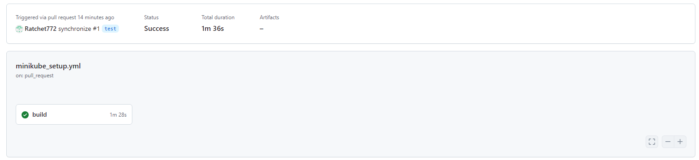

# Homework Assignment 1: KinD Kubernetes Cluster Setup

## 1. Install Docker and KinD on your local machine.

### Docker
```bash
adminn@ubuntudocker:~$ docker --version
Docker version 27.3.1, build ce12230
adminn@ubuntudocker:~$
```
### KinD


## 2. Create a KinD cluster with a single control plane node.


## 3. Verify that the cluster is up and running using kubectl.

### Kubectl install


### Cluster verification


# Homework Assignment 2: Minikube Kubernetes Cluster Setup

## 1. Install Minikube and a hypervisor (e.g., VirtualBox/Docker) on your local machine.


## 2. Start a Minikube cluster with a single node.


## 3. Confirm that the cluster is operational using kubectl.


# Homework Assignment 3: GitHub Actions for KinD Cluster Setup

## 1. Create a GitHub repository for your Kubernetes-related assignments.

Repo: https://github.com/Ratchet772/Kubernetes

## 2. Write a GitHub Actions workflow that sets up a KinD cluster.

## 3. Configure the workflow to run on every push to a specific branch.

```bash
name: Set up kind Cluster

on:
  push:
    branches:
      - main

jobs:
  setup-kind:
    runs-on: ubuntu-latest

    steps:
      - name: Checkout code
        uses: actions/checkout@v2

      - name: Set up Docker Buildx
        uses: docker/setup-buildx-action@v2

      - name: Install kind
        run: |
          curl -Lo ./kind https://kind.sigs.k8s.io/dl/v0.17.0/kind-linux-amd64
          chmod +x ./kind
          sudo mv ./kind /usr/local/bin/kind
      - name: Create cluster
        run: |
          kind create cluster --name ratchet772-cluster
      - name: Verify cluster
        run: |
          kubectl cluster-info --context kind-ratchet772-cluster
```

## 4. Use a Docker container or GitHub-hosted runner for the workflow execution.


# Homework Assignment 4: GitHub Actions for Minikube Cluster Setup

## 1. Enhance the existing GitHub repository with another Actions workflow.

## 2. This time, create a workflow that sets up a Minikube cluster.

## 3. Configure the workflow to run on pull requests to the repository.

```bash
name: Minikube Setup

on:
  pull_request:
    branches:
      - main

jobs:
  build:
    runs-on: ubuntu-latest

    steps:
      - name: Checkout code
        uses: actions/checkout@v2
        
      - name: Start minikube
        uses: medyagh/setup-minikube@latest
        
      - name: Ensure kubectl is working
        run: |
          kubectl version --client
          kubectl get pods -A
          kubectl cluster-info --context minikube
```

## 4. Utilize appropriate GitHub Actions features to customize the workflow execution environment.


## Please check in the last two assignments:

### how many nodes they have
One for each workflow

### which latest version of Kubernetes they are using
Kind: 1.25.3
Minikube: 1.34.0
### how long they spin up (you can provide just timing)

