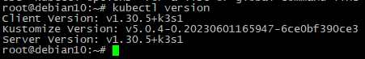
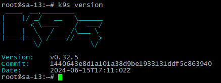
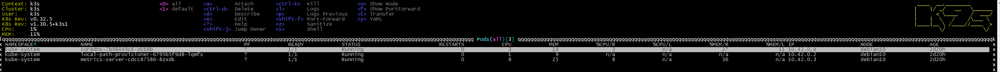
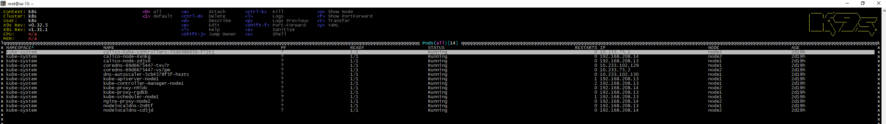
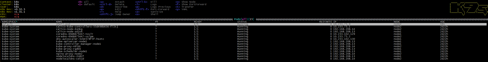
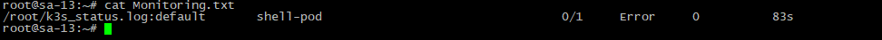
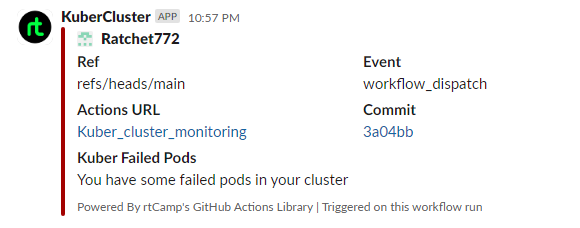

### Homework Assignment 1. K8s Installation

## Localhost:

### Install kubectl for local run



### Install k9s to maintain cluster



### Make print-screen of k9s with pods in all namespaces

#### k3s:


#### k8s


## Kubernetes host

### Finish workshop deployment if it is not done yet
```bash
Done
```
### Deploy shell pod in default namespace which you can you use for internal checks inside the cluster
```bash
root@sa-13:~# cat pod.yaml
apiVersion: v1
kind: Pod
metadata:
  name: shell-pod
  namespace: default
spec:
  containers:
  - name: shell
    image: busybox
    command: ['sh', '-c', 'sleep 3600']
  restartPolicy: Never
root@sa-13:~#
```



### Monitoring of cluster:
### Create GitHub action to check status of pods and create slack notification if you have crashed/failed pods

#### Couldn't simulate "Failure" so simulated "error" with custom shell pod.


```bash
name: Kuber_cluster_monitoring

on:
  schedule:
    - cron: '*/60 * * * *'
  workflow_dispatch:

jobs:
  build:
    name: build
    runs-on: ubuntu-latest

    steps:
      - uses: actions/checkout@v2
      - name: Check for failed pods
        uses: appleboy/ssh-action@v1.1.0
        with:
          proxy_host: ${{ secrets.JUMPHOST_IP }}
          proxy_port: ${{ secrets.JUMPHOST_PORT }}
          proxy_username: ${{ secrets.JUMPHOST_USER }}
          proxy_password: ${{ secrets.JUMPHOST_PASS }}
          host: ${{ secrets.K9S_SERVER_IP }}
          username: ${{ secrets.K9S_SERVER_USER }}
          password: ${{ secrets.K9S_SERVER_PASS }}
          script: |
            kubectl config use-context k8s --kubeconfig ~/.kube/config-k8s
            kubectl --kubeconfig ~/.kube/config-k8s get pods -A > k8s_status.log
            kubectl config use-context k3s --kubeconfig ~/.kube/config-k3s
            kubectl --kubeconfig ~/.kube/config-k3s get pods -A > k3s_status.log
            grep -E "Error" ~/k3s_status.log ~/k8s_status.log > Monitoring.txt

      - name: Monitoring result download
        uses: nicklasfrahm/scp-action@main
        with:
          direction: download
          host: ${{ secrets.K9S_SERVER_IP }}
          username: ${{ secrets.K9S_SERVER_USER }}
          key: ${{ secrets.SSH_KEY }}
          insecure_ignore_fingerprint: true
          proxy_host: ${{ secrets.JUMPHOST_IP }}
          proxy_fingerprint: true
          proxy_username: ${{ secrets.JUMPHOST_USER }}
          proxy_key: ${{ secrets.SSH_KEY }}
          proxy_port: ${{ secrets.JUMPHOST_PORT }}
          insecure_proxy_ignore_fingerprint: true
          source: "/root/Monitoring.txt"
          target: "./Monitoring.txt"    

      - id: check_results
        run: |
          cat ./Monitoring.txt
          if grep -q Error ./Monitoring.txt; then
              echo "failed=true" >> $GITHUB_OUTPUT
          else
              echo "failed=false" >> $GITHUB_OUTPUT
          fi
          
      - name: Slack Notification on Failure
        if: steps.check_results.outputs.failed == 'true'
        uses: rtCamp/action-slack-notify@v2   
        env:
          SLACK_COLOR: failure
          SLACK_MESSAGE: "You have some failed pods in your cluster"
          SLACK_TITLE: Kuber Failed Pods
          SLACK_USERNAME: KuberCluster
          SLACK_WEBHOOK: ${{ secrets.HOOK }}
```


