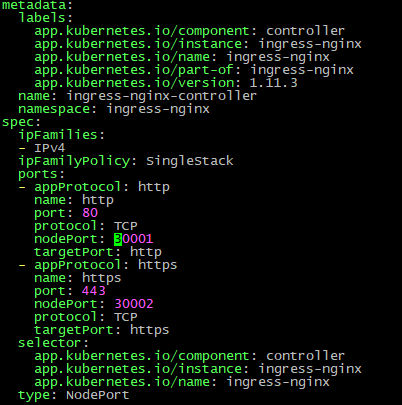
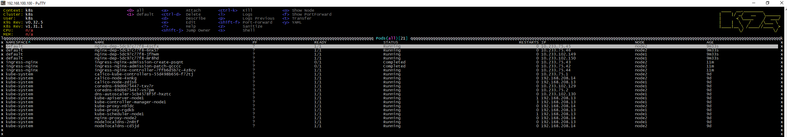
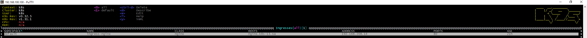
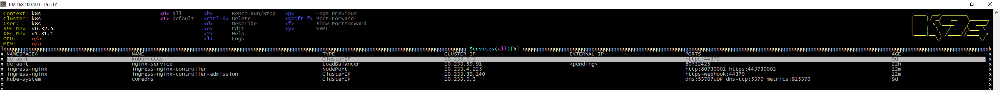
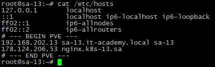
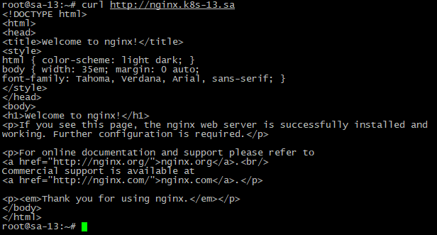

# Homework Assignment 1. Nginx deployment

## Create deployment of nginx service:

* replicas: 4
* set resources for pods
* deployment shouldn't have any outage (service is available all time)
* ingress rule for host name (nginx-test.k8s-<NUMBER>.sa)

#### Ingress-controller
```bash
wget https://raw.githubusercontent.com/kubernetes/ingress-nginx/refs/tags/controller-v1.11.3/deploy/static/provider/baremetal/deploy.yaml -O ingress-controller.yaml
```

```bash
kubectl apply -f ingress-controller.yaml
```
#### nginx_dep.yaml
```bash
apiVersion: apps/v1
kind: Deployment
metadata:
  name: nginx-dep
  labels:
    app: nginx
spec:
  replicas: 4
  strategy:
    type: RollingUpdate
    rollingUpdate:
      maxSurge: 2
      maxUnavailable: 2
  selector:
    matchLabels:
      app: nginx
  template:
    metadata:
      labels:
        app: nginx
    spec:
      containers:
      - name: nginx
        image: nginx:latest
        ports:
        - containerPort: 80
        resources:
          requests:
            cpu: 64m
            memory: 200Mi
          limits:
            cpu: 128m
            memory: 400Mi
---
apiVersion: v1
kind: Service
metadata:
  name: nginx-service
  labels:
    run: nginx-service
spec:
  type: LoadBalancer
  ports:
  - protocol: TCP
    port: 80
  selector:
    app: nginx
---
apiVersion: networking.k8s.io/v1
kind: Ingress
metadata:
  name: ingress-nginx
  annotations:
    nginx.ingress.kubernetes.io/server-alias: "nginx.k8s-13.sa"
spec:
  ingressClassName: nginx
  rules:
    - host: nginx.k8s-13.sa
      http:
        paths:
          - path: /
            pathType: Prefix
            backend:
              service:
                name: nginx-service
                port:
                  number: 80
```
```bash
kubectl apply -f nginx_dep.yaml
```

#### Pods


#### Ingresses


#### Services


#### Hosts config


#### Curl result
