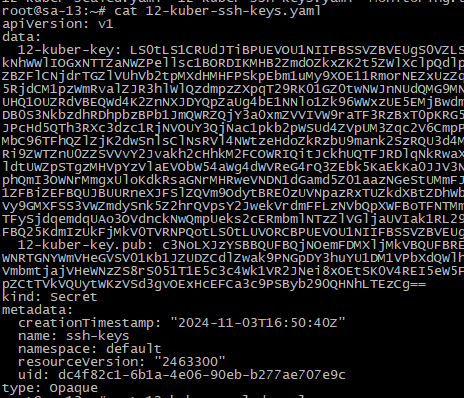
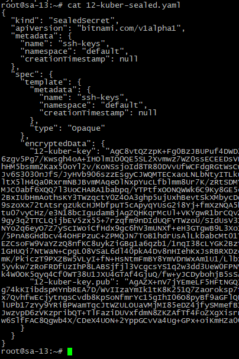
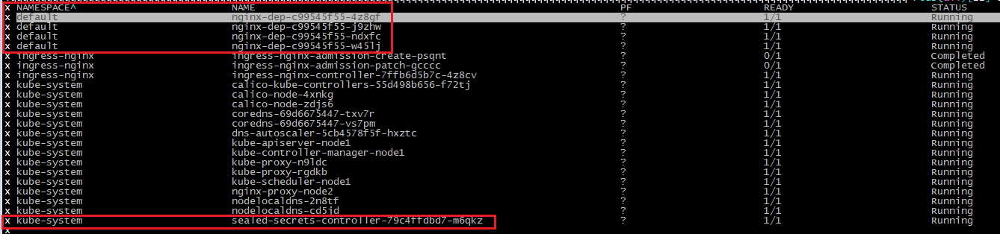
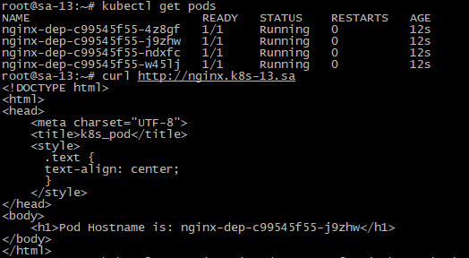
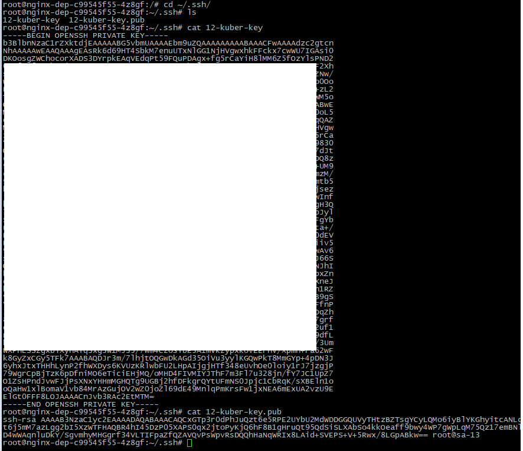

# Homework Assignment 1. Config maps and secrets

## Add index.php page as config map, which should display hostname of pod as first level header, or generate index.html inside init container

## Generate pair public and private keys (or use existing) and add them to the pod for user root as secrets, please use sealsecret object for that

### nginx_dep.yaml

```bash
apiVersion: v1
kind: ConfigMap
metadata:
  name: index-html
data:
  index.html: |
    <!DOCTYPE html>
    <html>
    <head>
        <meta charset="UTF-8">
        <title>k8s_pod</title>
        <style>
          .text {
          text-align: center;
          }
        </style>
    </head>
    <body>
        <h1>Pod Hostname is: pod_hostname</h1>
    </body>
    </html>
---
apiVersion: apps/v1
kind: Deployment
metadata:
  name: nginx-dep
  labels:
    app: nginx
spec:
  replicas: 4
  strategy:
    type: RollingUpdate
    rollingUpdate:
      maxSurge: 2
      maxUnavailable: 2
  selector:
    matchLabels:
      app: nginx
  template:
    metadata:
      labels:
        app: nginx
    spec:
      containers:
      - name: nginx
        image: nginx:latest
        ports:
        - containerPort: 80
        resources:
          requests:
            cpu: 100m
            memory: 200Mi
          limits:
            cpu: 200m
            memory: 400Mi
        volumeMounts:
        - name: nginx-volume
          mountPath: /usr/share/nginx/html
        - name: ssh-keys-volume
          mountPath: /root/.ssh
      initContainers:
      - name: set-hostname
        image: nginx:latest
        command: ["sh", "-c", 'cd /tmp/; sed -e "s/pod_hostname/$HOSTNAME/" /tmp/index.html > /usr/share/nginx/html/index.html']
        env:
        - name: create-html
          valueFrom:
            configMapKeyRef:
              name: index-html
              key: index.html
        volumeMounts:
        - name: config-volume
          mountPath: /tmp
        - name: nginx-volume
          mountPath: /usr/share/nginx/html
        - name: ssh-keys-volume
          mountPath: /root/.ssh
      volumes:
      - name: config-volume
        configMap:
          name: index-html
      - name: nginx-volume
        emptyDir: 
      - name: ssh-keys-volume
        secret:
          secretName: ssh-keys		  
---
apiVersion: v1
kind: Service
metadata:
  name: nginx-service
  labels:
    run: nginx-service
spec:
  type: LoadBalancer
  ports:
  - protocol: TCP
    port: 80
  selector:
    app: nginx
---
apiVersion: networking.k8s.io/v1
kind: Ingress
metadata:
  name: ingress-nginx
  annotations:
    nginx.ingress.kubernetes.io/server-alias: "nginx.k8s-13.sa"
spec:
  ingressClassName: nginx
  rules:
    - host: nginx.k8s-13.sa
      http:
        paths:
          - path: /
            pathType: Prefix
            backend:
              service:
                name: nginx-service
                port:
                  number: 80
```

#### 12-kuber-ssh-keys.yaml


#### 12-kuber-sealed.yaml


## Validate secrets and index.html display

#### Pods and seal secret controller


#### Curl


#### Keys
