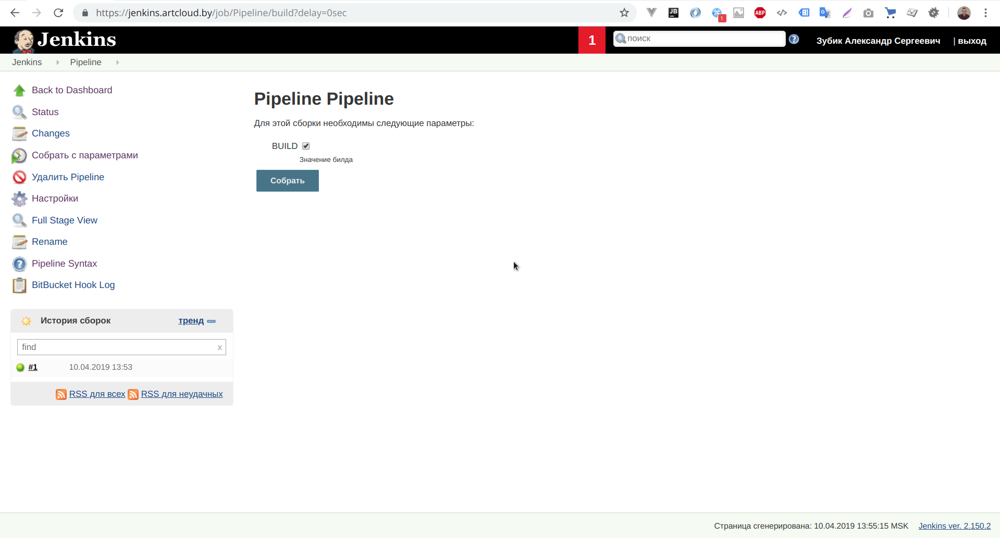
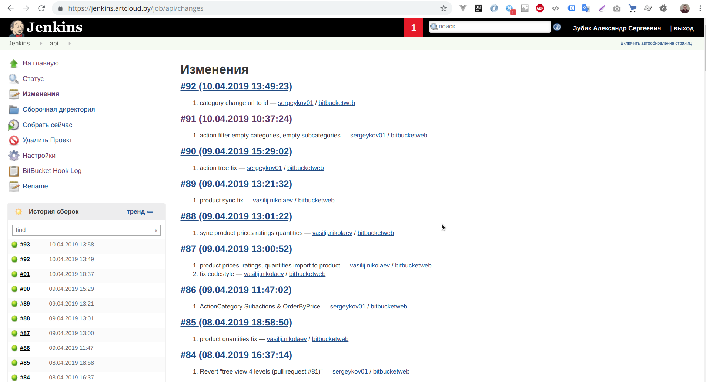
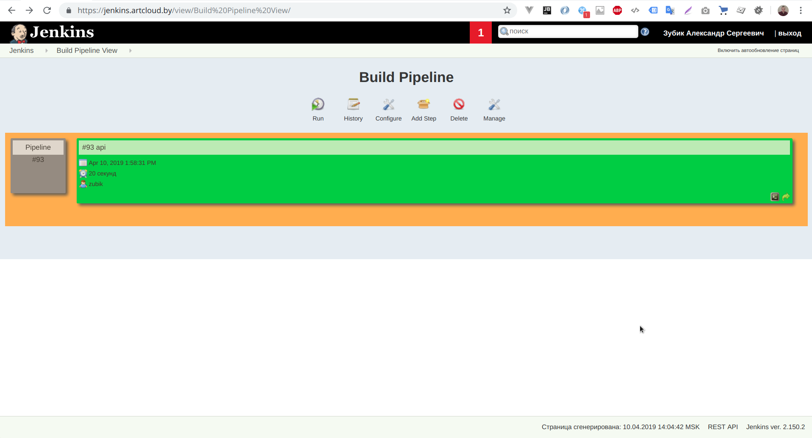

## Implement the Pipeline
    Parameters: BUILD [true/false]

    
    Changes job

    Pipeline view

## Console output mkp
    Started by BitBucket push by Mikkou
    Started by BitBucket push by Mikkou
    Started by BitBucket push by Mikkou
    Started by BitBucket push by Mikkou
    Building remotely on mkp.5element.by in workspace /home/patio/workspace/mkp
    using credential 181d563a-ce54-4c11-a7cf-92e766604e4a
     > git rev-parse --is-inside-work-tree # timeout=10
    Fetching changes from the remote Git repository
     > git config remote.origin.url https://bitbucket.org/artcloud/mkp.git # timeout=10
    Fetching upstream changes from https://bitbucket.org/artcloud/mkp.git
     > git --version # timeout=10
    using GIT_ASKPASS to set credentials zubik@bitbucket.org
     > git fetch --tags --progress https://bitbucket.org/artcloud/mkp.git +refs/heads/*:refs/remotes/origin/* # timeout=10
     > git rev-parse refs/remotes/origin/master^{commit} # timeout=10
     > git rev-parse refs/remotes/origin/origin/master^{commit} # timeout=10
    Checking out Revision 21b661348e9826fc9723f65ad0891fc4cef4f0f3 (refs/remotes/origin/master)
     > git config core.sparsecheckout # timeout=10
     > git checkout -f 21b661348e9826fc9723f65ad0891fc4cef4f0f3 # timeout=10
    Commit message: "Merged in EL-121_Make_interfaces_for_classes (pull request #173)"
     > git rev-list --no-walk bfea8fc5858847388a8362ae60304f573ad6a623 # timeout=10
    [mkp] $ /bin/sh -xe /tmp/jenkins8103319833087354421.sh
    + cd /var/www/5element
    + git pull origin master
    From bitbucket.org:artcloud/mkp
     * branch            master     -> FETCH_HEAD
    Updating bfea8fc..21b6613
    Fast-forward
     modules/Base.ts                                    |  6 +++--
     modules/ItemsKeeper/IClass.ts                      |  8 ++++++
     modules/WordProcessor/IClass.ts                    |  6 +++++
     .../{WordProcessor.ts => WordProcessor/index.ts}   |  0
     .../classes/Storage/classes/Items/IItemsClass.ts   | 30 ++++++++++++++++++++++
     .../Storage/classes/{Items.ts => Items/index.ts}   |  4 +--
     modules/api/Cart/classes/Storage/index.ts          |  6 +++--
     7 files changed, 54 insertions(+), 6 deletions(-)
     create mode 100644 modules/ItemsKeeper/IClass.ts
     create mode 100644 modules/WordProcessor/IClass.ts
     rename modules/{WordProcessor.ts => WordProcessor/index.ts} (100%)
     create mode 100644 modules/api/Cart/classes/Storage/classes/Items/IItemsClass.ts
     rename modules/api/Cart/classes/Storage/classes/{Items.ts => Items/index.ts} (99%)
    + npm ci
    npm WARN prepare removing existing node_modules/ before installation
    
    > swiper@4.5.0 postinstall /var/www/5element/node_modules/swiper
    > node -e "console.log('\u001b[35m\u001b[1mLove Swiper? Support Vladimir\'s work by donating or pledging on patreon:\u001b[22m\u001b[39m\n > \u001b[32mhttps://patreon.com/vladimirkharlampidi\u001b[0m\n')"
    
    Love Swiper? Support Vladimir's work by donating or pledging on patreon:
     > https://patreon.com/vladimirkharlampidi
    
    
    > fsevents@1.2.7 install /var/www/5element/node_modules/fsevents
    > node install
    
    
    > node-sass@4.11.0 install /var/www/5element/node_modules/node-sass
    > node scripts/install.js
    
    Cached binary found at /home/patio/.npm/node-sass/4.11.0/linux-x64-64_binding.node
    
    > node-sass@4.11.0 postinstall /var/www/5element/node_modules/node-sass
    > node scripts/build.js
    
    Binary found at /var/www/5element/node_modules/node-sass/vendor/linux-x64-64/binding.node
    Testing binary
    Binary is fine
    added 1664 packages in 10.835s
    + npm run build
    
    > 5element@1.0.0 build /var/www/5element
    > nuxt-ts build
    
    [10:39:47] [ERROR]
    + pm2 delete 5element
    [PM2] Applying action deleteProcessId on app [5element](ids: 0)
    [PM2] [5element](0) ✓
    ┌──────────┬────┬─────────┬──────┬─────┬────────┬─────────┬────────┬─────┬─────┬──────┬──────────┐
    │ App name │ id │ version │ mode │ pid │ status │ restart │ uptime │ cpu │ mem │ user │ watching │
    └──────────┴────┴─────────┴──────┴─────┴────────┴─────────┴────────┴─────┴─────┴──────┴──────────┘
     Use `pm2 show <id|name>` to get more details about an app
    + pm2 start npm --name 5element -- start
    [PM2] Starting /usr/local/bin/npm in fork_mode (1 instance)
    [PM2] Done.
    ┌──────────┬────┬─────────┬──────┬───────┬────────┬─────────┬────────┬─────┬──────────┬───────┬──────────┐
    │ App name │ id │ version │ mode │ pid   │ status │ restart │ uptime │ cpu │ mem      │ user  │ watching │
    ├──────────┼────┼─────────┼──────┼───────┼────────┼─────────┼────────┼─────┼──────────┼───────┼──────────┤
    │ 5element │ 0  │ N/A     │ fork │ 85096 │ online │ 0       │ 0s     │ 0%  │ 6.0 MB   │ patio │ disabled │
    └──────────┴────┴─────────┴──────┴───────┴────────┴─────────┴────────┴─────┴──────────┴───────┴──────────┘
     Use `pm2 show <id|name>` to get more details about an app
    + ./changelog.sh
    Jenkins build https://jenkins.artcloud.by/job/mkp/changes
    Finished: SUCCESS
    
## Console output api
    Started by user Зубик Александр Сергеевич
    Building remotely on api.5element.by in workspace /home/patio/workspace/api
    using credential 181d563a-ce54-4c11-a7cf-92e766604e4a
     > git rev-parse --is-inside-work-tree # timeout=10
    Fetching changes from the remote Git repository
     > git config remote.origin.url https://bitbucket.org/artcloud/5element.git # timeout=10
    Fetching upstream changes from https://bitbucket.org/artcloud/5element.git
     > git --version # timeout=10
    using GIT_ASKPASS to set credentials zubik@bitbucket.org
     > git fetch --tags --progress https://bitbucket.org/artcloud/5element.git +refs/heads/*:refs/remotes/origin/* # timeout=10
     > git rev-parse refs/remotes/origin/master^{commit} # timeout=10
     > git rev-parse refs/remotes/origin/origin/master^{commit} # timeout=10
    Checking out Revision b392fad3e95952c2cfe3e564a96e8200106222e1 (refs/remotes/origin/master)
     > git config core.sparsecheckout # timeout=10
     > git checkout -f b392fad3e95952c2cfe3e564a96e8200106222e1 # timeout=10
    Commit message: "category change url to id"
     > git rev-list --no-walk b392fad3e95952c2cfe3e564a96e8200106222e1 # timeout=10
    [api] $ /bin/bash /tmp/jenkins4191867059362039619.sh
    Already up-to-date.
    Loading composer repositories with package information
    Installing dependencies (including require-dev) from lock file
    Warning: The lock file is not up to date with the latest changes in composer.json. You may be getting outdated dependencies. Run update to update them.
    Nothing to install or update
    Generating optimized autoload files
    > Illuminate\Foundation\ComposerScripts::postAutoloadDump
    > @php artisan package:discover
    Discovered Package: barryvdh/laravel-debugbar
    Discovered Package: barryvdh/laravel-ide-helper
    Discovered Package: designmynight/laravel-mongodb-passport
    Discovered Package: fideloper/proxy
    Discovered Package: intervention/image
    Discovered Package: jenssegers/mongodb
    Discovered Package: laravel/horizon
    Discovered Package: laravel/passport
    Discovered Package: laravel/tinker
    Discovered Package: nunomaduro/collision
    Discovered Package: nwidart/laravel-modules
    Discovered Package: unisharp/laravel-filemanager
    Discovered Package: yajra/laravel-datatables-oracle
    Package manifest generated successfully.
    Sending TERM Signal To Process: 32734
    Jenkins build https://jenkins.artcloud.by/job/api/changes
    Triggering a new build of Pipeline #2
    Finished: SUCCESS