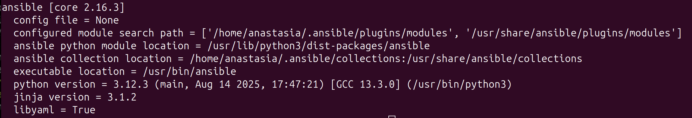
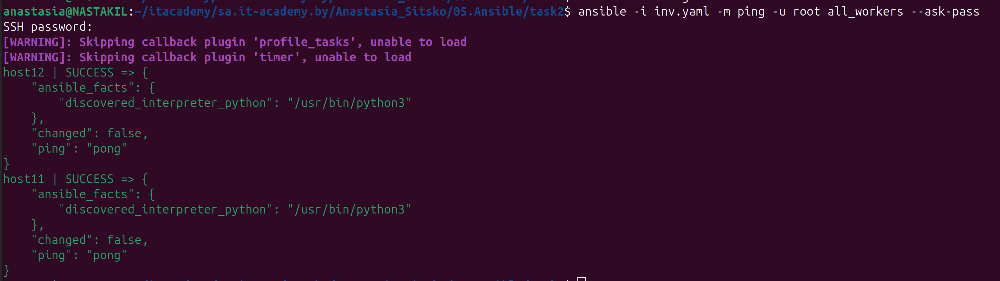
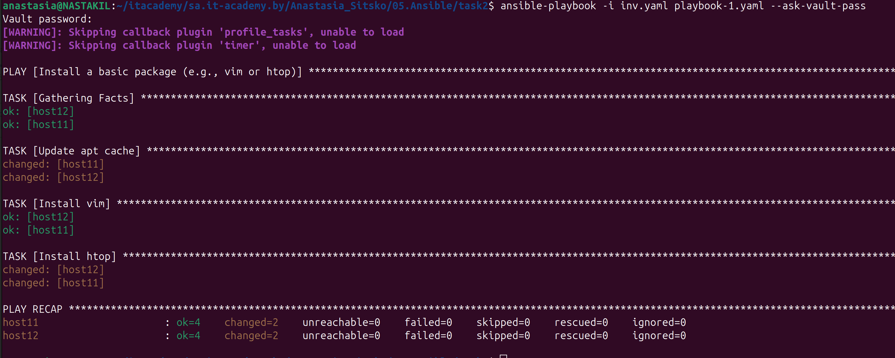
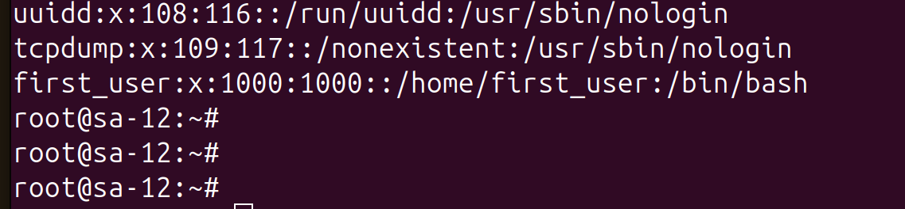
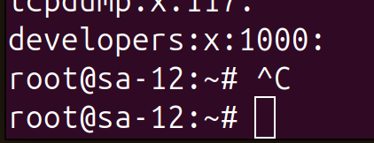

# Homework Assignment 1: Setting Up Ansible

```
 sudo apt update && sudo apt upgrade -y
```

```
sudo apt install python3-pip
```

```
 sudo pip3 install ansible
 ```

 ```
 ansible --version
 ```



```
ansible -i inv.yaml -m ping -u root all_workers --ask-pass
```

 

 ```
 ansible-playbook hello-ansible.yaml
 ```

 


# Homework Assignment 2: Managing Remote Hosts

```
sudo apt install sshpass
```

```
ansible-playbook -i inv.yaml playbook-1.yaml --ask-vault-pass
```



# Homework Assignment 3: Managing Users and Groups

```
ansible-playbook -i inv.yaml playbook-2.yaml --ask-vault-pass
```

```
cat /etc/passwd
```



```
cat /etc/group
```

