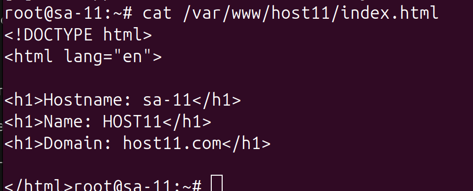
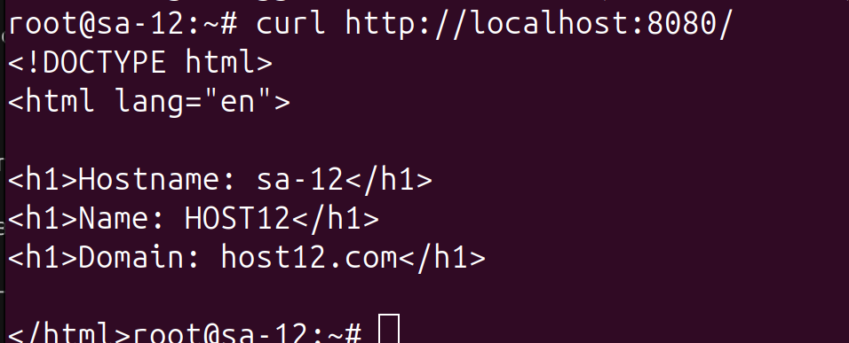

`
ansible-playbook -i inv.yaml playbook.yaml -u root --ask-pass
`

```
SSH password: 

PLAY [Install and configure nginx] ************************************************************************************

TASK [Gathering Facts] ************************************************************************************************
Thursday 20 November 2025  18:05:29 +0300 (0:00:00.007)       0:00:00.007 ***** 
ok: [host11]
ok: [host12]

TASK [Select site for this host] **************************************************************************************
Thursday 20 November 2025  18:05:45 +0300 (0:00:15.984)       0:00:15.992 ***** 
ok: [host11]
ok: [host12]

TASK [Ensure nginx is installed] **************************************************************************************
Thursday 20 November 2025  18:05:45 +0300 (0:00:00.048)       0:00:16.041 ***** 
ok: [host12]
ok: [host11]

TASK [Create root directories for each site] **************************************************************************
Thursday 20 November 2025  18:05:58 +0300 (0:00:13.151)       0:00:29.193 ***** 
ok: [host11]
ok: [host12]

TASK [Create index.html with unique content per host] *****************************************************************
Thursday 20 November 2025  18:06:10 +0300 (0:00:11.830)       0:00:41.023 ***** 
ok: [host12]
ok: [host11]

TASK [Remove default nginx site if exists] ****************************************************************************
Thursday 20 November 2025  18:06:26 +0300 (0:00:16.194)       0:00:57.218 ***** 
ok: [host11]
ok: [host12]

TASK [Deploy nginx config for each virtual host] **********************************************************************
Thursday 20 November 2025  18:06:37 +0300 (0:00:11.015)       0:01:08.234 ***** 
changed: [host12]
changed: [host11]

TASK [Enable virtual hosts by creating symlinks] **********************************************************************
Thursday 20 November 2025  18:06:58 +0300 (0:00:20.658)       0:01:28.892 ***** 
changed: [host12]
changed: [host11]

TASK [Show last 20 lines of nginx journal] ****************************************************************************
Thursday 20 November 2025  18:07:09 +0300 (0:00:11.245)       0:01:40.137 ***** 
changed: [host12]
changed: [host11]

TASK [Print nginx journal] ********************************************************************************************
Thursday 20 November 2025  18:07:20 +0300 (0:00:11.053)       0:01:51.191 ***** 
ok: [host11] => {
    "nginx_journal.stdout_lines": [
        "Nov 20 14:14:13 sa-11 systemd[1]: Starting A high performance web server and a reverse proxy server...",
        "░░ Subject: A start job for unit nginx.service has begun execution",
        "░░ Defined-By: systemd",
        "░░ Support: http://www.ubuntu.com/support",
        "░░ ",
        "░░ A start job for unit nginx.service has begun execution.",
        "░░ ",
        "░░ The job identifier is 35415.",
        "Nov 20 14:14:13 sa-11 systemd[1]: Started A high performance web server and a reverse proxy server.",
        "░░ Subject: A start job for unit nginx.service has finished successfully",
        "░░ Defined-By: systemd",
        "░░ Support: http://www.ubuntu.com/support",
        "░░ ",
        "░░ A start job for unit nginx.service has finished successfully.",
        "░░ ",
        "░░ The job identifier is 35415.",
        "Nov 20 14:15:42 sa-11 systemd[1]: Stopping A high performance web server and a reverse proxy server...",
        "░░ Subject: A stop job for unit nginx.service has begun execution",
        "░░ Defined-By: systemd",
        "░░ Support: http://www.ubuntu.com/support",
        "░░ ",
        "░░ A stop job for unit nginx.service has begun execution.",
        "░░ ",
        "░░ The job identifier is 45187.",
        "Nov 20 14:15:42 sa-11 systemd[1]: nginx.service: Deactivated successfully.",
        "░░ Subject: Unit succeeded",
        "░░ Defined-By: systemd",
        "░░ Support: http://www.ubuntu.com/support",
        "░░ ",
        "░░ The unit nginx.service has successfully entered the 'dead' state.",
        "Nov 20 14:15:42 sa-11 systemd[1]: Stopped A high performance web server and a reverse proxy server.",
        "░░ Subject: A stop job for unit nginx.service has finished",
        "░░ Defined-By: systemd",
        "░░ Support: http://www.ubuntu.com/support",
        "░░ ",
        "░░ A stop job for unit nginx.service has finished.",
        "░░ ",
        "░░ The job identifier is 45187 and the job result is done.",
        "Nov 20 14:15:42 sa-11 systemd[1]: Starting A high performance web server and a reverse proxy server...",
        "░░ Subject: A start job for unit nginx.service has begun execution",
        "░░ Defined-By: systemd",
        "░░ Support: http://www.ubuntu.com/support",
        "░░ ",
        "░░ A start job for unit nginx.service has begun execution.",
        "░░ ",
        "░░ The job identifier is 45187.",
        "Nov 20 14:15:42 sa-11 systemd[1]: Started A high performance web server and a reverse proxy server.",
        "░░ Subject: A start job for unit nginx.service has finished successfully",
        "░░ Defined-By: systemd",
        "░░ Support: http://www.ubuntu.com/support",
        "░░ ",
        "░░ A start job for unit nginx.service has finished successfully.",
        "░░ ",
        "░░ The job identifier is 45187."
    ]
}
ok: [host12] => {
    "nginx_journal.stdout_lines": [
        "Nov 20 14:14:16 sa-12 systemd[1]: Starting A high performance web server and a reverse proxy server...",
        "░░ Subject: A start job for unit nginx.service has begun execution",
        "░░ Defined-By: systemd",
        "░░ Support: http://www.ubuntu.com/support",
        "░░ ",
        "░░ A start job for unit nginx.service has begun execution.",
        "░░ ",
        "░░ The job identifier is 35425.",
        "Nov 20 14:14:16 sa-12 systemd[1]: Started A high performance web server and a reverse proxy server.",
        "░░ Subject: A start job for unit nginx.service has finished successfully",
        "░░ Defined-By: systemd",
        "░░ Support: http://www.ubuntu.com/support",
        "░░ ",
        "░░ A start job for unit nginx.service has finished successfully.",
        "░░ ",
        "░░ The job identifier is 35425.",
        "Nov 20 14:15:42 sa-12 systemd[1]: Stopping A high performance web server and a reverse proxy server...",
        "░░ Subject: A stop job for unit nginx.service has begun execution",
        "░░ Defined-By: systemd",
        "░░ Support: http://www.ubuntu.com/support",
        "░░ ",
        "░░ A stop job for unit nginx.service has begun execution.",
        "░░ ",
        "░░ The job identifier is 45197.",
        "Nov 20 14:15:42 sa-12 systemd[1]: nginx.service: Deactivated successfully.",
        "░░ Subject: Unit succeeded",
        "░░ Defined-By: systemd",
        "░░ Support: http://www.ubuntu.com/support",
        "░░ ",
        "░░ The unit nginx.service has successfully entered the 'dead' state.",
        "Nov 20 14:15:42 sa-12 systemd[1]: Stopped A high performance web server and a reverse proxy server.",
        "░░ Subject: A stop job for unit nginx.service has finished",
        "░░ Defined-By: systemd",
        "░░ Support: http://www.ubuntu.com/support",
        "░░ ",
        "░░ A stop job for unit nginx.service has finished.",
        "░░ ",
        "░░ The job identifier is 45197 and the job result is done.",
        "Nov 20 14:15:42 sa-12 systemd[1]: Starting A high performance web server and a reverse proxy server...",
        "░░ Subject: A start job for unit nginx.service has begun execution",
        "░░ Defined-By: systemd",
        "░░ Support: http://www.ubuntu.com/support",
        "░░ ",
        "░░ A start job for unit nginx.service has begun execution.",
        "░░ ",
        "░░ The job identifier is 45197.",
        "Nov 20 14:15:42 sa-12 systemd[1]: Started A high performance web server and a reverse proxy server.",
        "░░ Subject: A start job for unit nginx.service has finished successfully",
        "░░ Defined-By: systemd",
        "░░ Support: http://www.ubuntu.com/support",
        "░░ ",
        "░░ A start job for unit nginx.service has finished successfully.",
        "░░ ",
        "░░ The job identifier is 45197."
    ]
}

TASK [Ensure nginx is started and enabled] ****************************************************************************
Thursday 20 November 2025  18:07:20 +0300 (0:00:00.053)       0:01:51.244 ***** 
changed: [host12]
changed: [host11]

TASK [Verify websites are accessible] *********************************************************************************
Thursday 20 November 2025  18:07:32 +0300 (0:00:11.273)       0:02:02.518 ***** 
ok: [host11]
ok: [host12]

PLAY RECAP ************************************************************************************************************
host11                     : ok=12   changed=4    unreachable=0    failed=0    skipped=0    rescued=0    ignored=0   
host12                     : ok=12   changed=4    unreachable=0    failed=0    skipped=0    rescued=0    ignored=0   

Thursday 20 November 2025  18:07:43 +0300 (0:00:10.787)       0:02:13.306 ***** 
=============================================================================== 
Deploy nginx config for each virtual host --------------------------------------------------------------------- 20.66s
Create index.html with unique content per host ---------------------------------------------------------------- 16.19s
Gathering Facts ----------------------------------------------------------------------------------------------- 15.98s
Ensure nginx is installed ------------------------------------------------------------------------------------- 13.15s
Create root directories for each site ------------------------------------------------------------------------- 11.83s
Ensure nginx is started and enabled --------------------------------------------------------------------------- 11.27s
Enable virtual hosts by creating symlinks --------------------------------------------------------------------- 11.25s
Show last 20 lines of nginx journal --------------------------------------------------------------------------- 11.05s
Remove default nginx site if exists --------------------------------------------------------------------------- 11.02s
Verify websites are accessible -------------------------------------------------------------------------------- 10.79s
Print nginx journal -------------------------------------------------------------------------------------------- 0.05s
Select site for this host -------------------------------------------------------------------------------------- 0.05s
Playbook run took 0 days, 0 hours, 2 minutes, 13 seconds

```
## Host-11
` cat `

 

` curl `


## Host-12

` cat `

 

` curl `

 
