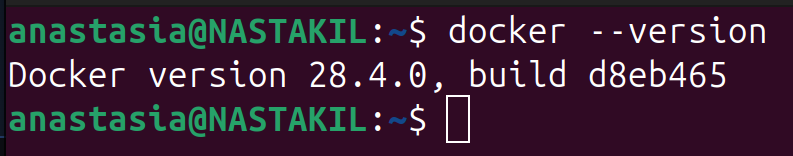
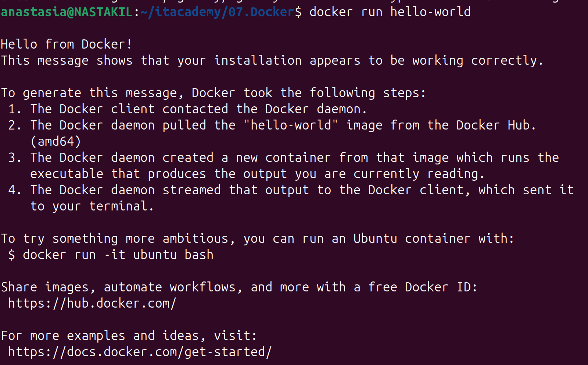
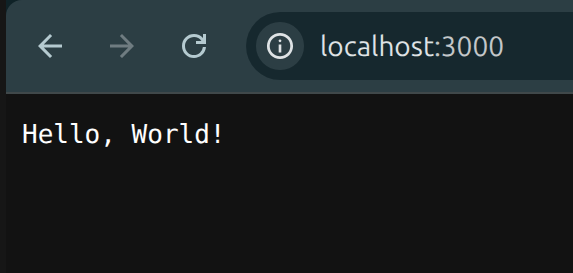
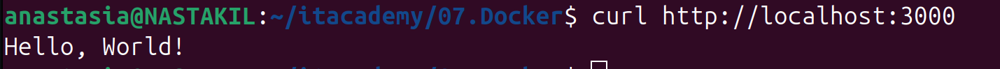

# Homework Assignment 1: Docker Installation and Basic Commands
```
docker --version
```



```
docker search hello-world
```

```
docker pull hello-world
```

```
docker images
```

```
REPOSITORY                TAG       IMAGE ID       CREATED        SIZE
hello-world               latest    1b44b5a3e06a   2 months ago   10.1kB
```

```
docker run hello-world
```


```
docker ps -a
```

```
CONTAINER ID   IMAGE                     COMMAND                  CREATED              STATUS                          PORTS     NAMES
04d3c0338a09   hello-world               "/hello"                 2 seconds ago        Exited (0) 1 second ago                   xenodochial_moser
```

# Homework Assignment 2: Building a Docker Image with Dockerfile

```
docker build -t hello-w-app .
```

```
docker run -d -p 3000:3000 hello-w-app
```

```
curl http://localhost:3000
```







```
docker ps
```

```
CONTAINER ID   IMAGE          COMMAND                  CREATED         STATUS         PORTS                                         NAMES
7019126d8bfa   a27db5b363ed   "docker-entrypoint.s…"   7 minutes ago   Up 7 minutes   0.0.0.0:3000->3000/tcp, [::]:3000->3000/tcp   blissful_curie
```