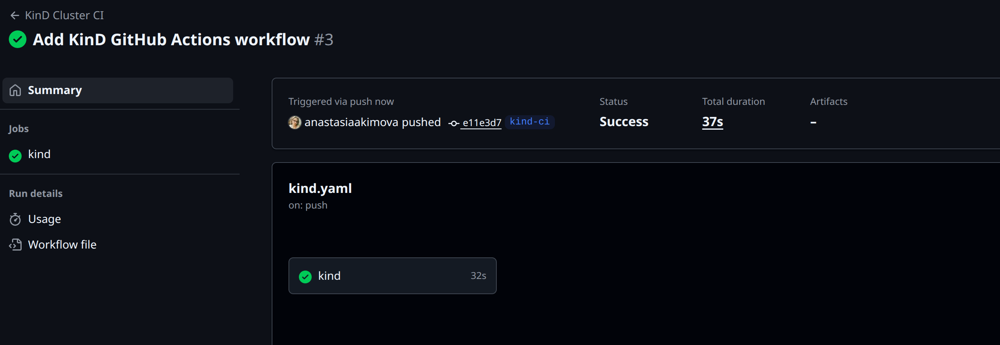
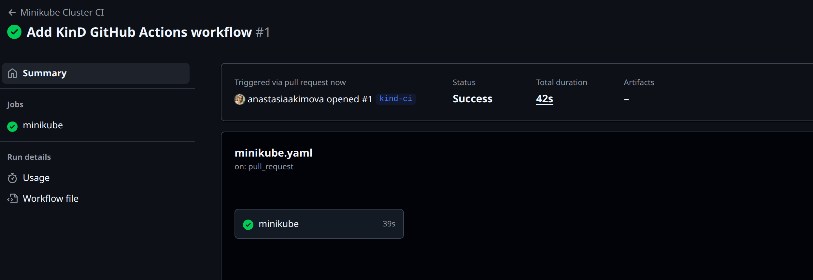

# Homework Assignment 1: KinD Kubernetes Cluster Setup

```
url -Lo ./kind https://kind.sigs.k8s.io/dl/v0.30.0/kind-linux-amd64
chmod +x kind
sudo mv kind /usr/local/bin/
```

```
kind version
```

```
kind create cluster
```

```
kubectl get nodes
```
## Output:
```
NAME                 STATUS   ROLES           AGE   VERSION
kind-control-plane   Ready    control-plane   21m   v1.34.0
```

# Homework Assignment 2: Minikube Kubernetes Cluster Setup

```
curl -LO https://storage.googleapis.com/minikube/releases/latest/minikube-linux-amd64
chmod +x minikube-linux-amd64
sudo mv minikube-linux-amd64 /usr/local/bin/minikube
```

```
minikube version
## Output
```
```
minikube version: v1.36.0
commit: f8f52f5de11fc6ad8244afac475e1d0f96841df1-dirty
```
```
minikube start --driver=docker
```
## Output

```
😄  minikube v1.36.0 on Ubuntu 24.04
    ▪ KUBECONFIG=/home/anastasia/.kube/config-k3s:/home/anastasia/.kube/config-k8s
✨  Using the docker driver based on existing profile
👍  Starting "minikube" primary control-plane node in "minikube" cluster
🚜  Pulling base image v0.0.47 ...
🔄  Restarting existing docker container for "minikube" ...
🎉  minikube 1.37.0 is available! Download it: https://github.com/kubernetes/minikube/releases/tag/v1.37.0
💡  To disable this notice, run: 'minikube config set WantUpdateNotification false'

🐳  Preparing Kubernetes v1.33.1 on Docker 28.1.1 ...
🔎  Verifying Kubernetes components...
    ▪ Using image registry.k8s.io/ingress-nginx/controller:v1.12.2
    ▪ Using image gcr.io/k8s-minikube/storage-provisioner:v5
    ▪ Using image registry.k8s.io/ingress-nginx/kube-webhook-certgen:v1.5.3
    ▪ Using image registry.k8s.io/ingress-nginx/kube-webhook-certgen:v1.5.3
🔎  Verifying ingress addon...
🌟  Enabled addons: storage-provisioner, default-storageclass, ingress
🏄  Done! kubectl is now configured to use "minikube" cluster and "default" namespace by default
```

```
kubectl get nodes
```
## Output:

```
NAME       STATUS   ROLES           AGE    VERSION
minikube   Ready    control-plane   6d6h   v1.33.1
```

# Homework Assignment 3: GitHub Actions for KinD Cluster Setup

https://github.com/anastasiaakimova/09.kuber-action-workflow/actions



# Homework Assignment 4: GitHub Actions for Minikube Cluster Setup



