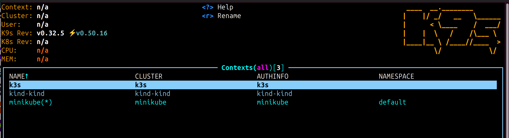
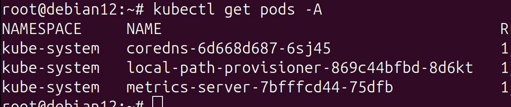
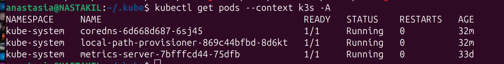

# Homework Assignment 1. K8s Installation 

Localhost:

## Install kubectl for local run

```
curl -LO https://dl.k8s.io/release/v1.29.0/bin/linux/amd64/kubectl
chmod +x kubectl
sudo mv kubectl /usr/local/bin/
```
```
kubectl version --client
```

## Install k9s to maintain cluster
source: https://dev.to/dm8ry/how-to-install-k9s-on-ubuntu-a-step-by-step-guide-2f98
```
wget https://github.com/derailed/k9s/releases/download/v0.32.5/k9s_linux_amd64.deb
```

```
sudo apt install ./k9s_linux_amd64.deb
```
```
rm k9s_linux_amd64.deb
```
```
k9s
```
OUTPUT: 



Kubernetes host:

## Finish workshop deployment if it is not done yet




