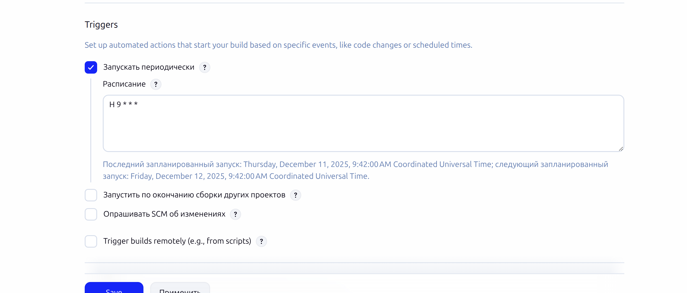
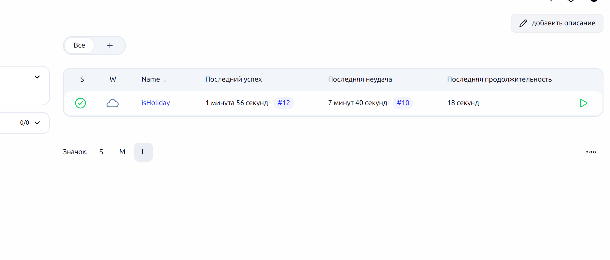
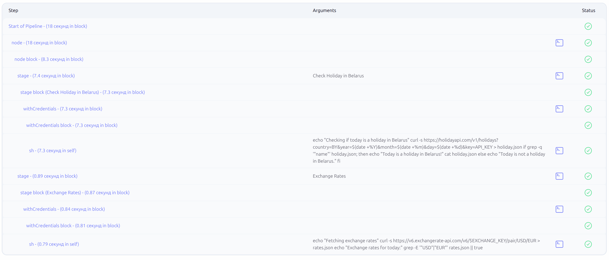
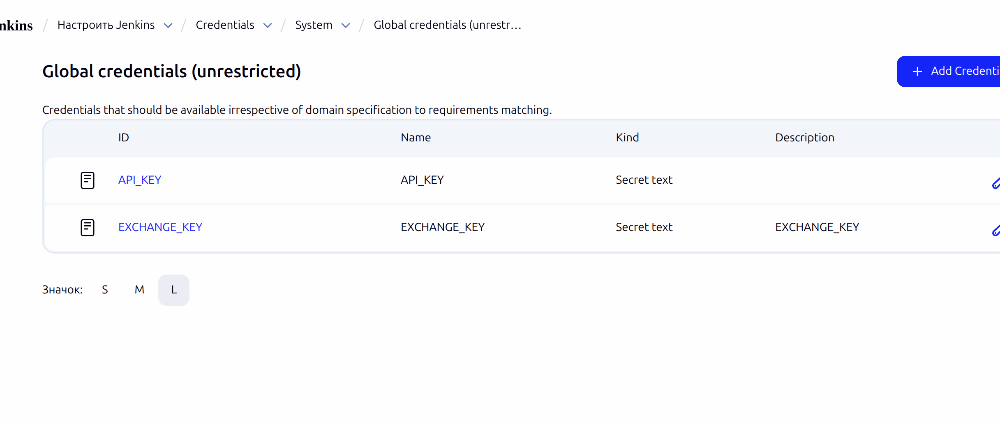

```
helm repo add jenkins https://charts.jenkins.io
```
```
helm repo update
```

```
kubectl create namespace jenkins
```

```
helm install jenkins jenkins/jenkins -n jenkins

```
```
kubectl get pods -n jenkins
```
```
NAME        READY   STATUS    RESTARTS   AGE
jenkins-0   2/2     Running   0          91m
```
```
kubectl get svc -n jenkins
```
```
NAME            TYPE        CLUSTER-IP      EXTERNAL-IP   PORT(S)     AGE
jenkins         ClusterIP   10.107.196.12   <none>        8080/TCP    91m
jenkins-agent   ClusterIP   10.104.77.249   <none>        50000/TCP   91m

```



