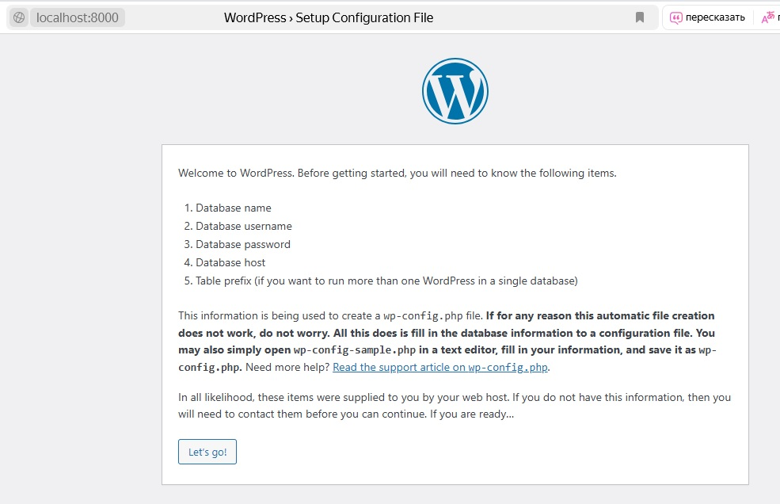
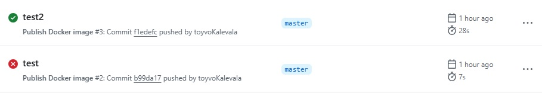
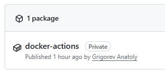
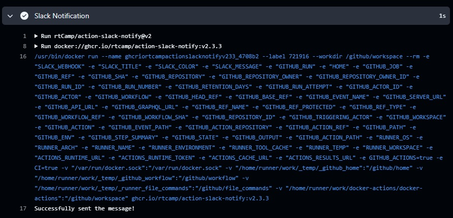

# 08. Docker. Docker compose

## Homework Assignment 1: Docker Compose for Application Stacks

[Docker compose](./Assignment1/docker-compose.yaml)

### Run Docker compose

```shell

docker compose up -d

[+] Running 2/2
 ✔ Container compose-db-1         Running                                  0.0s
 ✔ Container compose-wordpress-1  Start...                                 1.7s
root@debian10:~/compose# mkdir compose2
root@debian10:~/compose# cd compose2/
root@debian10:~/compose/compose2# nano docker-compose.yaml
root@debian10:~/compose/compose2# docker compose up -d
[+] Running 8/8
 ✔ Network compose2_default              Cre...                            0.1s
 ✔ Volume "compose2_wordpress_sites"     Created                           0.0s
 ✔ Volume "compose2_db_data"             Cr...                             0.0s
 ✔ Volume "compose2_wordpress_modules"   Created                           0.0s
 ✔ Volume "compose2_wordpress_profiles"  Created                           0.0s
 ✔ Volume "compose2_wordpress_themes"    Created                           0.0s
 ✔ Container compose2-db-1               Star...                           0.4s
 ✔ Container compose2-wordpress-1        Started                           0.7s                                                                                                      1.4s
```

### Checking in a web browser

```shell
ssh -L 8000:127.0.0.1:8000 root@192.168.203.3 -f -Nf
```



## Homework Assignment 2: Docker build automation

[Dockerfile](./Assignment2/Dockerfile)

[Workflow](./Assignment2/.github/workflows/build.yaml)

[Application](./Assignment2/PyApp.py)

[Docker image](https://github.com/users/toyvoKalevala/packages/container/package/docker-actions)

### Build image and run 

```shell
docker build -t pyapp .

[+] Building 50.7s (11/11) FINISHED                              docker:default
 => [internal] load build definition from Dockerfile                       0.0s
 => => transferring dockerfile: 460B                                       0.0s
 => [internal] load metadata for docker.io/library/python:3.11-slim       21.8s
 => [internal] load .dockerignore                                          0.0s
 => => transferring context: 2B                                            0.0s
 => [builder 1/4] FROM docker.io/library/python:3.11-slim@sha256:82c07f2f  7.6s
 => => resolve docker.io/library/python:3.11-slim@sha256:82c07f2f6e35255b  0.0s
 => => sha256:2a47a8c4fd5c358f98fb193471dc5d7a1e75e33d480 3.51MB / 3.51MB  6.2s
 => => sha256:9c538fc354918cfe13231798fe17d7c4b463cda38 16.20MB / 16.20MB  6.1s
 => => sha256:47bbb0afa7fe5695aca89f358dc3e73f46655977e201f55 250B / 250B  6.2s
 => => sha256:82c07f2f6e35255b92eb16f38dbd22679d5e8fb5230 9.13kB / 9.13kB  0.0s
 => => sha256:974cb5b34070dd2f5358ca1de1257887bec76ba87f6 1.75kB / 1.75kB  0.0s
 => => sha256:0334b36fd0ebeff9f5bc512b1d61f5b79ae54fddc7f 5.31kB / 5.31kB  0.0s
 => => extracting sha256:2a47a8c4fd5c358f98fb193471dc5d7a1e75e33d480fb7a2  0.2s
 => => extracting sha256:9c538fc354918cfe13231798fe17d7c4b463cda38500187c  1.1s
 => => extracting sha256:47bbb0afa7fe5695aca89f358dc3e73f46655977e201f553  0.0s
 => [internal] load build context                                          0.0s
 => => transferring context: 284B                                          0.0s
 => [builder 2/4] WORKDIR /app                                             0.2s
 => [builder 3/4] COPY requirements.txt .                                  0.1s
 => [builder 4/4] RUN pip install --no-cache-dir -r requirements.txt      19.7s
 => [stage-1 2/3] COPY --from=builder /usr/local/lib/python3.11/site-pack  0.5s
 => [stage-1 3/3] COPY PyApp.py .                                          0.1s
 => exporting to image                                                     0.3s
 => => exporting layers                                                    0.3s
 => => writing image sha256:1accfbfbc2f3a67cf1b854e19eab69d53a94584353e79  0.0s
 => => naming to docker.io/library/pyapp                                   0.0s
```

```
docker run -d -p 5000:5000 pyapp

docker ps

CONTAINER ID   IMAGE              COMMAND                  CREATED         STATUS         PORTS                                       NAMES
fa7c1d1ed7ca   pyapp              "python PyApp.py"        3 seconds ago   Up 2 seconds   0.0.0.0:5000->5000/tcp, :::5000->5000/tcp   naughty_gagarin

```


### Workwlows results



### Git package



### Slack notify

