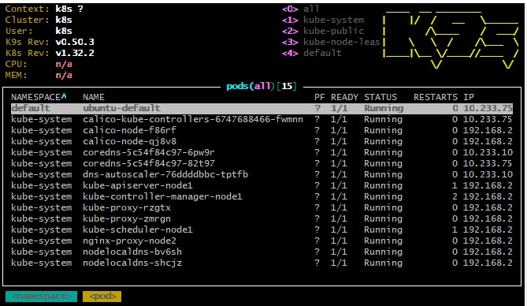
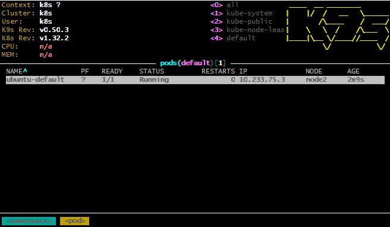

# 10. Kubernetes installation (WS)

## Homework Assignment 1. K8s Installation

### Install kubectl

```shell
curl -LO "https://dl.k8s.io/release/$(curl -L -s https://dl.k8s.io/release/stable.txt)/bin/linux/amd64/kubectl"
sudo install -o root -g root -m 0755 kubectl /usr/local/bin/kubectl
```
### Install K9s

```shell 
wget https://github.com/derailed/k9s/releases/download/v0.50.3/k9s_linux_amd64.deb
sudo dpkg -i k9s_linux_amd64.deb
```

#### Pods in all namespaces


### Pod deployment

[pod.yaml](./pod.yaml)

```shell
kubectl apply -f pod.yaml
```
#### Checking pod

