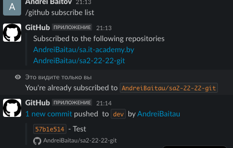

# 03.Git.Hosting

## Repo’s links

[GitHub - https://github.com/](https://github.com/AndreiBaitau/sa.it-academy.by/tree/md-sa2-22-22)

[GitLab - https://gitlab.com/](https://gitlab.com/AndreiBaitau/md-sa2-22-22)

[BitBucket - https://bitbucket.org/](https://bitbucket.org/andrewbaitov/md-sa2-22-22/src/md-sa2-22-22/)


## Slack/email integration



## Script


```bash
#!/bin/bash
echo -n "Enter text for commit: "
read commit

git add --all
git commit -m $commit

for push in $(git remote); do
        git push -u $push
done

```

## Output

```bash
Enter text for commit: Homework.v.0.5
[md-sa2-22-22 a8da87b8] Homework.v.0.5
 1 file changed, 2 insertions(+), 2 deletions(-)
Enumerating objects: 9, done.
Counting objects: 100% (9/9), done.
Delta compression using up to 2 threads
Compressing objects: 100% (5/5), done.
Writing objects: 100% (5/5), 459 bytes | 459.00 KiB/s, done.
Total 5 (delta 2), reused 0 (delta 0), pack-reused 0
remote:
remote: Create pull request for md-sa2-22-22:
remote:   https://bitbucket.org/andrewbaitov/md-sa2-22-22/pull-requests/new?source=md-sa2-22-22&t=1
remote:
To bitbucket.org:andrewbaitov/md-sa2-22-22.git
   40724e75..a8da87b8  md-sa2-22-22 -> md-sa2-22-22
Branch 'md-sa2-22-22' set up to track remote branch 'md-sa2-22-22' from 'origin_bitbucket'.
Enumerating objects: 9, done.
Counting objects: 100% (9/9), done.
Delta compression using up to 2 threads
Compressing objects: 100% (5/5), done.
Writing objects: 100% (5/5), 459 bytes | 459.00 KiB/s, done.
Total 5 (delta 2), reused 0 (delta 0), pack-reused 0
remote: Resolving deltas: 100% (2/2), completed with 2 local objects.
To github.com:AndreiBaitau/sa.it-academy.by.git
   40724e75..a8da87b8  md-sa2-22-22 -> md-sa2-22-22
Branch 'md-sa2-22-22' set up to track remote branch 'md-sa2-22-22' from 'origin_github'.
Enumerating objects: 9, done.
Counting objects: 100% (9/9), done.
Delta compression using up to 2 threads
Compressing objects: 100% (5/5), done.
Writing objects: 100% (5/5), 459 bytes | 459.00 KiB/s, done.
Total 5 (delta 2), reused 0 (delta 0), pack-reused 0
To gitlab.com:AndreiBaitau/md-sa2-22-22.git
   40724e75..a8da87b8  md-sa2-22-22 -> md-sa2-22-22
Branch 'md-sa2-22-22' set up to track remote branch 'md-sa2-22-22' from 'origin_gitlab'.

```
