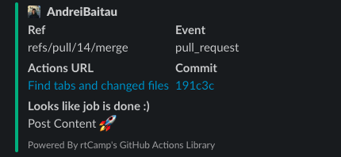

# 04.GitOps

[Repo - sgoser/Git.Local](https://github.com/AndreiBaitau/sa2-22-22-git)

[Git Action](https://github.com/AndreiBaitau/sa2-22-22-git/actions/runs/3555602061)

## Yaml file

```yaml
name: Find tabs and changed files

on: pull_request

jobs:
  make:
    runs-on: ubuntu-latest

    steps:
      - name: Get changed files
        uses: actions/checkout@v3
        with:
          fetch-depth: 0

      - name: Get changed files
        id: chngd-files
        uses: tj-actions/changed-files@v34
    
      - name: Count tabs in changed files
        run: |
           for file in ${{ steps.chngd-files.outputs.all_changed_files }}; do
             echo "Changed file $file has `tr -cd '\t' < $file | wc -m` tabs." >> result.log
           done
    
      - name: Upload report
        uses: actions/upload-artifact@v2
        with:
          path: result.log
  


  slack:
    name: Slack Notification
    runs-on: ubuntu-latest
    steps:
    - name: Slack Notification
      uses: rtCamp/action-slack-notify@v2
      env:
        SLACK_CHANNEL: git-test
        SLACK_COLOR: ${{ job.status }}
        SLACK_ICON: https://github.com/rtCamp.png?size=48
        SLACK_MESSAGE: 'Post Content :rocket:'
        SLACK_TITLE: 'Looks like job is done :)'
        SLACK_USERNAME: Andrei Baitov
        SLACK_WEBHOOK: ${{ secrets.SLACK_WEBHOOK }}

```

## Files with tabs (news from BBC)

### text1.txt

```text
Videos			 shared on so			icial media in China have appeared to show fresh protests against Covid restrictions, after an					 apartment block		 fire									 killed 10 	people.

```

### text2.txt

```text
That 			has been disputed by Chinese state media. However, Urumqi authorities did issue an unusual apology late on Friday - vowing to punish anyone who 						had							 deserted 										their duty.

```

## result.log

```text
Changed file .github/workflows/Homework_4.yaml has 0 tabs.
Changed file text1.txt has 23 tabs.
Changed file text2.txt has 32 tabs.
```

## Slack notification


