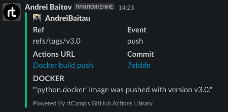

# 08.Docker_compose

## Links

[Docker hub](https://hub.docker.com/r/andreibaitov/python.docker/tags)

[GitHub Registry](https://github.com/users/AndreiBaitau/packages/container/package/python.docker)

[GitHub Action](https://github.com/AndreiBaitau/docker.action/actions/runs/3668733536)

## Workflow file

```yaml
ame: Docker build push

on:
  push:
    tags:
      - "v*.*"
jobs:
  build:
    runs-on: ubuntu-latest
    steps:
      -
        name: Checkout
        uses: actions/checkout@v3
      -
        name: Login to GitHub Registry
        uses: docker/login-action@v2
        with:
          registry: ghcr.io
          username: ${{ github.actor }}
          password: ${{ secrets.REGISTRY_TOKEN }}

      -
        name: Login to Docker Hub
        uses: docker/login-action@v2
        with:
          username: ${{ secrets.DOCKER_HUB_USERNAME }}
          password: ${{ secrets.DOCKER_HUB_ACCESS_TOKEN }}
      -
        name: Set up Docker Buildx
        uses: docker/setup-buildx-action@v2
      -
        name: Build and push
        uses: docker/build-push-action@v3
        with:
          context: .
          file: ./python.Dockerfile
          push: true
          tags: |
            ${{ secrets.DOCKER_HUB_USERNAME }}/python.docker:${{github.ref_name}}
            ghcr.io/andreibaitau/python.docker:${{github.ref_name}}
  slack:
    name: Slack Notification
    runs-on: ubuntu-latest
    steps:
    - name: Slack Notification
      uses: rtCamp/action-slack-notify@v2
      env:
        SLACK_CHANNEL: git-test
        SLACK_COLOR: ${{ job.status }}
        SLACK_ICON: https://github.com/rtCamp.png?size=48
        SLACK_MESSAGE: |-
            "'python.docker' Image was pushed with version ${{  github.ref_name }}."
        SLACK_TITLE: 'DOCKER'
        SLACK_USERNAME: Andrei Baitov
        SLACK_WEBHOOK: ${{ secrets.SLACK_WEBHOOK }}

```

## Slack image
