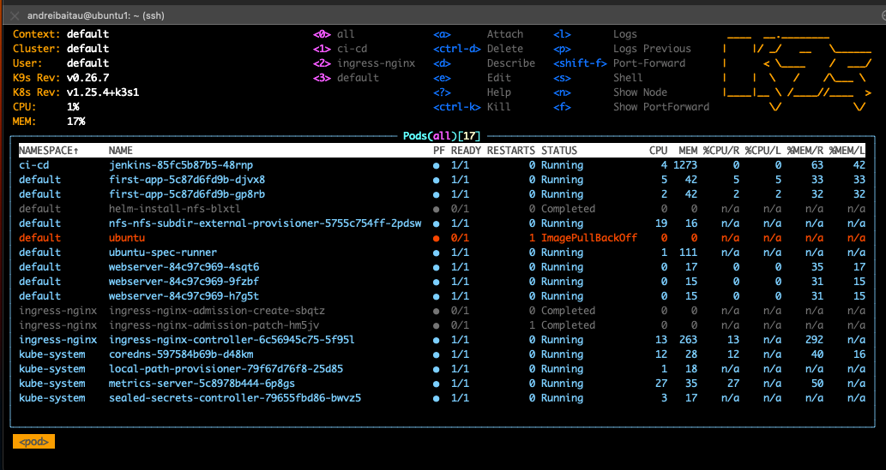
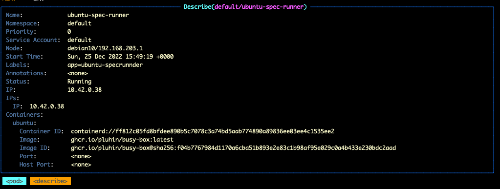
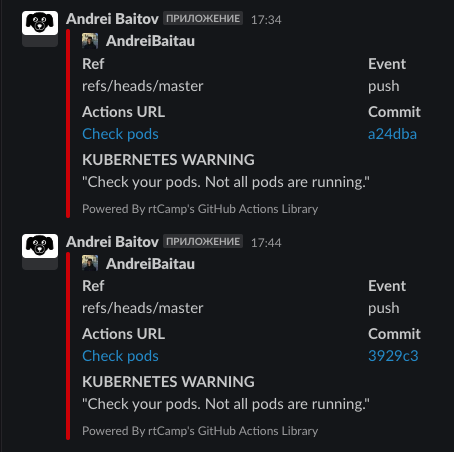

# 10.K8s_workshop

## Workshop. K8s installation

### Localhost:

- [x] Install kubectl for local run
- [x] Install k9s to maintain cluster
- [x] Make print-screen of k9s with pods in all namespaces


### Kubernetes host

- [x] Finish workshop deployment if it is not done yet
- [x] Deploy shell pod in default namespace which you can you use for internal checks inside the cluster


## Hometask. GitHub Action

[GitHub Action](https://github.com/AndreiBaitau/sa2-22-22-git/actions/runs/3823322184)

### atifact


### Slack notification



### yaml file

```yaml
name: Check pods
on:
#  schedule:
#    - cron: '*/5 * * * *'
  push:
    branches:
      - 'master'
jobs:
  check:
    env:
      result_file: result.log
      channel: git-test
      GIT: ${{secrets.JUMP_IP}} 
    runs-on: ubuntu-latest
    outputs:
      output1: ${{steps.check.outputs.check}}
    steps:
    - name: Executing remote ssh commands using password
      uses: appleboy/ssh-action@v0.1.6
      id: check
      env:
        SSH_PUB: ${{secrets.SSH_PUB}}
      with:
        host: ${{secrets.JUMP_IP}}
        username: ${{ secrets.JUMP_USERNAME }}
        password: ${{ secrets.JUMP_PASS}}
          #username: root
          #host: ${{ secrets.K3S_HOST }}
          #password: ${{ secrets.K3S_PASS }}
        envs: SSH_PUB
        script:  |
          echo $SSH_PUB >> ~/.ssh/k3s.pub
    - name: Add ssh and checking pods
      run: |
        mkdir -p ~/.ssh
        eval `ssh-agent -s`
        echo "$SSH_PRIVATE" > ~/.ssh/k3s
        sudo chmod 600 ~/.ssh/k3s
        ssh-add - <<< "$SSH_PRIVATE"
        ssh-keyscan -H ${{secrets.JUMP_IP}} >> ~/.ssh/known_hosts
        ssh ${{ secrets.JUMP_USERNAME}}@${{secrets.JUMP_IP}} ssh-keyscan ${{ secrets.K3S_HOST }} >> ~/.ssh/known_hosts
        sshpass -p ${{ secrets.K3S_PASS }} ssh -oProxyCommand="sshpass ssh -W %h:%p ${{ secrets.JUMP_USERNAME}}@${{secrets.JUMP_IP}}" root@${{ secrets.K3S_HOST }} "kubectl get pods -A" >> ${{ env.result_file}}  
      shell: bash
      env:
        SSH_PRIVATE: ${{secrets.SSH_PRIVATE}}
        SSH_PUBLIC: ${{secrets.SSH_PUB}}
    - name: Check pods statuses and write other than 'Running'
      id: check_2
      run: |
        sed -i '/Running/d' ${{ env.result_file }}
        sed -i '/Completed/d' ${{ env.result_file }}
        echo "other_than_running=$(wc -l < ${{ env.result_file }})" >> $GITHUB_OUTPUT
    - name: Upload report
      if: steps.check_2.outputs.other_than_running > 1
      uses: actions/upload-artifact@v2
      with:
        path: ${{ env.result_file}}
  
    - name: Slack Notification
      if: steps.check_2.outputs.other_than_running > 1
      uses: rtCamp/action-slack-notify@v2
      env:
        SLACK_CHANNEL: git-test
        SLACK_COLOR: db0606
        SLACK_ICON: https://www.creativefabrica.com/wp-content/uploads/2019/03/Dog-Icon-by-Mine-Eyes-Design.jpg
        SLACK_MESSAGE: |-
          "Check your pods. Not all pods are running."
        SLACK_TITLE: 'KUBERNETES WARNING'
        SLACK_USERNAME: Andrei Baitov
        SLACK_WEBHOOK: ${{ secrets.SLACK_WEBHOOK }}
```