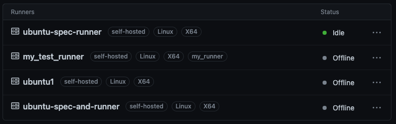
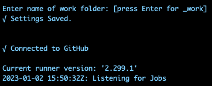
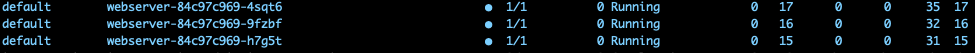

# 11.K8s.Basic ojbects.

## Additional task

### Pod with connect to GitHub Actions as self-hosted runner





## Hometask

### nginx-test.k8s-1.sa

 The result is shown in the 12th homework assignment  
 [>>> Click here to see <<<](https://github.com/AndreiBaitau/sa.it-academy.by/tree/md-sa2-22-22/Andrei_Baitau/12.K8s_Data)

### 3 replicas



### nginx.yaml

```yaml
---
apiVersion: apps/v1
kind: Deployment
metadata:
  name: webserver
  labels:
    app: nginx-web
spec:
  replicas: 3
  strategy:
    type: RollingUpdate
    rollingUpdate:
      maxSurge: "33%"
      maxUnavailable: "33%"
  selector:
    matchLabels:
      app: nginx-web
  template:
    metadata:
      labels:
        app: nginx-web
    spec:
      containers:
      - name: php-nginx
        image: nginx:latest
        ports:
        - containerPort: 80
        resources:
          requests:
            cpu: 51m
            memory: 50Mi
          limits:
            cpu: 100m
            memory: 100Mi
---
apiVersion: v1
kind: Service
metadata:
  name: nginx-web-service
  labels:
    run: nginx-web-service
spec:
 #type: LoadBalancer
  ports:
  - port: 80
    protocol: TCP
  selector:
    app: nginx-web
---
apiVersion: networking.k8s.io/v1
kind: Ingress
metadata:
  name: ingress-sa
  annotations:
    kubernetes.io/ingress.class: nginx
    nginx.ingress.kubernetes.io/server-alias: "nginx-test-alias.k8s-1.sa"
spec:
  rules:
    - host: nginx-test.k8s-1.sa
      http:
        paths:
          - path: /
            pathType: Prefix
            backend:
              service:
                name: nginx-web-service
                port:
                  number: 80
```