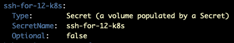
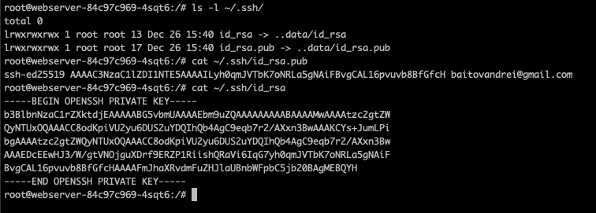
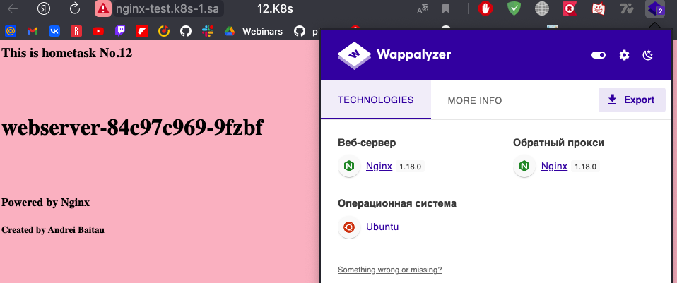

# 12.K8s. Data and Security

## Hometask

### secrets





### nginx-test.k8s-1.sa/



### new_sealed_secret.yaml

```yaml
apiVersion: bitnami.com/v1alpha1
kind: SealedSecret
metadata:
  creationTimestamp: null
  name: ssh-for-12-k8s
  namespace: default
spec:
  encryptedData:
    id_rsa: AgACHVhueZsmSZPsNXBO4qHJLhJL4WRGSSThg57aQSw6/TRxwPsR9bG8JNJAo+cYZXVuh/c3I+x8RWPRCdqIoSRrgVu3YEqfIFj0BiDrFBmVwL33YTZ0yH8GZB9FZwx28Ex8SE4HiNHEW7PvIe2ylxE/EmLS0IBvXRrZXEn7wYnXKsK8ukYINDbDzHd0uIjbWVX/2FUkP5fHHEtrP6bdsD3MrPjGyfAqcZysq/xLAP+IK0UsDwYrfwAk92vlAeKLSjHpqorVDMyZdIy3kF9+9kHvBG+MU7bvinfdYSEKlprHIAcbtfxvO6yP+hDV1sH/E80sD+ndpLA+OVyNSiRJ1N9S81bL0y7uclrfkYUk0/t1ra3oTJbgMNJxlIyFeAE0oByh3sYnaLYKbbfmF3gkkCiz3bfVqFnmYnYm4IclgQ7T08j/sdb23RSuxJ1fEbhvpSy2DaRf5BhgGEkaF96JGZTrPI0AuEkE6g3DNBF97nAJlurAGWFtpCWrv3vzpbLj3c5N1w7p8OoQEzN/ODi+bkxkzMFw+2nidQ6j5a2CXb7tOUu9UTBClv5JKWKIV2HcERQL761cNS4ScqfTTpTyHM4wuoeBQ9n7qe7jsfQ9YRoyinFGjQoUO2V8RWaSt0fDqzLx/Zq+VaZTKejlNxbJ4kQAEsU1xnqALus1s7YxtmPMKi/vp8hcy+eXj4SakJiI2Ji58V7qcC86yEJaNGyqyoo8Xo9plJqsCZYpFVTJVLcz2Bj/CJovaiKJ44Sfn/io4fVahxI/yLdU7dD8c0G1rNw8Ipm8oNg+KKATG75WHeZ69+cjSpfwoYL9yST5lGV03LOS1S5Cef9xNPb89HVd+Q2pyvX57DwtvGC+D0+tgMI29hqw5KOv5S23CIrFPv/4QN5SYfbySNPc8dAnzsdH/aofmAgcWNyt7tgN6piCcvn4WNo/KYcwdUS6qOwxC74Vz1fdYi2w48wDaXjoUm7YkplgW32xPgXld7Uqf0zOKVPTK2ijhl9Cz+CSDJPRAT4BvTFY38uXinOo09zZ0wrJhSw3V3ADgQJclecLOfYKW5l6j6TEayAtCtrWJpgNE5Vp9nP9HFTXDRqlGvc3Kvl3XIVMdoI72UswoZC14a5A/wqvS4MAtjKR9/NSiHYT9T4D4WojAoiDC+nM5fI2z+jBuD4kBpuc6fRldGOO/8barZnohcVJn7WPtCbOVHZ0QPKb9vPwrCtllivY3/oK1h8B3eF1PIjwmnJpna5u5wxvmskd8L6tBQ==
    id_rsa.pub: AgCvCDl5mEa1pnfMtMBieYur6OJz82QZM7so0tiwLXFXi1BABjpJUibm0t4cKoOu3zrtUTcnLch1Z/T3ufHPpOq6cKScorfckFspEzCNluxfsg7I9ed1IlXDdIetetoTZQz6zYfKazWgwznJ6RQr92zOEqTCLkpUQCORCZ+27ntQ/txBieWcFlI0YDNMlNYFBlWtJk/PzTi5O8QxcYykRjLFzKd86RT78hWG1I7T5nSqW1rWuAOmSoIyY3JcIwxImZQ7q4EIfb4eANHwSa54ZXJHqth0sDi4iA6dzvfsKNSQNVpjsIVXqkBvpm5k2hzwPu/UOQ4flOW4rRfpQPxiHPYiucB1pDEqfMM767PyjZ6Yk642RtYePaZAJVGB+mVGsqDuwrDyMqyRR8exGk1sqPDn5QXoqes7J6NE4A7Z53+7f8ZinW9s4p3dBJZnDUE1vgxKaxnaubgtfOiMIRQSwjL23BySnN/nsIcePlwIoA/nIfRSVRc0avDnPKmoXOD7mnlP4pQe9AdiNCyOKR6yemuWntjQv4RP1ljachLN/K3SaYWSoXvYayVoLOHrVwtqoGEJzADsyFkSJlB+pcOFkUV5i6Y31AXeSdZW7U5vQyhcgrzNi0ZWJP+DBMRRqpWaCfx0QxmT4SpTyud2UN+7WXchngFE3JU7p/DF5E0wNtEkw+/6TckfxhFgJd6MZQEZypwk1BIviejVevkmQ/bLV2lp3EOuRSez3faGDi+8TF0Yo8OWYpTikwDGXyCETm7B3pAJp6gfnxEz5uFnzvTV9gWZWhr7MZ+0XAUmYFlD0oe/sh9Ph+VPB6p9dbgiBbwBzR+n3atrtdXrdw==
  template:
    metadata:
      creationTimestamp: null
      name: ssh-for-12-k8s
      namespace: default
    type: Opaque
```

### nginx.yaml

```yaml
---
apiVersion: v1
kind: ConfigMap
metadata:
  name: index-config
data:
  index.html: |
    <html>
    <title>12.K8s</title>
    <body>
    <h3> This is hometask No.12 </h3>
    <br><br><h1> host </h1><br><br>
    <h4> Powered by Nginx
    <h5> Created by Andrei Baitau </h5>
    <body bgcolor=pink>
    </h4>
    </body>
    </head>
---
apiVersion: apps/v1
kind: Deployment
metadata:
  name: webserver
  labels:
    app: nginx-web
spec:
  replicas: 3
  strategy:
    type: RollingUpdate
    rollingUpdate:
      maxSurge: "33%"
      maxUnavailable: "33%"
  selector:
    matchLabels:
      app: nginx-web
  template:
    metadata:
      labels:
        app: nginx-web
    spec:
      containers:
      - name: php-nginx
        image: nginx:latest
        ports:
        - containerPort: 80
        resources:
          requests:
            cpu: 50m
            memory: 50Mi
          limits:
            cpu: 100m
            memory: 100Mi
        volumeMounts:
        - name: index
          mountPath: /usr/share/nginx/html/
        - name: ssh-for-12-k8s
          mountPath: /root/.ssh/
      initContainers:
      - name: init
        image: busybox
        command: ["sh"]
        args: ["-c", "cp /tmp/index.html /usr/share/nginx/html/; 
          sed -i 's/host/$(HOSTNAME)/' /usr/share/nginx/html/index.html" ]
        env:
          - name: HOSTNAME
            valueFrom:
              fieldRef:
                fieldPath: metadata.name
        volumeMounts:
        - name: index-config-mount
          mountPath: /tmp/ 
        - name: index
          mountPath: /usr/share/nginx/html/
      volumes:
      - name: index
        emptyDir: {} 
      - name: index-config-mount
        configMap:
          name: index-config
      - name: ssh-for-12-k8s
        secret:
          secretName: ssh-for-12-k8s
          defaultMode: 0600 
---
apiVersion: v1
kind: Service
metadata:
  name: nginx-web-service
  labels:
    run: nginx-web-service
spec:
 #type: LoadBalancer
  ports:
  - port: 80
    protocol: TCP
  selector:
    app: nginx-web
---
apiVersion: networking.k8s.io/v1
kind: Ingress
metadata:
  name: ingress-sa
  annotations:
    kubernetes.io/ingress.class: nginx
    nginx.ingress.kubernetes.io/server-alias: "nginx-test-alias.k8s-1.sa"
spec:
  rules:
    - host: nginx-test.k8s-1.sa
      http:
        paths:
          - path: /
            pathType: Prefix
            backend:
              service:
                name: nginx-web-service
                port:
                  number: 80
```