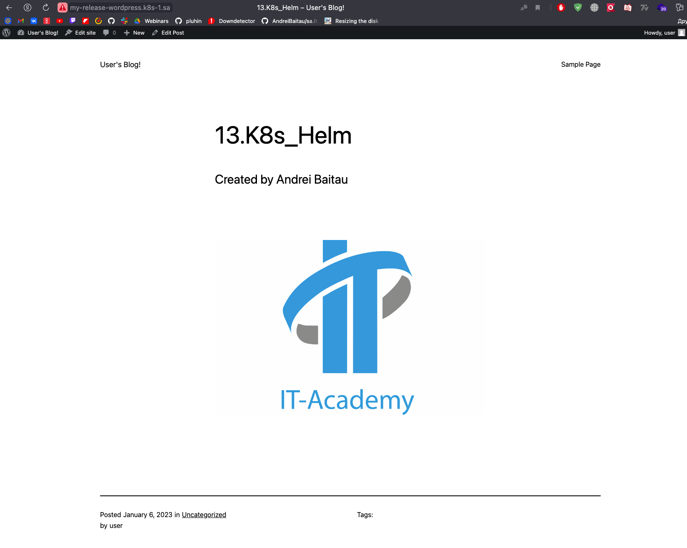

# 13.K8s.Helm

## Drupal

```bash
 ansible-playbook -i inv.yaml mariadb.yaml -e "name_db=drupal user_db=drupal pass_db=drupal"
 helm install sa-drupal  --set mariadb.enabled=false,externalDatabase.host=192.168.201.1,externalDatabase.password=drupal ,externalDatabase.user=drupal ,externalDatabase.database=drupal ,global.storageClass=nfs,wordpressUsername=admin,wordpressPassword=drupal my-repo/drupal
```


## Wordpress using default installation

```bash
helm repo add bitnami https://charts.bitnami.com/bitnami
helm install my-release bitnami/wordpress
```

