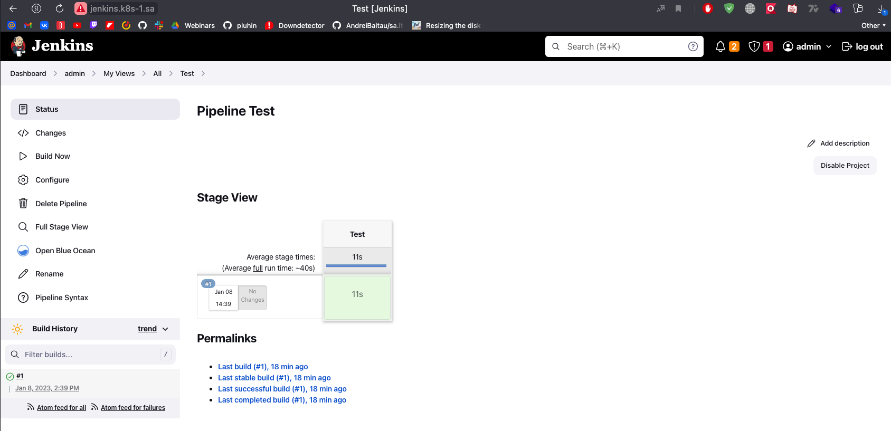

# 14.K8s.AppDeployment

## Workshop

All steps was successfully done

## Helm repository 

Link to jenkins-helm >> [link](https://github.com/AndreiBaitau/jenkins-helm/tree/master/helm-source/jenkins)

### History

```bash
helm install jenkins ../helm-releases/jenkins-0.1.0.tgz
 2042  helm install jenkins ../helm-releases/jenkins-0.1.0.tgz
 2044  helm install jenkins ../helm-releases/jenkins-0.1.0.tgz
 2045  helm package jenkins
 2046  rm ../helm-releases/jenkins-0.1.0.tgz
 2047  mv jenkins-0.1.0.tgz ../helm-releases/
 2048  helm install jenkins ../helm-releases/jenkins-0.1.0.tgz
 2051  rm ../helm-releases/jenkins-0.1.0.tgz
 2052  helm package jenkins
 2053  mv jenkins-0.1.0.tgz ../helm-releases/
 2054  helm install jenkins ../helm-releases/jenkins-0.1.0.tgz
 2055  rm ../helm-releases/jenkins-0.1.0.tgz
 2057  helm package jenkins
 2058  mv jenkins-0.1.0.tgz ../helm-releases/
 2059  helm install jenkins ../helm-releases/jenkins-0.1.0.tgz
 2061  helm unistall jenkins
 2062  helm uninstall jenkins
 2065  helm unistall jenkins
 2066  helm install jenkins ../helm-releases/jenkins-0.1.0.tgz
 2074  helm unistall jenkins
 2075  helm uninstall jenkins
 2079  helm install jenkins ../helm-releases/jenkins-0.1.0.tgz
 2086  helm uninstall jenkins
 2088  cd helm-source/
 2091  helm package jenkins
 2092  helm package first-app/
 2093  helm install first-app first-app-0.2.0.tgz
 2094  helm install app first-app-0.2.0.tgz
 2103  ls helm-releases/
 2105  cd helm-source/
 2106  helm install jenkins ../helm-releases/jenkins-0.1.0.tgz
 2107  helm uninstall jenkins
 2108  helm package jenkins
 2109  rm ../helm-releases/jenkins-0.1.0.tgz
 2111  mv jenkins-0.1.0.tgz ../helm-releases/
 2112  helm install jenkins ../helm-releases/jenkins-0.1.0.tgz
 2119  git remote add origin git@github.com:AndreiBaitau/jenkins-helm.git
 2123  helm repo index --url https://andreibaitau.github.io/jenkins-helm/
 2124  helm repo index --url https://andreibaitau.github.io/jenkins-helm/ .
 2127  cd helm-source/
 2129  rm ../helm-releases/jenkins-0.1.0.tgz
 2131  helm package jenkins
 2132  mv jenkins-0.1.0.tgz ../helm-releases/
 2133  helm install jenkins ../helm-releases/jenkins-0.1.0.tgz
 2134  helm uninstall jenkins
 2135  helm install jenkins ../helm-releases/jenkins-0.1.0.tgz
 2136  helm uninstall jenkins
 2137  helm install jenkins ../helm-releases/jenkins-0.1.0.tgz
 2138  helm uninstall jenkins
 2140  rm ../helm-releases/jenkins-0.1.0.tgz
 2141  helm package jenkins
 2142  mv jenkins-0.1.0.tgz ../helm-releases/
 2143  helm install jenkins ../helm-releases/jenkins-0.1.0.tgz
 2145  helm uninstall jenkins
 2147  helm package jenkins
 2148  mv jenkins-0.1.0.tgz ../helm-releases/
 2149  helm install jenkins ../helm-releases/jenkins-0.1.0.tgz
 2151  rm ../helm-releases/jenkins-0.1.0.tgz
 2152  helm package jenkins
 2153  mv jenkins-0.1.0.tgz ../helm-releases/
 2154  helm install jenkins ../helm-releases/jenkins-0.1.0.tgz
 2155  helm uninstall jenkins
 2156  helm install jenkins ../helm-releases/jenkins-0.1.0.tgz
 2157  helm uninstall jenkins
 2158  helm install jenkins ../helm-releases/jenkins-0.1.0.tgz
 2159  helm uninstall jenkins
 2160  helm install jenkins ../helm-releases/jenkins-0.1.0.tgz
 2162  helm uninstall jenkins
 2163  rm ../helm-releases/jenkins-0.1.0.tgz
 2164  helm package jenkins
 2165  mv jenkins-0.1.0.tgz ../helm-releases/
 2166  helm install jenkins ../helm-releases/jenkins-0.1.0.tgz
 2168*  helm repo index --url
 2170  history | grep helm
 2171  helm repo index --url https://andreibaitau.github.io/jenkins-helm/ .
```
## Additional task

Add config.xml

### deployment.yaml

```yaml
---
apiVersion: v1
kind: Namespace
metadata:
  name: {{ .Values.namespace }}

---
apiVersion: v1
kind: ConfigMap
metadata:
  namespace: {{ .Values.namespace }}
  name: test
data:
  config.xml: |
    <?xml version='1.1' encoding='UTF-8'?>
    <flow-definition plugin="workflow-job@1254.v3f64639b_11dd">
      <actions>
        <org.jenkinsci.plugins.pipeline.modeldefinition.actions.DeclarativeJobAction plugin="pipeline-model-definition@2.2118.v31fd5b_9944b_5"/>
        <org.jenkinsci.plugins.pipeline.modeldefinition.actions.DeclarativeJobPropertyTrackerAction plugin="pipeline-model-definition@2.2118.v31fd5b_9944b_5">
          <jobProperties/>
          <triggers/>
          <parameters/>
          <options/>
        </org.jenkinsci.plugins.pipeline.modeldefinition.actions.DeclarativeJobPropertyTrackerAction>
      </actions>
      <description></description>
      <keepDependencies>false</keepDependencies>
      <properties>
        <com.sonyericsson.rebuild.RebuildSettings plugin="rebuild@1.34">
          <autoRebuild>false</autoRebuild>
          <rebuildDisabled>false</rebuildDisabled>
        </com.sonyericsson.rebuild.RebuildSettings>
      </properties>
      <definition class="org.jenkinsci.plugins.workflow.cps.CpsFlowDefinition" plugin="workflow-cps@3583.v4f58de0d78d5">
        <script>pipeline {
      agent {
        kubernetes {
            containerTemplate {
            name &apos;curl-test&apos;
            image &apos;pluhin31/wget_curl:latest&apos;
            ttyEnabled true
            command &apos;cat&apos;
            }
      }
      }
      stages {
        stage(&apos;Test&apos;) {
          steps {
            container(&apos;curl-test&apos;) {
              sh &quot;&quot;&quot;#!/bin/sh
                curl --version
                    curl https://onliner.by
                    wget -O - https://onliner.by | egrep &quot;https://[0-9a-z]+[.]onliner[.]by&quot; -o | sort -u &gt; tmp.out
                    cat tmp.out
                    curl \$(cat tmp.out) -I | egrep HTTP
              &quot;&quot;&quot;
            }
          }
        }
      }
    }</script>
        <sandbox>true</sandbox>
      </definition>
      <triggers/>
      <disabled>false</disabled>

    
---
apiVersion: apps/v1
kind: Deployment
metadata:
  name: {{ .Values.name }}
  namespace: {{ .Values.namespace }}
spec:
  replicas: {{ .Values.replicaCount }}
  selector:
    matchLabels:
      app: {{ .Values.name }}
  template:
    metadata:
      labels:
        app: {{ .Values.name }}
    spec:
      containers:
        - name: {{ .Values.name }}
          image: "{{ .Values.image.repository }}:{{ .Values.image.tag | default .Chart.AppVersion }}"
          imagePullPolicy: {{ .Values.image.pullPolicy }}
          env:
            - name: JAVA_OPTS
              value: "-Djenkins.install.runSetupWizard=false"
            - name: CASC_JENKINS_CONFIG
              value: /var/jenkins_home/casc_configs/jenkins.yaml
          ports:
            - name: http
              containerPort: {{ .Values.service.port }}
            - name: jnlp
              containerPort: {{ .Values.service.jnlpport }}
          securityContext:
            runAsUser: 0
          resources:
            requests:
              cpu: {{ .Values.resources.requests.cpu }}
              memory: {{ .Values.resources.requests.memory }}
            limits:
              cpu: {{ .Values.resources.limits.cpu }}
              memory: {{ .Values.resources.limits.memory }}
          volumeMounts:
            - name: jenkins-auth-config
              mountPath: {{ .Values.jenkinsAuthConfig }}
              subPath: {{ .Values.ACsubPath }}
            - name: jenkins-config-yaml
              mountPath: {{ .Values.jenkinsConfigYaml }}
              subPath: {{ .Values.JCsubPath }}
            - name: jenkins-config
              mountPath: {{ .Values.jenkinsConfig }}
            - name: create-pipeline
              mountPath: /var/jenkins_home/jobs/Test     
      initContainers:
      - name: code-from-pipeline
        image: busybox
        command: ["sh", "-c"]
        args:  
          - cp /tmp/config.xml /var/jenkins_home/jobs/Test;
        volumeMounts:
        - name: jenkins-test
          mountPath: /tmp/
        - name: create-pipeline
          mountPath: /var/jenkins_home/jobs/Test       
      volumes:
        - name: jenkins-auth-config
          configMap:
            name: {{ .Values.configMap.name_basic }}
        - name: jenkins-config-yaml
          configMap:
            name: {{ .Values.configMap.name_config }}
        - name: jenkins-config
          nfs:
            server: {{ .Values.nfs.server }}
            path: {{ .Values.nfs.path }}
        - name: create-pipeline
          emptyDir: {}
        - name: jenkins-test
          configMap:
            name: test

```

