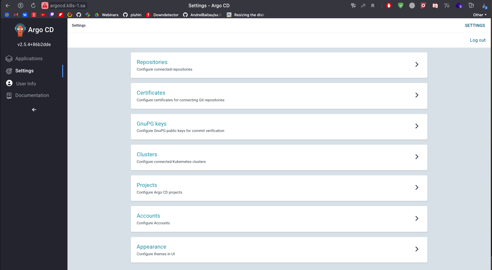
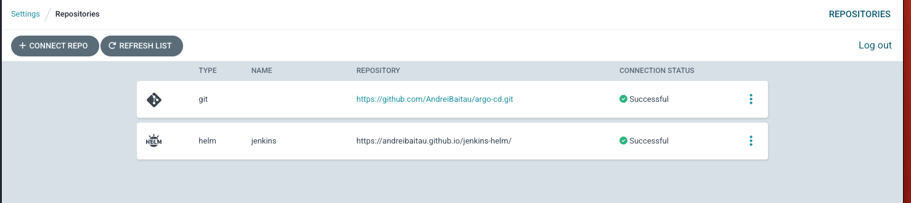
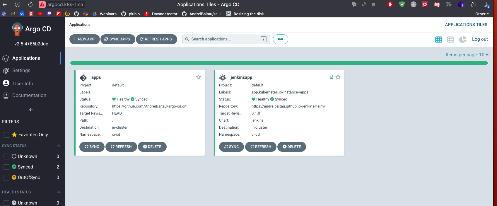

# 15.K8s.ArgoCD

## Hometasks

- [x] deploy ArgoCD into your cluster
- [x] add your repositories with helm packages as source for deployment
- [x] create separate repository which contains application manifests for ArgoCD
    - [x] application objects
    - [x] git secrets objects as sealsecret objects
- [x] add this repository as project for your applications

## Links

Helm repository with Jenkins >> [Link](https://github.com/AndreiBaitau/jenkins-helm)

ArgoCD repository with apps.yaml and sealed secrets >> [Link](https://github.com/AndreiBaitau/argo-cd/tree/main)

### Deploy ArgoCD

### separate repository and helm repository

Helm repo from previous 14 hw with jenkins and config.xml
Also added sealed secrets for username and password 

### application

