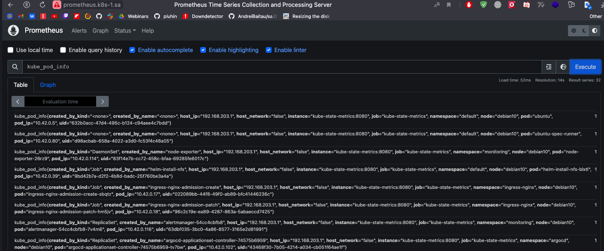
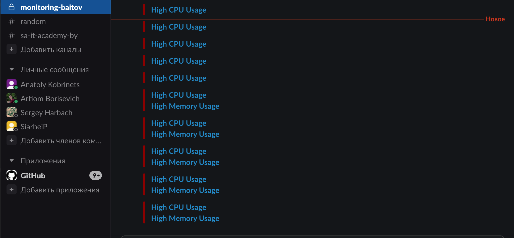
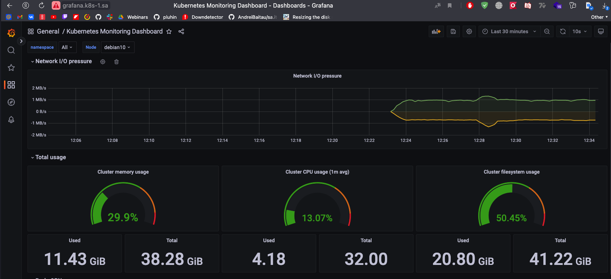
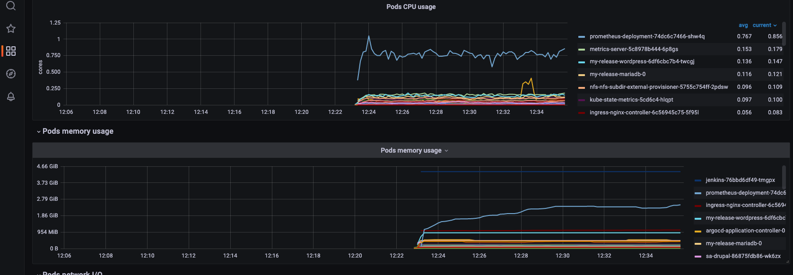

# 16.Monitoring. Prometheus. Grafana.

## Hometask

- [x] Deploy Prometheus + Alert manager

- [x] Setup slack notification for Alert manager

    - [x] Add alert for CPU overload per pods
    - [x] Emulate payload to test alert
    - [x] Thresholds can be any value as you wish

- [x] Expose Prometheus web UI

- [x] Deploy Grafana

- [x] Add Prometheus as metrics source

- [x] Create dashboard with CPU and memory graphs per pods

## Attachments

### Prometheus

### Slack notification

### Grafana

### Grafana dashboard

### Yaml files

All yaml files were added to pr