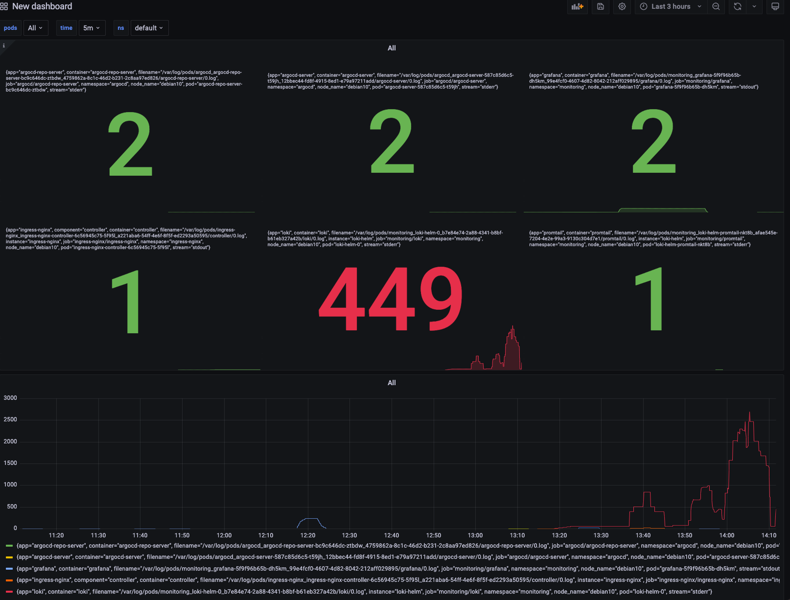
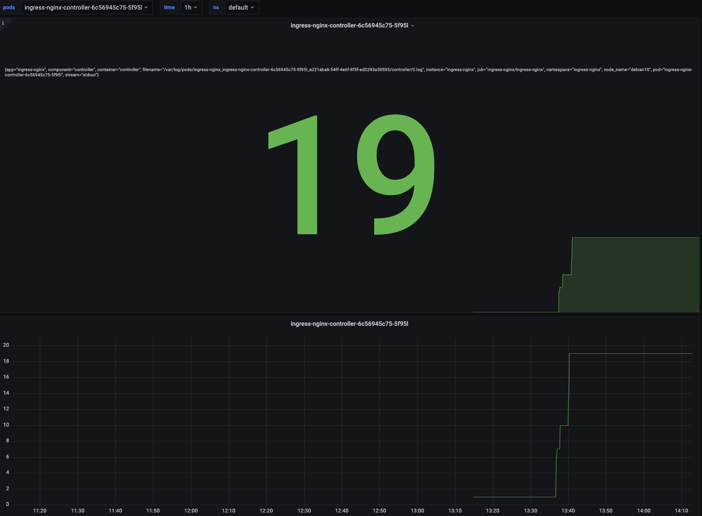
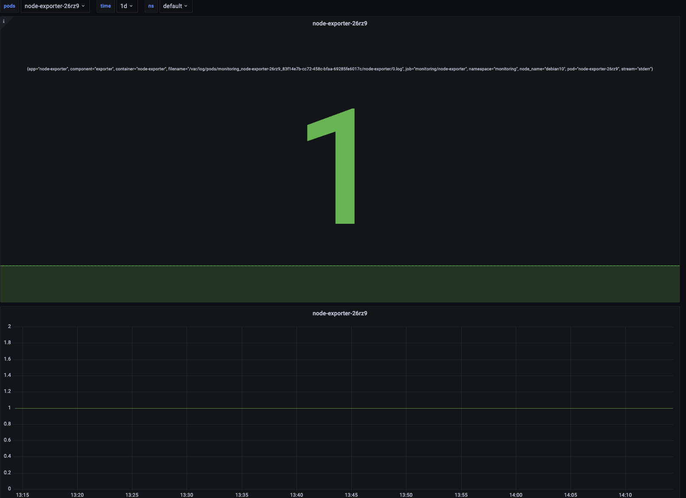
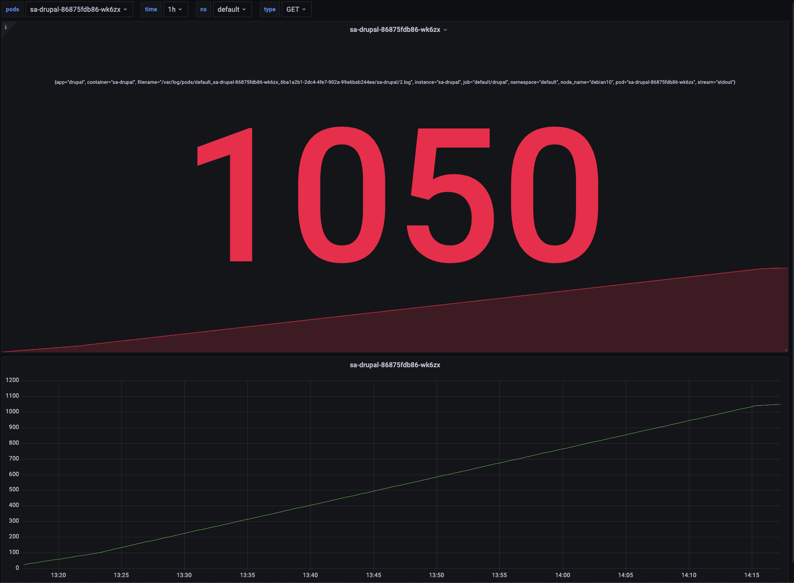
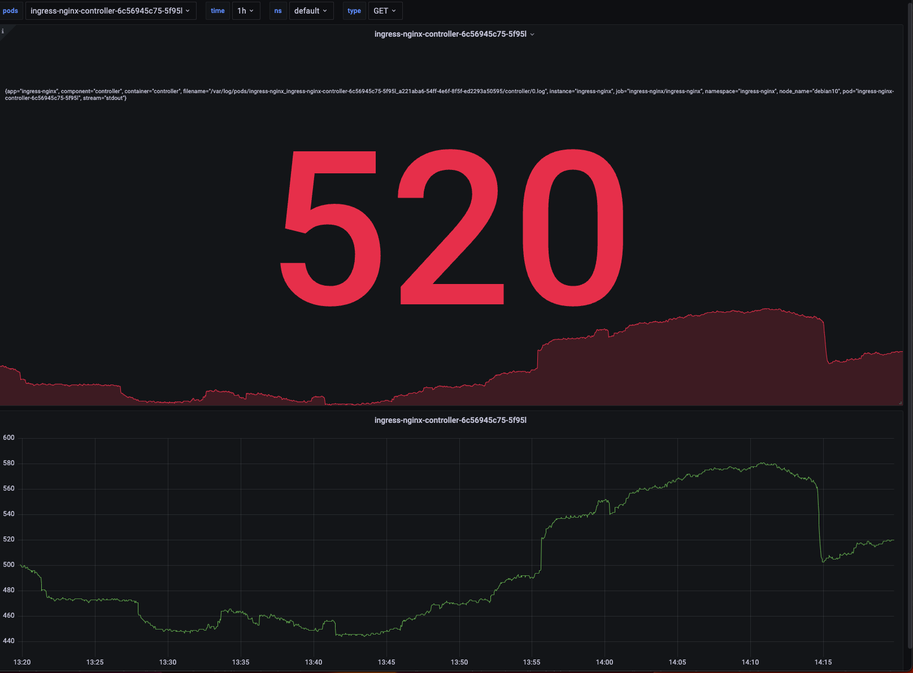

# 17.Log. Grafana Loki.

## Hometask

- [x] Deploy Grafana loki inside your cluster
- [x] Create Grafana dashboard to monitor counts errors for the following application inside your cluster
    - [x] Jenkins
    - [x] Ingress
    - [x] node-exporter
- [x] Drupal|Joomla|Wordpress components (these CMS should be deployed from previous home-work)
- [x] Dashboard style can be any of your choice
- [x] Counts of error should be as parameter from list: 5m, 1h, 1d

### Attachments

I created dashboard with pod,type and time selection (include "all" pods) for count several types of logs

#### All pods and 5m

#### Ingress and 1h

#### Node-exorter and 1d

#### Drupal and Ingress by GET 

