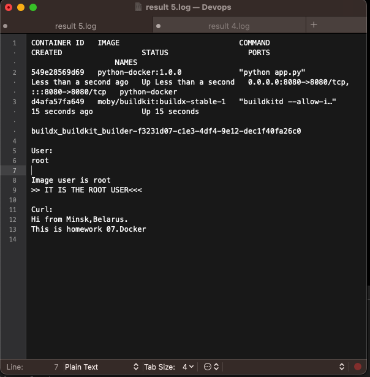
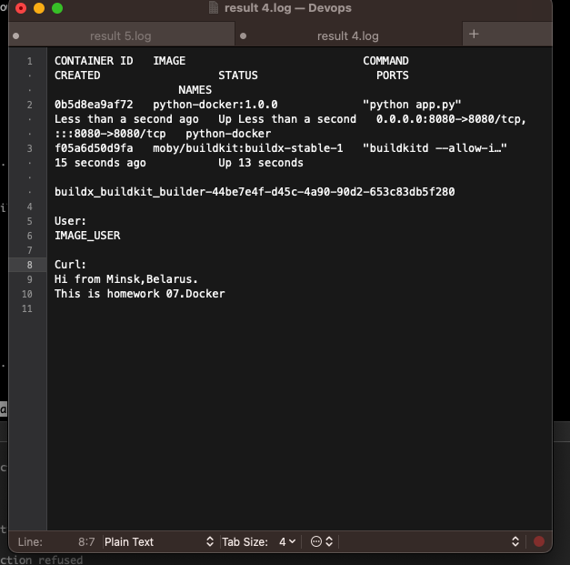
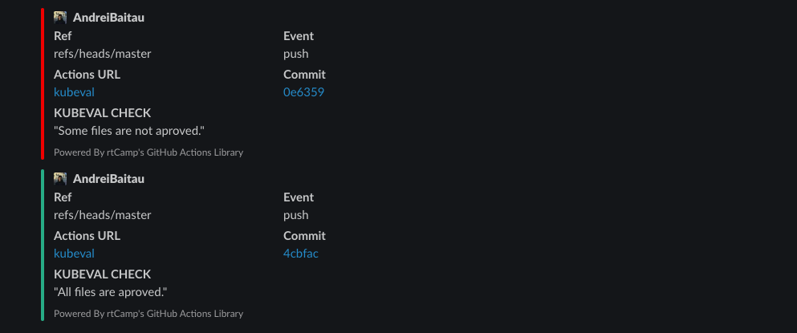

# 18.Tests

## Docker

- [x] Automate Docker images test by github action:

    - [x] deploy docker image for test
    - [x] test by requesting data from image
    - [x] test if image has not root access inside

Link to docker.action repo >> [Link](https://github.com/AndreiBaitau/docker.action)

Link to action >> [Link](https://github.com/AndreiBaitau/docker.action/actions/runs/3900168446)

### Check with root user



### Check with not root user



### Yaml file

```yaml
name: Task 

on:
  push:
    branches:
      - "main"


jobs:
  docker:
    runs-on: ubuntu-latest
    env:
      image_name: "python-docker"
      result_file: result.log
    outputs:
      out-job-status: ${{ job.status }}
    steps:
       
      - name: Checkout
        uses: actions/checkout@v2
       
      - name: Set up Docker Buildx
        uses: docker/setup-buildx-action@v2
     
      - name: Build Dokerimage
        run: |
          docker build -f python.Dockerfile . --network=host -t ${{ env.image_name }}:1.0.0
          #docker run --rm -p 8080:8080 --name hm  ${{ env.image_name }}:1.0.0
          docker run -d  -p 8080:8080 --name ${{ env.image_name }} -t ${{ env.image_name }}:1.0.0
          docker ps >> ${{ env.result_file }}
          sleep 5
       
      - name: Check for Doker user
        id: user
        run: |
          echo -e "\nUser:"  >> ${{ env.result_file }}
          docker exec ${{ env.image_name }} whoami >> ${{ env.result_file }}
          echo "user=$(docker exec ${{ env.image_name }} whoami)" >> $GITHUB_OUTPUT
      
      - name: Warning if user is root
        if: ${{ steps.user.outputs.user == 'root' }}
        run: echo "Image user is ${{ steps.user.outputs.user }} \n >> IT IS THE ROOT USER<<<" >> ${{ env.result_file }} 
     
  
      - name: Curl check
        run: |
          echo "\nCurl: \n "  >> ${{ env.result_file }}
          curl http://172.17.0.3:5000 >> ${{ env.result_file }}
      
      - name: result
        uses: actions/upload-artifact@v2 
        with:
          path: ${{ env.result_file }}
```

## Kubeval

- [x] Create CI for testing Kubernetes manifests using kubeval

    - [x] start on push or create PR to manifests repository
    - [x] all tools are inside container/pods
    - [x]  integrate notification about status of validation
    - [x]  (optional) if you have more then one manifest, you have to implement parallel validation for them

Link to action where some files not approved >> [Link](https://github.com/AndreiBaitau/sa2-22-22-git/actions/runs/3885496168)

Link to action where all files approved >> [Link](https://github.com/AndreiBaitau/sa2-22-22-git/actions/runs/3885485520)


### Yaml file

```yaml
name: kubeval

on: [push, pull_request]

jobs:
  check-dir-with-files:
    runs-on: ubuntu-latest
    outputs:
      files: ${{ env.files }}
    steps:
      - uses: actions/checkout@v2
        id: files
      - run: |
              yaml_files="$(ls -d ./18.K8s/* | jq -R -s -c 'split("\n")[:-1]')"
              echo "files=`echo -n $yaml_files`" >> $GITHUB_ENV
  kubeval_check:
    needs: check-dir-with-files
    runs-on: ubuntu-latest
    strategy:
      matrix:
        manifest-files: ${{fromJson(needs.check-dir-with-files.outputs.files)}}
      fail-fast: false
    steps:
      - uses: actions/checkout@v2 
      - name: Checking files with kubeval
        uses: instrumenta/kubeval-action@master
        with: 
          files: ${{matrix.manifest-files}}
      - name: Slack Notificationi
        if: ${{ failure() }}
        uses: rtCamp/action-slack-notify@v2
        env:
          SLACK_CHANNEL: git-test
          SLACK_COLOR: fa0000
          SLACK_ICON: https://avatars.mds.yandex.net/i?id=ab4d8466aeb3ace0427503c69b9583ec296c3081-5295804-images-thumbs&n=13
          SLACK_MESSAGE: |-
            "Some files are not aproved."
          SLACK_TITLE: 'KUBEVAL CHECK'
          SLACK_USERNAME: Andrei Baitov
          SLACK_WEBHOOK: ${{ secrets.SLACK_WEBHOOK }}
  slack:
    needs: kubeval_check
    runs-on: ubuntu-latest
    steps:
      - name: Slack Notificationi
        #if: ${{ failure() }}
        uses: rtCamp/action-slack-notify@v2
        env:
          SLACK_CHANNEL: git-test
          SLACK_COLOR: 00b899
          SLACK_ICON: https://avatars.mds.yandex.net/i?id=ab4d8466aeb3ace0427503c69b9583ec296c3081-5295804-images-thumbs&n=13
          SLACK_MESSAGE: |-
            "All files are aproved."
          SLACK_TITLE: 'KUBEVAL CHECK'
          SLACK_USERNAME: Andrei Baitov
          SLACK_WEBHOOK: ${{ secrets.SLACK_WEBHOOK }} 
```

### Slack

