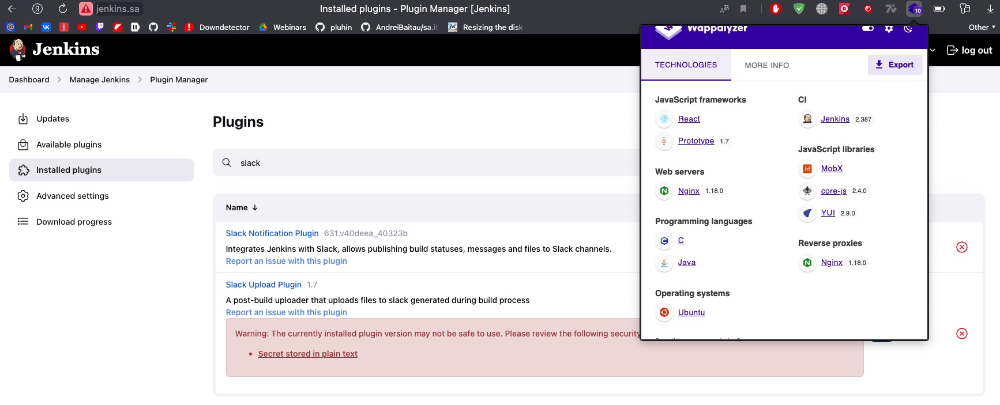
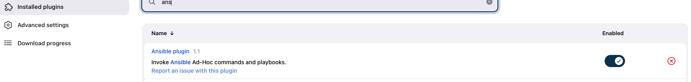
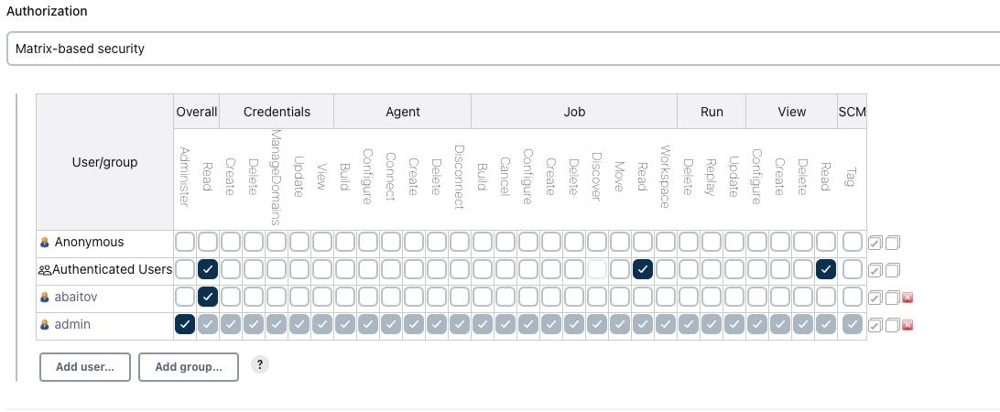
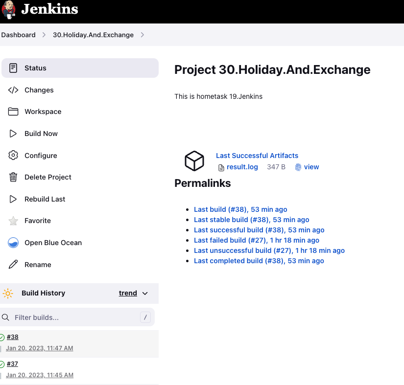
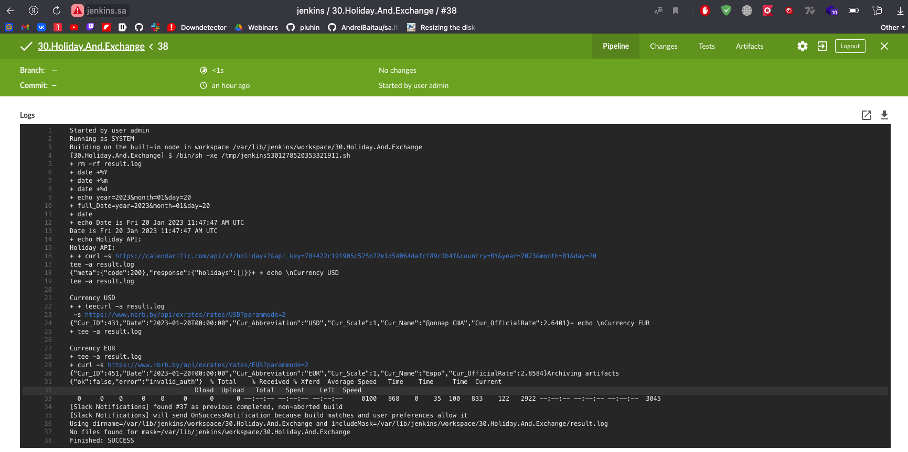

# 19.Jenkins.Start

## Deploy Jenkins inside your home environment

- [x] Install Jenkins
- [x] Setup the following
    - [x] install plugins: Ansible, slack notification
    - [x] add restricted user to view Jobs, without any changes inside Jobs and Jenkins settings
- [x] Hide Jenkins behind the web server (Nginx)







## Job

- [x] Create job to run each day and collect data and send as artefacts to the slack:
   - [x]  Check if today holiday in Belarus
   - [x]  Inform about exchange rates for current day (please find any)
   - [x]  Can be included in one file-artefacts or simple message in slack





### xml file 

```xml
<?xml version='1.1' encoding='UTF-8'?>
<project>
  <actions/>
  <description>This is hometask 19.Jenkins</description>
  <keepDependencies>false</keepDependencies>
  <properties>
    <com.sonyericsson.rebuild.RebuildSettings plugin="rebuild@1.34">
      <autoRebuild>false</autoRebuild>
      <rebuildDisabled>false</rebuildDisabled>
    </com.sonyericsson.rebuild.RebuildSettings>
  </properties>
  <scm class="hudson.scm.NullSCM"/>
  <canRoam>true</canRoam>
  <disabled>false</disabled>
  <blockBuildWhenDownstreamBuilding>false</blockBuildWhenDownstreamBuilding>
  <blockBuildWhenUpstreamBuilding>false</blockBuildWhenUpstreamBuilding>
  <triggers>
    <hudson.triggers.TimerTrigger>
      <spec>@daily</spec>
    </hudson.triggers.TimerTrigger>
  </triggers>
  <concurrentBuild>false</concurrentBuild>
  <builders>
    <hudson.tasks.Shell>
      <command>rm -rf result.log
full_Date=$(echo year=$(date +%Y)\&amp;month=$(date +%m)\&amp;day=$(date +%d))
echo &quot;Date is $(date)&quot;
echo &quot;Holiday API: &quot;
curl -s &quot;https://calendarific.com/api/v2/holidays?&amp;api_key=******&amp;country=BY&amp;${full_Date}&quot; | tee -a result.log

echo &quot;\nCurrency USD&quot; | tee -a result.log
curl -s &quot;https://www.nbrb.by/api/exrates/rates/USD?parammode=2&quot;| tee -a result.log
echo &quot;\nCurrency EUR&quot;| tee -a result.log
curl -s &quot;https://www.nbrb.by/api/exrates/rates/EUR?parammode=2&quot;| tee -a result.log</command>
      <configuredLocalRules/>
    </hudson.tasks.Shell>
  </builders>
  <publishers>
    <hudson.tasks.ArtifactArchiver>
      <artifacts>result.log</artifacts>
      <allowEmptyArchive>false</allowEmptyArchive>
      <onlyIfSuccessful>true</onlyIfSuccessful>
      <fingerprint>false</fingerprint>
      <defaultExcludes>true</defaultExcludes>
      <caseSensitive>true</caseSensitive>
      <followSymlinks>false</followSymlinks>
    </hudson.tasks.ArtifactArchiver>
    <jenkins.plugins.slack.SlackNotifier plugin="slack@631.v40deea_40323b">
      <baseUrl></baseUrl>
      <teamDomain></teamDomain>
      <authToken></authToken>
      <tokenCredentialId>slack_webhook</tokenCredentialId>
      <botUser>false</botUser>
      <room></room>
      <sendAsText>false</sendAsText>
      <iconEmoji></iconEmoji>
      <username></username>
      <startNotification>false</startNotification>
      <notifySuccess>true</notifySuccess>
      <notifyAborted>false</notifyAborted>
      <notifyNotBuilt>false</notifyNotBuilt>
      <notifyUnstable>false</notifyUnstable>
      <notifyRegression>false</notifyRegression>
      <notifyFailure>false</notifyFailure>
      <notifyEveryFailure>false</notifyEveryFailure>
      <notifyBackToNormal>false</notifyBackToNormal>
      <notifyRepeatedFailure>false</notifyRepeatedFailure>
      <includeTestSummary>false</includeTestSummary>
      <includeFailedTests>false</includeFailedTests>
      <uploadFiles>true</uploadFiles>
      <artifactIncludes>/var/lib/jenkins/workspace/30.Holiday.And.Exchange/result.log</artifactIncludes>
      <commitInfoChoice>NONE</commitInfoChoice>
      <includeCustomMessage>true</includeCustomMessage>
      <customMessage></customMessage>
       <customMessageSuccess>
Daily exchange and if holiday today</customMessageSuccess>
      <customMessageAborted></customMessageAborted>
      <customMessageNotBuilt></customMessageNotBuilt>
      <customMessageUnstable></customMessageUnstable>
      <customMessageFailure></customMessageFailure>
    </jenkins.plugins.slack.SlackNotifier>
    <SlackUploader plugin="slack-uploader@1.7">
      <channel>jenkins-baitov</channel>
      <token>https://hooks.slack.com/services/******</token>
      <filePath>/var/lib/jenkins/workspace/30.Holiday.And.Exchange/*</filePath>
    </SlackUploader>
  </publishers>
  <buildWrappers/>
</project>

```