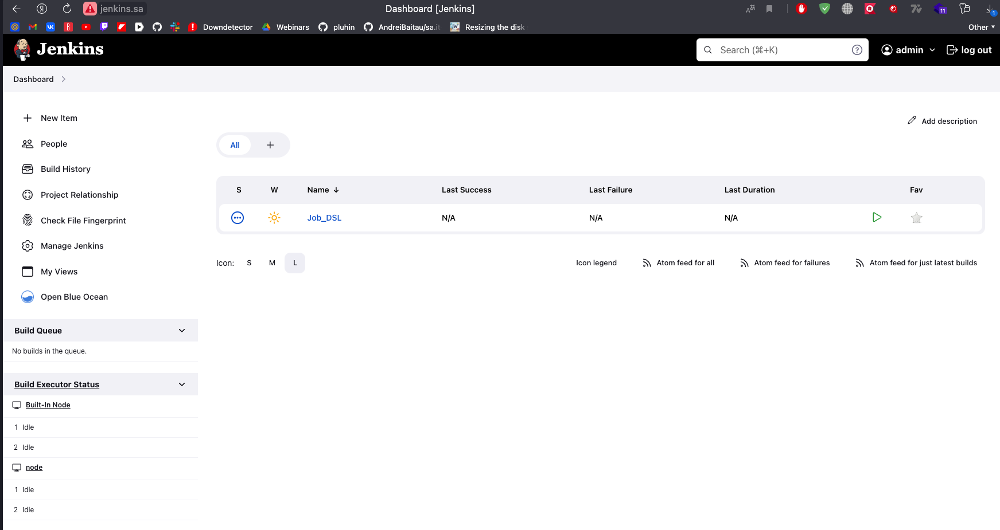
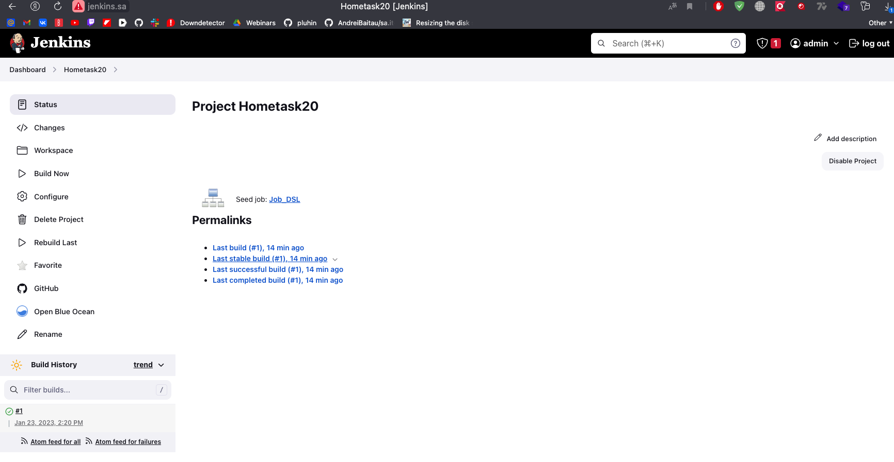
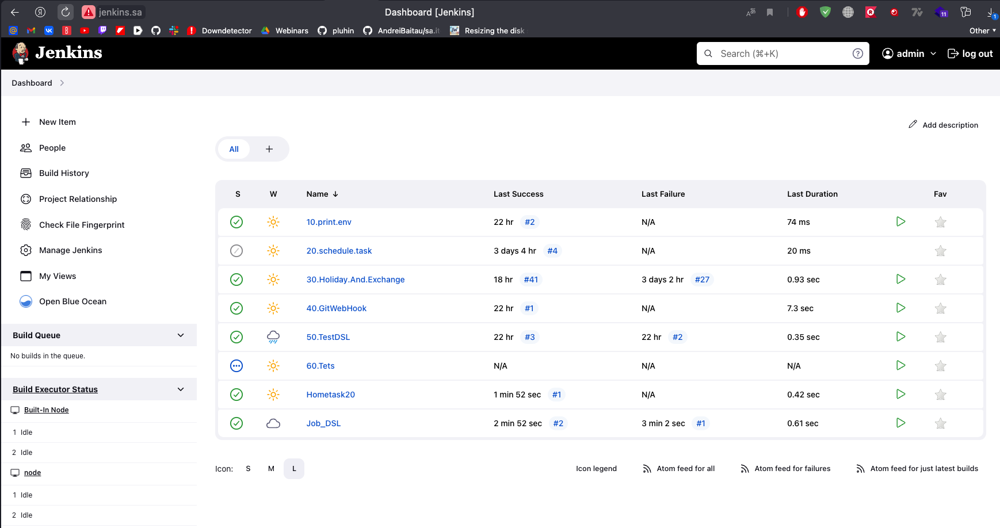

# 20. Jenkins. Routine

## Hometask

- [x] Add to your Jenkins job-dsl plugin
- [x] Create repository with jobs from the Jenkins (simple add there folder jobs from Jenkins server)
- [x] Seed job:
    - [x] Included in Jenkins configuration as code file
    - [x] Task steps:
        - [x] Create folder for jobs
        - [x] Clone repository with jobs folders and xml files into created folder
- [x] Run this job on webui and check result, jobs should be created and are visible

## Steps 

### Upload jobs dir to git

GitHub link -> [Link](https://github.com/AndreiBaitau/jenkins/tree/master)


### Edit CasC file

```yaml
jobs:
  - script: >
     job('Job_DSL') {
             scm {
                git {
                  remote {
                     url 'https://github.com/AndreiBaitau/jenkins.git'
               }
            branch('master')
            }
          }
        steps {
          dsl {
            external('Test.groovy')

          }
        }
      }
```

### Run jenkins without previous jobs



### Run DSL jobs




### Reboot jenkins

See result



### Test.groovy

```groovy
job("Hometask20"){
   scm {
        github('AndreiBaitau/jenkins', 'master')
    }
            steps {
              shell('''
                ls -l
                pwd
                rm -rf /var/lib/jenkins/jobs/*0.*
                pwd
                ls -l /var/lib/jenkins/jobs/
                mv /var/lib/jenkins/workspace/Hometask20/jobs/* '/var/lib/jenkins/jobs/'
                ls -l /var/lib/jenkins/jobs/
''')
     
        }

    }
```