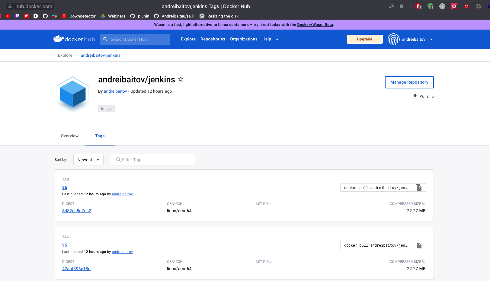
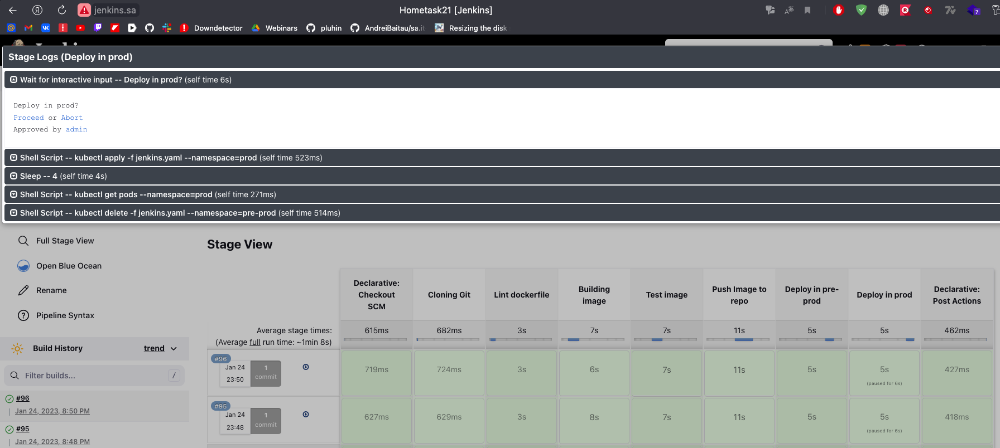
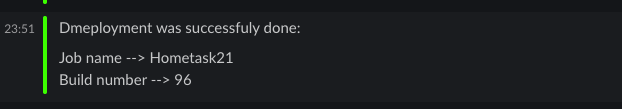

# 21.Jenkins. Docker and Pod

- [x]Repository content:
    - [x]Dockerfiles with application inside
    - [x]Jenkinsfile with pipeline code
- [x]Pipeline steps are:
    - [x]Checkout code
    - [x]Validate Dockerfile (https://github.com/hadolint/hadolint)
    - [x]Build image
    - [x]Test image (run and check if webUI of application is accessible)
    - [x]Push image to register (any)
- [x]Deployment in two namespaces in sequence with manual approve from Jenkins WebUI
    - [x]Deploy in namespace pre-prod
    - [x]Test if deployment done
    - [x]Display message about status of deployment and approve interface on Jenkins WebUI
    - [x]deploy in namespace prod
    - [x]cleaning: remove deployment from pre-prod
- [x]Notification

## Repository 

Git Repo --> [Link](https://github.com/AndreiBaitau/jenkins/tree/master)

DockerHub repo --> [Link](https://hub.docker.com/r/andreibaitov/jenkins/tags)



## Pipeline 

### Jenkinsfile

```groovy
pipeline {
      environment {
    registry = "andreibaitov/jenkins"
    registryCredential = 'docker'

  }
      agent { label 'master'}
  stages {
      

    stage('Cloning Git') {
      steps {
        
        
        git 'https://github.com/AndreiBaitau/jenkins.git'
        sh 'ls -l'
      }
    }

    stage ("Lint dockerfile") {
        agent {
            docker {
                image 'hadolint/hadolint:latest-debian'
                label 'master'
            }
        }
        steps {
            sh 'hadolint Dockerfile | tee -a hadolint_lint.txt'
        }
        post {
            always {
                archiveArtifacts 'hadolint_lint.txt'
                            
            }

        }
    }
   
    stage('Building image') {
      steps{ 

        script {
             dockerImage = docker.build registry + ":$BUILD_NUMBER" , "--network host ."
        }
      }
    }
   
    stage('Test image') {
      steps{
        sh "docker run -d -p 81:81 --name $BUILD_NUMBER -t $registry:$BUILD_NUMBER"
        sh" sed -i 's/latest/$BUILD_NUMBER/' jenkins.yaml" //change image for kubernetes
        sh "sleep 5" 
        sh 'curl http://172.17.0.2:5000'  //check curl
        sh "docker kill $BUILD_NUMBER"   //kill build
        
      }
    }
    stage('Push Image to repo') {
      steps{
        script {
            docker.withRegistry( '', registryCredential ) {
            dockerImage.push()
          }
        }
      }
    }
    stage('Deploy in pre-prod') {
      steps{
          withKubeConfig([credentialsId: 'mykubeconfig']) {
          sh "kubectl get pods --namespace=pre-prod"
          sh "kubectl apply -f jenkins.yaml --namespace=pre-prod"
          sleep 4
          sh "kubectl get pods --namespace=pre-prod"
          }
      }
    }
    stage('Deploy in prod') {
      steps{
        script {
          catchError(buildResult: 'SUCCESS', stageResult: 'FAILURE'){
            def depl = true
            try{
              input("Deploy in prod?")
            }
            catch(err){
              depl = false
            }
            try{
              if(depl){
                withKubeConfig([credentialsId: 'mykubeconfig']) {
                sh "kubectl apply -f jenkins.yaml --namespace=prod"
                sleep 4
                sh "kubectl get pods --namespace=prod"
                sh "kubectl delete -f jenkins.yaml --namespace=pre-prod"
                }
              }
            }
            catch(Exception err){
              error "Deployment failed"
            }
          }
        }
      }
    }
  }
  post {
    success {
      slackSend (color: '#00FF00', message: "\1 Deployment was successfuly done:\1 \n\n Job name --> ${env.JOB_NAME} \n Build number --> ${env.BUILD_NUMBER}")
    }
    failure {
      slackSend (color: '#FF0000', message: "Deployment was failed: \n\n Job name --> ${env.JOB_NAME} \n Build number --> ${env.BUILD_NUMBER}")
    }
  }
}
```



### Notification Slack 

