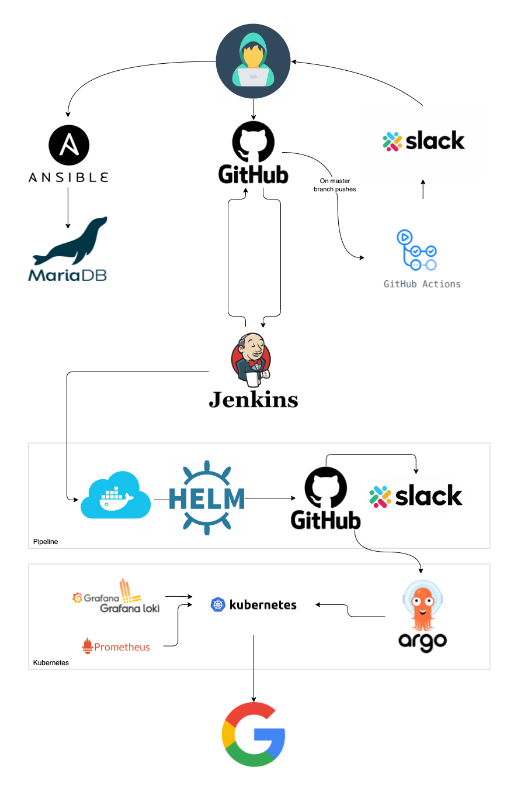

# IT-Academy DevOps course / Final Project :octocat:

### Project reporter: Andrei Baitau 

### Group number: md-sa2-22-22

---

## Description of applications for deployment

### First application

- **Name of application:** Drupal 
- **Database:** MariaDB
- **Link to repository:**
    - **Docker (drupal branch):** [Link here](https://github.com/AndreiBaitau/project_drupal/tree/drupal)
    - **Helm (master branch):** [Link here](https://github.com/AndreiBaitau/project_drupal)

### Second application

- **Name of application:** Wordpress
- **Database:** MariaDB
- **Link to repository:**
    - **Docker (drupal branch):** [Link here](https://github.com/AndreiBaitau/project_wordpress/tree/wordpress)
    - **Helm (master branch):** [Link here](https://github.com/AndreiBaitau/project_wordpress) 

---

### Technologies which were used in project

- **Orchestration:** Kubernetes
- **Automation tools:** Jenkins, Github Actions, ArgoCD, Ansible
- **Source Control Management:** GitHub, DockerHub
- **Notification:** Slack, Telegram
- **Content Managment Systems:** Wordpress, Drupal
- **Monitoring:** Prometheus, Grafana and Grafana Loki.
- **Virtual machines:** Vagrant, VMWare Fusion, VirtualBox
- **Other tools:** Docker, Helm , MariaDB, NFS

---

### CI steps 

| **№** | **Action** | **Options** | **Description** |
|---|---|---|---|
| **1** | **Push changes to GitHub** |  | Dev pushes changed files to GitHub for further interception by Jenkins |
| **2** | **Jenkins pipeline** | In general: | Every midnight in Minsk, Jenkins checks repositories for changes. If there are some changes Jenkins starts the Job. |
|  |  | Job explonation: | Firstly Jenkins clones repositories with necessary branches in parallel. Then checks Dockerfile with Hadolint. After that, builds image and pushes to DockerHub. At the end of pipeline Jenkins changes version and package Helm, and pushes changed files to all repositories. Finally sends notification to Slack |
| **3** | **GitAction** | Kubelinter: | Check yaml files in Helm-source folder. Sends notification to Slack and Telegram|
|  |  | Pages build: | _created by GitHub Pages_ |
| **4** | **ArgoCD** |  | Waiting for changes in repository. If there are some changes, starts Sync and than Refreshing apps. Sends notification to Slack |

---

### Performance testing

|  | **Statistic** | |  |
|---|---|:---:|---|
| 1 | **Action** | **Options** | **Time** |
| 2 | **Pushing changes to git** |  | 5 s |
|  |  |  |  |
| 3 | **Jenkins pipeline** | Build with new image | ~ 3 min |
|  |  | Build with existing image | ~ 30 sec |
|  |  |  |  |
| 4 | **GitHub Actions** | Check kube-lint | 30 sec |
|  |  | pages  | 1 min |
|  |  |  |  |
| 5 | **ArgoCD** | Sync (waiting for git update) | ~ 1 min |
|  |  | Refresh with new image | ~ 2 min |
|  |  | Refresh with existing image | ~ 30 sec |
|  |  | Rollback | ~ 3.5 min |
|  |  |  |  |
| 6 | **Full Deploy in k8s  (when you can use app)** | With new image  | ~ 3.5 min |
|  |  | Existing image | ~ 1 min |
| - | - | - | - |
|  |  | **TOTAL RESULT** |  |
| 7 | **Total time** | With new image and GitActions | ~ 8.5 min |
|  |  | With existing image |  ~ 4.5 min  |

---

### Other Links:

Drupal project repository --> [Link](https://github.com/AndreiBaitau/project_drupal) 

Wordpress project repository --> [Link](https://github.com/AndreiBaitau/project_wordpress) 

Wordpress official repository --> [Link](https://github.com/WordPress/WordPress)

Drupal official repository --> [Link](https://github.com/docker-library/drupal)

ArgoCD project repository --> [Link](https://github.com/AndreiBaitau/argo-cd/tree/project)

Presentation --> [Link](https://docs.google.com/presentation/d/1_OrhKzUt4OyABjzXEjQ8U2yChn84MCzJ8i43kDiq8Ik/edit?usp=sharing)

---

### Project scheme.

