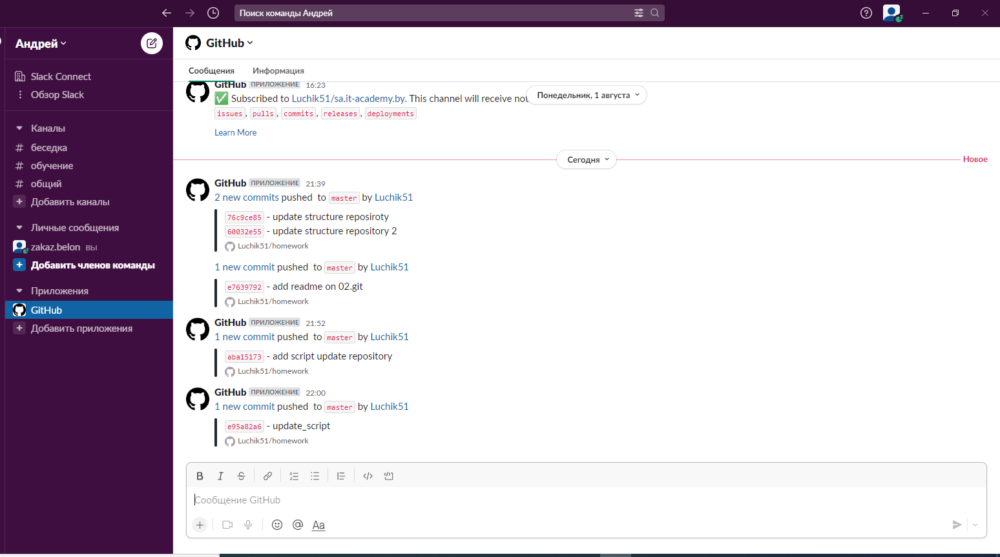

## Git local

## History

```bash
    1  ls
    2  cd Documents/
    3  mkdir Git
    4  cd Git
    5  mkdir 02.GIT.Local
    6  cd 02.GIT.Local/
    7  git init
    8  git config --global user.email "zakaz.belon@gmail.com" git config --global user.email "zakaz.belon@gmail.com"
    9  git config --global user.email "zakaz.belon@gmail.com"
   10  git config --global user.name "Andrei Luchanok"
   11  nano 1.txt
   12  git commit -m "first commit"
   13  git add --all
   14  git commit -m "first commit"
   15  nano 2.txt
   16  git add --all
   17  git commit -m "second commit"
   18  git checkout -b dev 
   19  git log --oneline
   20  nano 2.txt
   21  git add --all
   22  git commit -m "3 commit"
   23  nano 1.txt
   24  git add --all
   25  git commit -m "4 commit"
   26  git checkout -b features/do_one
   27  nano feat.txt
   28  git add --all
   29  git commit -m "5 commit"
   30  git checkout master
   31  git checkout -b hotfix/we_gonna_die
   32  nano 6.txt
   33  git add --all
   34  git commit -m "6 commit"
   35  git status
   36  git log --oneline
   37  git checkout master
   38  git merge dev 
   39  git merge features/do_one
   40   git log --oneline
   41  git branch dev 
   42  git checkout dev 
   43  git checkout master
   44  git merge hotfix/we_gonna_die
   45  git checkout dev 
   46  git merge hotfix/we_gonna_die
   47   git log --oneline
   48   git checkout features/do_one 
   49  git merge hotfix/we_gonna_die 
   50  history >> README.md
   51  ls
   52  nano README.md 
   53  ssh_keygen
   54  git remote add origin git@github.com:Luchik51/homework.git
   55  git remote
   56  git branch -a
   57  git remote add homework_github git@github.com:Luchik51/sa.it-academy.by
   58  git remote
   59  cd ../
   60  mkdir sa.it-academy.by
   61  cd sa.it-academy.by/
   62  git clone homework_github
   63  git clone git@github.com:Luchik51/sa.it-academy.by
   64  cd ../
   65  cd /tmp/
   66  git clone git@github.com:AlexeyAsgard/sa.it-academy.by.git
   67  ssh-keygen -t rsa -C "Andrei Luchanok"
   68  cd ../
   69  ls
   70  ~
   71  cd ../
   72  ls
   73  cd /Documents/Git
   74  ~
   75  ~
   76  cd Documents/Git/sa.it-academy.by/
   77  git clone git@github.com:Luchik51/sa.it-academy.by
   78  git remote
   79  git remote
   80  ls
   81  cd sa.it-academy.by/
   82  ls
   83  git checkout md-sa2-21-22
   84  ls
   85  mkdir Andrei_Luchanok
   86  cd Alexander_Vinichenko/
   87  ls
   88  cd ../
   89  cd Andrei_Luchanok/
   90  mkdir 02.Git.local
   91  cd 02.Git.local/
   92  ls
   93  git branch -a
   94  cp ~/Documents/Git/02.GIT.Local/README.md ~/Documents/Git/sa.it-academy.by/sa.it-academy.by/Andrei_Luchanok/02.Git.local/
   95  ls
   96  git pull
   97  git push
   98  git remote
   99  git rebase origin/md-sa2-21-22 
  100  git push origin -f
  101  git pull
  102  git push origin --all
  103  nano .git/config
  104  cd ~/Documents/Git/sa.it-academy.by/sa.it-academy.by/
  105  nano .git/config
  106  git push origin --all
  107  git pull
  108  git branch
  109  git status
  110  git add -all
  111  git add --all
  112  git push origin --all
  113  git commit -m "homework 02 readme"
  114  git push origin --all
  115  cd ~/Documents/Git/02.GIT.Local/
  116  git checkout master 
  117   git log --oneline
  118  echo "master" >> README.md 
  119   git log --oneline >> README.md
  120  cat README.md 
  121  git checkout dev 
  122  echo "dev" >> README.md 
  123   git log --oneline >> README.md
  124  git checkout features/do_one 
  125  echo "features/do_one
  126  echo "features/do_one" >> README.md 
  127   git log --oneline >> README.md
  128  git checkout hotfix/we_gonna_die 
  129  echo "hotfix/we_gonna_die" >> README.md 
  130   git log --oneline >> README.md
  131  nano README.md 
  132  cp ~/Documents/Git/02.GIT.Local/README.md ~/Documents/Git/sa.it-academy.by/sa.it-academy.by/Andrei_Luchanok/02.Git.local/
  133  cd  ~/Documents/Git/sa.it-academy.by/
  134  ls
  135  cd sa.it-academy.by/
  136  ls
  137  git push origin --all
  138  git add --all
  139  git commit -m "homework 02 readme add branch and commits"
  140  git push origin --all
  141  cd  ~/Documents/Git/02.GIT.Local/
  142  git branch -a
  143  git remote 
  144  git pull origin --all
  145  git pull origin
  146  git pull homework_github 
  147  git remote -v
  148  git pull origin
  149  git branch 
  150  git checkout master 
  151  git pull origin
  152  git fetch origin 
  153  git branch
  154  git rebase
  155  git push origin
  156   git push --set-upstream origin master
  157   git push --set-upstream origin
  158   git push origin
  159  git branch 
  160   git push --set-upstream origin hotfix/we_gonna_die 
  161   git push --set-upstream origin dev
  162   git push --set-upstream origin hotfix/we_gonna_die 
  163  cd ~\YandexDisk-Gluchik51@yandex.ru\Обучение Linux\Git
  164  cd ~/YandexDisk-Gluchik51@yandex.ru/Обучение Linux/Git
  165  cd ~/YandexDisk-Gluchik51@yandex.ru/
  166  cd YandexDisk-Gluchik51\@yandex.ru/Обучение\ Linux/Git/
  167  git remote
  168  cd 02.GIT.Local/
  169  git remote
  170  git remote -v
  171  cd YandexDisk-Gluchik51@yandex.ru\it-academy\Git\sa.it-academy.byls
  172  cd YandexDisk-Gluchik51\@yandex.ru/it-academy/Git/
  173  cd sa.it-academy.by/sa.it-academy.by/Andrei_Luchanok/02.Git.local/
  174  git status
  175  git log --oneline 
  176  cd ..//
  177  cd 02.Git.local/
  178  git branch 
  179  git branch origin/md-sa2-21-22
  180  git branch 
  181  git checkout 
  182  git checkout -a
  183  git log --oneline
  184  cd ~/YandexDisk-Gluchik51\@yandex.ru/it-academy/Git/Homework/
  185  git log --oneline
  186  cd 02.GIT.Local/
  187  git log --oneline
  188  git checkout master 
  189  git log --oneline
  190  cd ../
  191  cd 03.GIT.Local/
  192  git log --oneline
  193  git remote
  194  git remote -v
  195  git remote rename origin origin_github
  196  cat .git/
  197  cat .git/config 
  198  git config --global user.name "Андрей Лученок"
  199  git config --global user.email "zakaz.belon@gmail.com"
  200  cat .git/config 
  201  git remote add origin_gitlab git@gitlab.com:zakaz.belon/homework.git
  202  git remote add origin_bitbucket git@bitbucket.org:luchik51/homework.git
  203  git remote -v
  204  git push -u origin_bitbucket master
  205  git push -u origin_bitbucket dev 
  206  git push -u origin_gitlab --all
  207  git checkout dev 
  208  git checkout -b features/do_one
  209  nano feat.txt
  210  git add --all
  211  git commit -m "new features 1"
  212  nano update_all_git.sh
  213  chmod +x update_all_git.sh 
  214  ls -l
  215  cd YandexDisk-Gluchik51\@yandex.ru/it-academy/Git/Homework/03.GIT.Local/
  216  ls -h
  217  update_all_git.sh
  218  nano update_all_git.sh 
  219  update_all_git.sh
  220  chmod +x ./update_all_git.sh 
  221  ./update_all_git.sh 
  222  cat update_all_git.sh 
  223  git push origin_github --all
  224  git remote -v
  225  cd ../
  226  ls
  227  git fetch origin_gitlab
  228  git pull 
  229  git status
  230  mv 1.txt 02.GIT.Local/
  231  git status
  232  git add --all
  233  git commit -m "update structure reposiroty"
  234  git remote -v
  235  git push origin --all
  236  git remote add origin_bitbucket git@bitbucket.org:luchik51/homework.git
  237  git push origin_bitbucket  --all
  238  mv 2.txt 02.GIT.Local/
  239  mv 6.txt 02.GIT.Local/
  240  mv feat.txt 02.GIT.Local/
  241  git add --all
  242  git commit -m "update structure repository 2"
  243  git push origin_bitbucket  --all
  244  mkdir 03.GIT.Local
  245  git add --all
  246  git commit -m "add 03.git.local"
  247  git push origin_bitbucket  --all
  248  mkdir 04.GIT.Local
  249  git add --all
  250  git commit -m "add 04.git.local"
  251  git push origin_bitbucket  --all
  252  cd 03.GIT.Local/
  253  touch README.md
  254  cd ..//
  255  git add --all
  256  git commit -m "add 03.git.local readme"
  257  git push origin_bitbucket  --all
  258  git status
  259  git push
  260  git remote remove origin
  261  git remote add origin_github git@github.com:zakaz.belon/homework.git
  262  git push
  263  git push origin_github   --all
  264  git remote -v
  265  git config --global user.name "Андрей Лученок"
  266  git config --global user.email "zakaz.belon@gmail.com"
  267  git push origin_github   --all
  268  git remote remove origin_github origin_
  269  git remote remove origin_github
  270  git remote add origin_github git@github.com:Luchik51/homework.git
  271  git push origin_github   --all
  272  git status
  273  git add --all
  274  git commit -m "add readme on 02.git"
  275  git push origin_github   --all
  276  git status
  277  cd 03.GIT.Local/
  278  git status
  279  nano 3.txt
  280  git status
  281  git push
  282  git push origin_github 
  283  git log --oneline 
  284  git remote -v
  285  git remote add origin_gitlab git@gitlab.com:zakaz.belon/homework.git
  286  git status
  287  git add --all
  288  git submodule update --remote --rebase
  289  git add --all
  290  git commit -m "add script update repository"
  291  git add ../update_all_git.sh 
  292  git status
  293  git status
  294  ls
  295  ls -l
  296  cd ..//
  297  ls -l
  298  git status
  299  git add --all
  300  git commit -m "add script update repository"
  301   ../update_all_git.sh 
  302  ./update_all_git.sh 
  303  nano ./update_all_git.sh 
  304  cd 02.GIT.Local/
  305  git checkout dev 
  306  cd ../
  307  ./update_all_git.sh 
  308  nano 02.GIT.Local/info.txt
  309  nano ./update_all_git.sh 
  310  ./update_all_git.sh update_script
  311  git log --oneline 
  312  history
  313  mkdir 03.GIT.Local
  314  history > 03.GIT.Local/README.md
```

##git log--oneline
```bash
$ git log --oneline
e95a82a (HEAD -> master, origin_gitlab/master, origin_github/master, origin_bitbucket/master) update_script
aba1517 add script update repository
e763979 add readme on 02.git
60032e5 update structure repository 2
76c9ce8 update structure reposiroty
f9339ed Merge branch 'hotfix/we_gonna_die'
8b22f43 (origin_gitlab/hotfix/we_gonna_die, origin_github/hotfix/we_gonna_die, origin_bitbucket/hotfix/we_gonna_die, hotfix/we_gonna_die) 6 commit
a1ecb79 5 commit
aa5c719 4 commit
bb67d57 3 commit
d23f8c3 second commit
e21a3bc first commit
```

##Script update_all_git.sh
```bash
#!/bin/bash
# This script update remote repository^ github, gitlab, bitbucket
comment=$1
git add --all
git commit -m "$comment"
Green="\033[0;32m"
git push origin_github --all
echo "${green}Github updated!"
git push origin_gitlab --all
echo "Gitlab updated!"
git push origin_bitbucket --all
echo "bitbucket updated!"
```
##Slack integration

