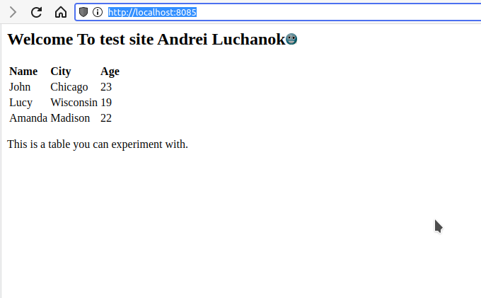
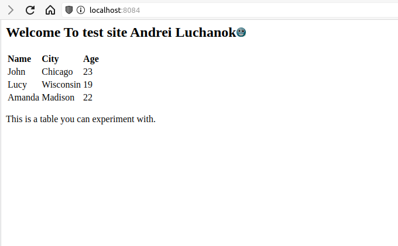

## History

```bash
 1637  vagrant up
 1638  vagrant destroy -f
 1639  vagrant up
 1640  vagrant destroy -f
 1641  vagrant up
 1642  vagrant ssh host2
 1643  vagrant destroy -f
 1644  vagrant up
 1645  vagrant ssh host2
 1646  vagrant destroy -f
 1647  vagrant up
 1648  vagrant destroy -f
 1649  vagrant up
 1650  vagrant destroy -f
 1651  vagrant up
 1652  vagrant package --output /tmp/my_image.box
 1653  vagrant ssh host1
 1654  vagrant package --base host1 --output /tmp/my_image1.box
 1655  vagrant package --base host2 --output /tmp/my_image1.box
 1656  vagrant status
 1657  vagrant package host1 --output /tmp/my_image1.box
 1658  vagrant package host2 --output /tmp/my_image2.box
 1659  vagrant cloud publish --release Luchik/test 1.0.0 virtualbox /tmp/my_image1.box
 1660  vagrant cloud publish --release Luchik/test2 1.0.0 virtualbox /tmp/my_image2.box
```

## Result of push vagrant box to vagrant cloud
```bash
vagrant cloud publish --release Luchik/test 1.0.0 virtualbox /tmp/my_image1.box
In a moment we will ask for your username and password to HashiCorp
Vagrant Cloud. After authenticating, we will store an access token locally on
disk. Your login details will be transmitted over a secure connection, and
are never stored on disk locally.

If you do not have an Vagrant Cloud account, sign up at
https://www.vagrantcloud.com

Vagrant Cloud username or email: Luchik
Password (will be hidden):
Token description (Defaults to "Vagrant login from LL-FACTOR-11"):
You are now logged in.
You are about to publish a box on Vagrant Cloud with the following options:
Luchik/test:   (v1.0.0) for provider 'virtualbox'
Automatic Release:     true
Do you wish to continue? [y/N]y
Saving box information...
Uploading provider with file /tmp/my_image1.box
Releasing box...
Complete! Published Luchik/test
Box:              Luchik/test
Description:
Private:          no
Created:          2022-08-18T11:23:20.144Z
Updated:          2022-08-18T11:24:07.551Z
Current Version:  N/A
Versions:         1.0.0
Downloads:        0
luchik@LL-FACTOR-11:~/Downloads/Disk500/05.Vagrant/4$ vagrant cloud publish --release Luchik/test2 1.0.0 virtualbox /tmp/my_image2.box
You are about to publish a box on Vagrant Cloud with the following options:
Luchik/test2:   (v1.0.0) for provider 'virtualbox'
Automatic Release:     true
Do you wish to continue? [y/N]y
Saving box information...
Uploading provider with file /tmp/my_image2.box
Releasing box...
Complete! Published Luchik/test2
Box:              Luchik/test2
Description:
Private:          no
Created:          2022-08-18T11:32:40.009Z
Updated:          2022-08-18T11:33:02.442Z
Current Version:  N/A
Versions:         1.0.0
Downloads:        0

```

## My Cloud Vagrant

Luchik/test1 (Debian11)
Luchik/test2 (Centos9 Stream)

My test site:
Debian11:

Centos9 Stream:

