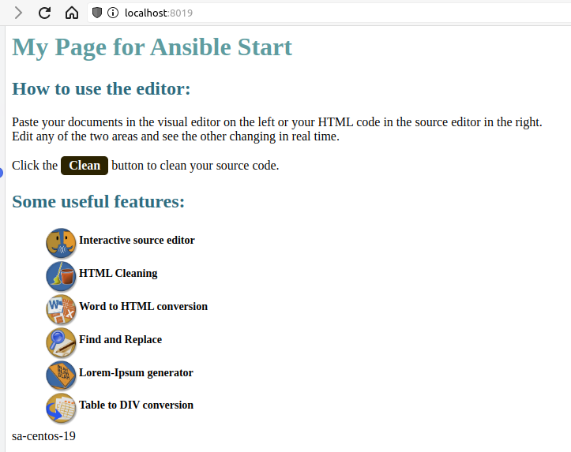
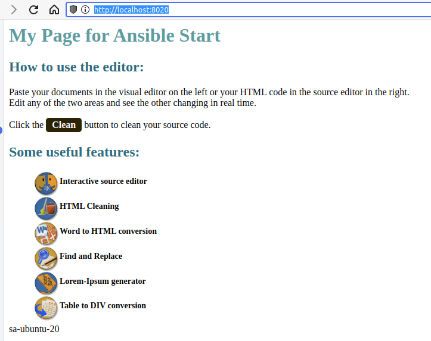

# 06. Ansible start

## List command

```bash
 1998  ssh -o ProxyCommand="ssh -W %h:%p -q jump_sa@178.124.206.53" -L 6443:127.0.0.1:6443 root@192.168.203.20 -f -N
 2002  ansible -i inventory.yaml -m shell -a "apt install nginx -y" -b host20 -u root
 2007  ansible -i inventory.yaml -m ping all_workers -u root
 2008  ansible -i inventory.yaml -m ping -b host19 -u root
 2009  ansible -i inventory.yaml -m shell -a "yum install nginx -y" -b host19 -u root
 2010* ansible -i inventory.yaml -m nx -y" -b host19 -u root
 2011  ansible -i inventory.yaml -m copy -a 'src=/html dest=/usr/share/nginx/html/' all_workers -u root
 2012* ansible -i inventory.yaml -m copy -a 'src=./' all_workers -u root
 2013  ansible -i inventory.yaml -m shell -a 'echo "uname -n">>/usr/share/nginx/html/index.html' all_workers -u root
 2014  ssh -o ProxyCommand="ssh -W %h:%p -q jump_sa@178.124.206.53" -L 8019:127.0.0.1:80 root@192.168.202.19 -f -N
 2015  ssh -o ProxyCommand="ssh -W %h:%p -q jump_sa@178.124.206.53" -L 8020:127.0.0.1:80 root@192.168.202.20 -f -N
 2016  ansible -i inventory.yaml -m shell -a 'systemctl restart nginx' all_workers -u root
 2017  ansible -i inventory.yaml -m copy -a 'src=./html/index.html dest=/usr/share/nginx/html/index.html' all_workers -u root
 2018  ansible -i inventory.yaml -m shell -a 'uname -n>>/usr/share/nginx/html/index.html' all_workers -u root
 2019  ansible -i inventory.yaml -m shell -a 'systemctl restart nginx' all_workers -u root
 2020  ansible -i inventory.yaml -m copy -a 'src=./html/index.html dest=/usr/share/nginx/html/index.html' all_workers -u root
 2021  ansible -i inventory.yaml -m shell -a 'uname -n>>/usr/share/nginx/html/index.html' all_workers -u root
 2022  ansible -i inventory.yaml -m shell -a 'systemctl restart nginx' all_workers -u root
 2023  ansible -i inventory.yaml -m copy -a 'src=./html/index.html dest=/usr/share/nginx/html/index.html' all_workers -u root
 2024  ansible -i inventory.yaml -m shell -a 'uname -n>>/usr/share/nginx/html/index.html' all_workers -u root
 2025  ansible -i inventory.yaml -m shell -a 'systemctl restart nginx' all_workers -u root
 2026  ansible -i inventory.yaml -m copy -a 'src=./html/index.html dest=/usr/share/nginx/html/index.html' -b host19 -u root
 2027  ansible -i inventory.yaml -m copy -a 'src=./html/index.html dest=/var/www/html/index.html' -b host20 -u root
 2028  ansible -i inventory.yaml -m shell -a 'uname -n>>/usr/share/nginx/html/index.html'  -b host19 -u root
 2029  ansible -i inventory.yaml -m shell -a 'uname -n>>/var/www/html/index.html'  -b host20 -u root
 2030  ansible -i inventory.yaml -m shell -a 'systemctl restart nginx' all_workers -u root
```

## Screenshot web sites

### Centos


### Ubuntu
