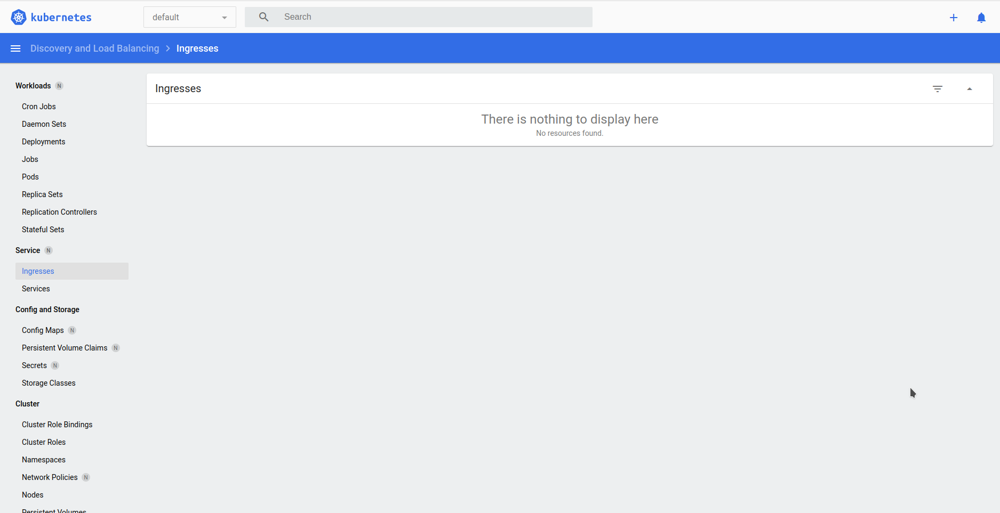

History install kubespray
```bash
PLAY RECAP ************************************************************************************************************************************************************
localhost                  : ok=3    changed=0    unreachable=0    failed=0    skipped=0    rescued=0    ignored=0
node1                      : ok=772  changed=145  unreachable=0    failed=0    skipped=1256 rescued=0    ignored=9
node2                      : ok=501  changed=92   unreachable=0    failed=0    skipped=734  rescued=0    ignored=2

Четверг 18 августа 2022  23:34:38 +0300 (0:00:00.154)       0:45:30.532 *******
===============================================================================
kubernetes/preinstall : Install packages requirements -------------------------------------------------------------------------------------------------------- 132.77s
download : download_file | Validate mirrors ------------------------------------------------------------------------------------------------------------------- 74.54s
kubernetes-apps/ansible : Kubernetes Apps | Lay Down CoreDNS templates ---------------------------------------------------------------------------------------- 62.53s
kubernetes-apps/ansible : Kubernetes Apps | Start Resources --------------------------------------------------------------------------------------------------- 43.75s
network_plugin/calico : Calico | Create calico manifests ------------------------------------------------------------------------------------------------------ 38.77s
bootstrap-os : Update Apt cache ------------------------------------------------------------------------------------------------------------------------------- 37.83s
download : download_container | Download image if required ---------------------------------------------------------------------------------------------------- 33.94s
download : download_container | Download image if required ---------------------------------------------------------------------------------------------------- 28.82s
container-engine/containerd : download_file | Download item --------------------------------------------------------------------------------------------------- 27.74s
kubernetes/control-plane : kubeadm | Initialize first master -------------------------------------------------------------------------------------------------- 27.61s
download : download_file | Download item ---------------------------------------------------------------------------------------------------------------------- 25.93s
download : download_container | Download image if required ---------------------------------------------------------------------------------------------------- 25.93s
network_plugin/calico : Start Calico resources ---------------------------------------------------------------------------------------------------------------- 25.51s
bootstrap-os : Assign inventory name to unconfigured hostnames (non-CoreOS, non-Flatcar, Suse and ClearLinux, non-Fedora) ------------------------------------- 24.69s
download : download_file | Download item ---------------------------------------------------------------------------------------------------------------------- 24.59s
kubernetes/kubeadm : Join to cluster -------------------------------------------------------------------------------------------------------------------------- 23.15s
container-engine/crictl : download_file | Download item ------------------------------------------------------------------------------------------------------- 21.31s
kubernetes/preinstall : Ensure kube-bench parameters are set -------------------------------------------------------------------------------------------------- 20.82s
download : download_container | Download image if required ---------------------------------------------------------------------------------------------------- 19.71s
container-engine/runc : download_file | Download item --------------------------------------------------------------------------------------------------------- 19.26s
```

# History
## Status
```bash
vagrant@ubuntu2204:~$ minikube kubectl -- get pods -A
    > kubectl.sha256: 64 B / 64 B [--------------------------] 100.00% ? p/s 0s
    > kubectl: 38.36 MiB / 38.36 MiB [--------------] 100.00% 6.35 MiB p/s 6.2s
NAMESPACE     NAME                               READY   STATUS    RESTARTS   AGE
kube-system   coredns-74ff55c5b-jdcsb            1/1     Running   0          18s
kube-system   etcd-minikube                      1/1     Running   0          26s
kube-system   kube-apiserver-minikube            1/1     Running   0          26s
kube-system   kube-controller-manager-minikube   0/1     Running   0          26s
kube-system   kube-proxy-f2v8r                   1/1     Running   0          18s
kube-system   kube-scheduler-minikube            0/1     Running   0          26s
kube-system   storage-provisioner                1/1     Running   0          31s
```
## Addon Ingress
```bash
vagrant@ubuntu2204:~$ minikube addons enable ingress
    ▪ Using image docker.io/jettech/kube-webhook-certgen:v1.5.1
    ▪ Using image docker.io/jettech/kube-webhook-certgen:v1.5.1
    ▪ Using image k8s.gcr.io/ingress-nginx/controller:v0.44.0
🔎  Verifying ingress addon...
🌟  The 'ingress' addon is enabled
vagrant@ubuntu2204:~$ minikube addons list
|-----------------------------|----------|--------------|
|         ADDON NAME          | PROFILE  |    STATUS    |
|-----------------------------|----------|--------------|
| ambassador                  | minikube | disabled     |
| auto-pause                  | minikube | disabled     |
| csi-hostpath-driver         | minikube | disabled     |
| dashboard                   | minikube | disabled     |
| default-storageclass        | minikube | enabled ✅   |
| efk                         | minikube | disabled     |
| freshpod                    | minikube | disabled     |
| gcp-auth                    | minikube | disabled     |
| gvisor                      | minikube | disabled     |
| helm-tiller                 | minikube | disabled     |
| ingress                     | minikube | enabled ✅   |
| ingress-dns                 | minikube | disabled     |
| istio                       | minikube | disabled     |
| istio-provisioner           | minikube | disabled     |
| kubevirt                    | minikube | disabled     |
| logviewer                   | minikube | disabled     |
| metallb                     | minikube | disabled     |
| metrics-server              | minikube | disabled     |
| nvidia-driver-installer     | minikube | disabled     |
| nvidia-gpu-device-plugin    | minikube | disabled     |
| olm                         | minikube | disabled     |
| pod-security-policy         | minikube | disabled     |
| registry                    | minikube | disabled     |
| registry-aliases            | minikube | disabled     |
| registry-creds              | minikube | disabled     |
| storage-provisioner         | minikube | enabled ✅   |
| storage-provisioner-gluster | minikube | disabled     |
| volumesnapshots             | minikube | disabled     |
|-----------------------------|----------|--------------|
```
## Run minikube with different HW options (RAM/CPU)
```bash
minikube start --memory 3400 --cpus 2
😄  minikube v1.21.0 on Ubuntu 22.04 (vbox/amd64)
✨  Automatically selected the docker driver. Other choices: ssh, none
❗  Your cgroup does not allow setting memory.
    ▪ More information: https://docs.docker.com/engine/install/linux-postinstall/#your-kernel-does-not-support-cgroup-swap-limit-capabilities

🧯  The requested memory allocation of 3400MiB does not leave room for system overhead (total system memory: 3925MiB). You may face stability issues.
💡  Suggestion: Start minikube with less memory allocated: 'minikube start --memory=3400mb'

👍  Starting control plane node minikube in cluster minikube
🚜  Pulling base image ...
🔥  Creating docker container (CPUs=2, Memory=3400MB) ...
🐳  Preparing Kubernetes v1.20.7 on Docker 20.10.7 ...
    ▪ Generating certificates and keys ...
    ▪ Booting up control plane ...
    ▪ Configuring RBAC rules ...
🔎  Verifying Kubernetes components...
    ▪ Using image gcr.io/k8s-minikube/storage-provisioner:v5
🌟  Enabled addons: storage-provisioner, default-storageclass

❗  /usr/bin/kubectl is version 1.24.4, which may have incompatibilites with Kubernetes 1.20.7.
    ▪ Want kubectl v1.20.7? Try 'minikube kubectl -- get pods -A'
🏄  Done! kubectl is now configured to use "minikube" cluster and "default" namespace by default
```
## Scrinshot Minicube


## Complete deployment of your k8s cluster inside IT-ACADEMY environment:
```bash
node1 | CHANGED | rc=0 >>
NAME    STATUS   ROLES           AGE   VERSION
node1   Ready    control-plane   21h   v1.24.3
node2   Ready    <none>          21h   v1.24.3
```
