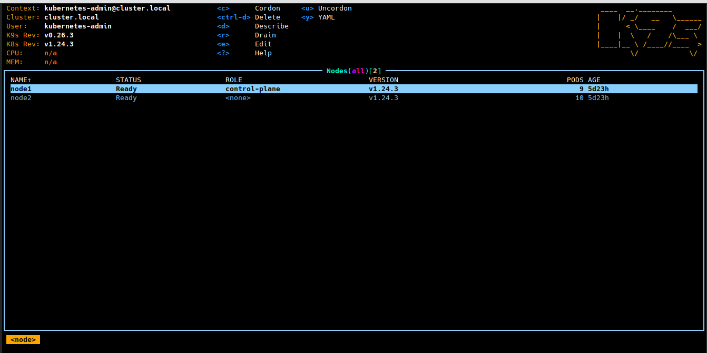
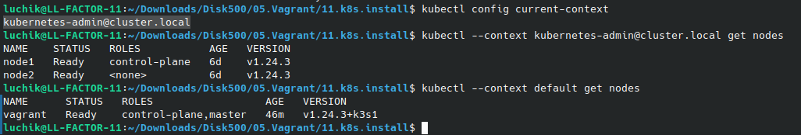

# My 11.K8s.Install

## Create Alias
```bash
echo "alias ka='kubectl apply -f'" >>~/.bashrc
```

## My Config File for K8s it-academy and K3s local host in vagrant
```bash
apiVersion: v1
clusters:
- cluster:
    certificate-authority-data: 
    remove
    server: https://127.0.0.1:6443
  name: cluster.local
- cluster:
    certificate-authority-data: 
    remove
    server: https://127.0.0.1:6444
  name: default
contexts:
- context:
    cluster: cluster.local
    user: kubernetes-admin
  name: kubernetes-admin@cluster.local
- context:
    cluster: default
    user: default
  name: default
current-context: kubernetes-admin@cluster.local
kind: Config
preferences: {}
users:
- name: kubernetes-admin
  user:
    client-certificate-data: 
    remove
    client-key-data: 
    remove
- name: default
  user:
    client-certificate-data: 
    remove
    client-key-data: 
    remove

```

## Screenshot K9s


## Screenshot kubectl --context

