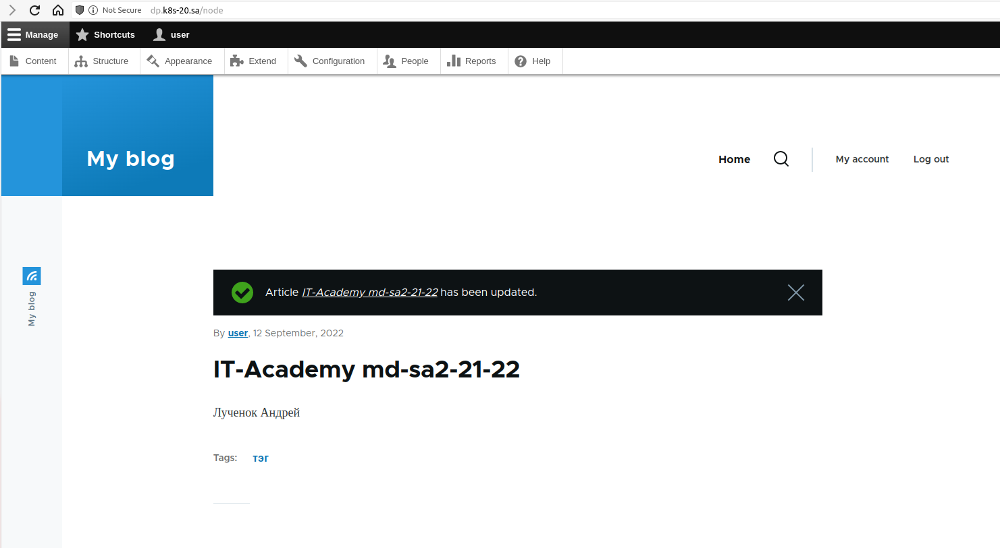
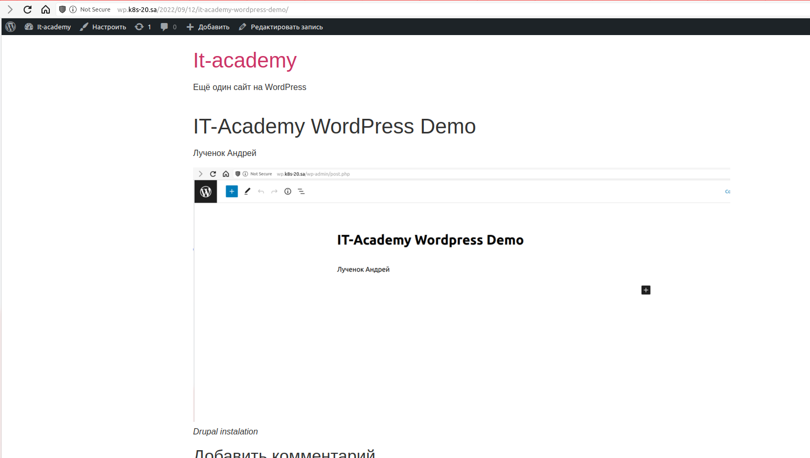

# 13. Kubernetes. Helm

## History
```bash
1975  ansible-playbook -i inventory.yaml maridb_host20.yaml -u root
1977  kubectl apply -f drupal_ingress.yam
1997  kubectl install -f wordpess_ingress.yaml
1980  helm install my-drupal --set mariadb.enabled=false,externalDatabase.host=192.168.202.20,externalDatabase.password=password,global.storageClass=nfs-client,drupalPassword=password bitnami/drupal
2010  helm install my-wordpress --set mariadb.enabled=false,externalDatabase.host=192.168.202.20,externalDatabase.password=password,global.storageClass=nfs-client,wordpressPassword=password bitnami/wordpress
2021  kubectl exec my-wordpress-5b64fc6f66-6pmvv -- mkdir /bitnami/wordpress/wp-content/themes
```

## Screenshot Drupal


## Screenshot Wordpress

