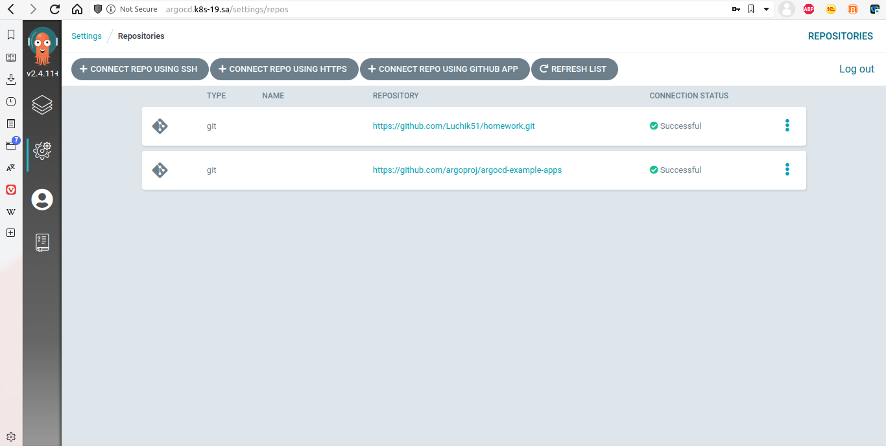
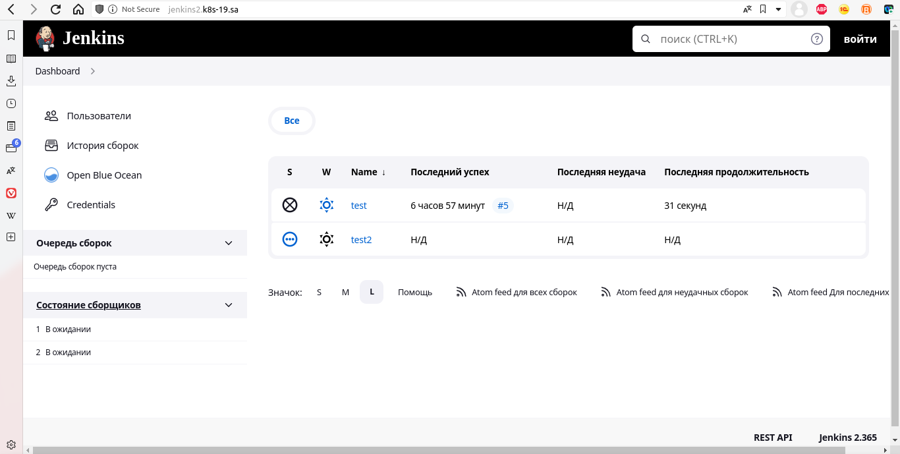
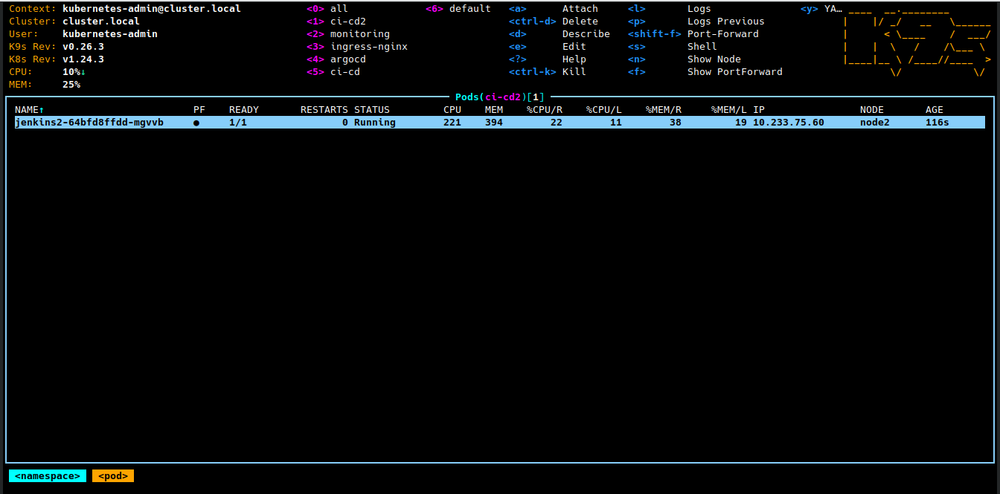

# 14. Kubernetes application deployment

## ArgoCD and list repository


# Helm package for Jenkins
History:
```bash
 1994  helm create jenkins-app
 1996  helm install jenkins-app --generate-name
 1997  helm delete jenkins-app --generate-name
 1998  helm delete jenkins-app
 1999  helm delete jenkins-app-1663012964
 2000  helm delete jenkins-app --generate-name
 2001  helm install jenkins-app --generate-name
 2002  helm delete jenkins-app --generate-name
 2003  helm delete jenkins-app-1663014024
 2004  helm install jenkins-app --generate-name
 2005  helm delete jenkins-app
 2006  helm delete jenkins-app-1663015009
 2007  helm install jenkins-app --generate-name
 2008  helm delete jenkins-app-1663015301
 2009  helm install jenkins-app --generate-name
 2010  sudo nano /etc/hosts
 2011  helm delete jenkins-app-1663015723
 2012  helm install jenkins-app --generate-name
 2013  helm delete jenkins-app-1663016026
 2014  helm install jenkins-app --generate-name
 2015  helm delete jenkins-app-1663016432
 2016  helm install jenkins-app --generate-name
 2017  helm delete jenkins-app-1663016547
 2018  helm install jenkins-app --generate-name
 2019  helm delete jenkins-app-1663016640
 2020  helm install jenkins-app --generate-name
```

## Screenshot new helming Jenkins


## Screenshot new helming Jenkins in K8s


