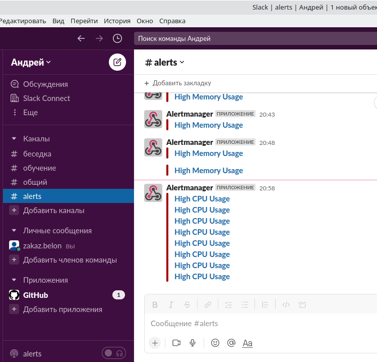
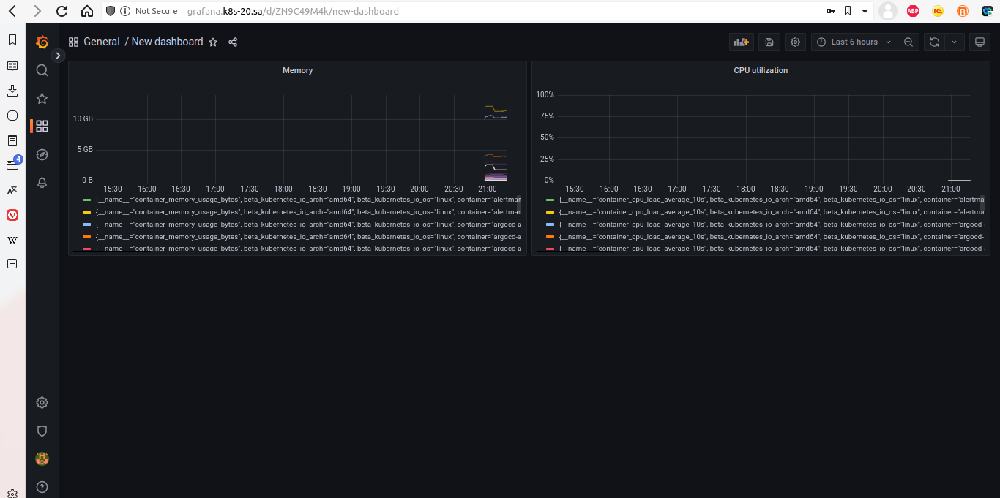
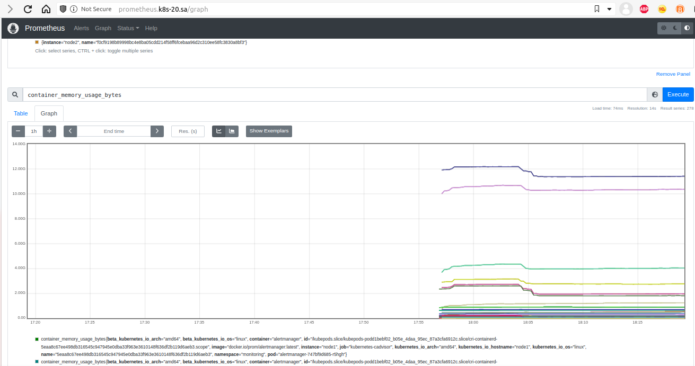
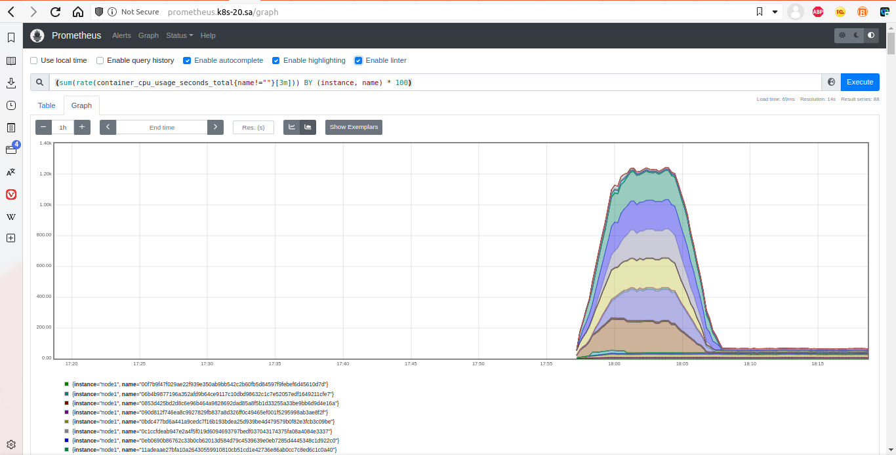

# 15. K8s. Monioring and alerts

Deploy monitoring service: Grafana and Promitheus + Alertmanager.

Add alerts from Alertmanager to Slack:
## Screenshot alerts in slack


Add dashboards CPU and memory from Promitheus
## Grafana


## Promitheus command
```bash
(sum(rate(container_cpu_usage_seconds_total{name!=""}[3m])) BY (instance, name) * 100)
container_memory_usage_bytes
```
Add dashboard CPU and memory usage
## Promitheus memory monitoring


## Promitheus CPU monitoring

