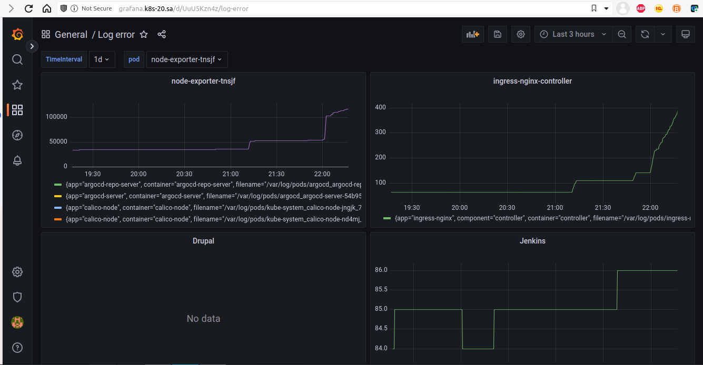
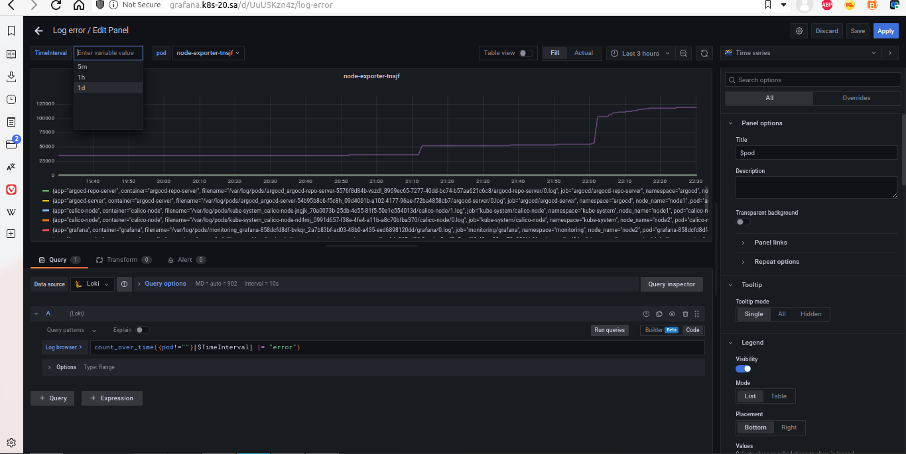
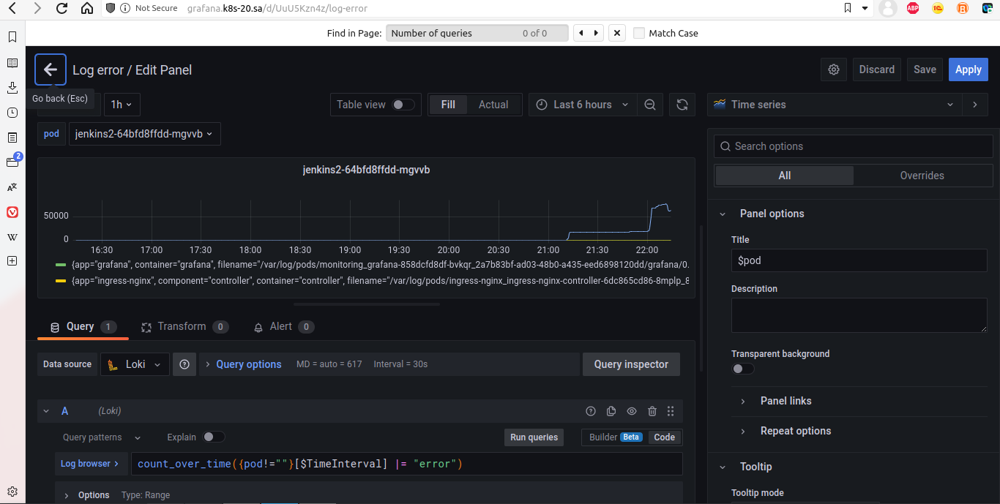

# 16. Log monitoring

## Описание:
В Grafana можно задать переменные (variables). Они создаются выпадающим списком и можно привять их к графикам. Путь создания такой:
Grafana - New Dashboard - Setting Variables - New Variables.
К примеру, создаем переменную с типом Interval и называем её TimeInterval. Снизу будет список через запятую временных интервалов.
Таким образом мы создали переменную, которую ожно вставлять в код через $TimeInterval. И она будет принимать параметр, который мы выбирем в выпадающем списке.

Еще один пример. Можно задать выпадающий список из pod. Создаем variables с типом query, источник данных Prometheus. Сам запрос query: label_values(kube_pod_container_resource_requests{},pod). В код с запросом вставляем pod!="". Пример:
count_over_time({pod!=""}[$TimeInterval] |= "error")
Это позволит нам выбрать из источника Promitheus любой pod, вставить временной интервал через переменную TimeInterval и выведет ошибки (error), кстати, можно его тоже параметризировать.

## Grafana dashboard

Так получилось, что у Drupal ошибок нет, поэтому график пустой (нет данных). Но логи есть.

## Screenshot Node-exporter and time interval

## Screenshot Jenkins
