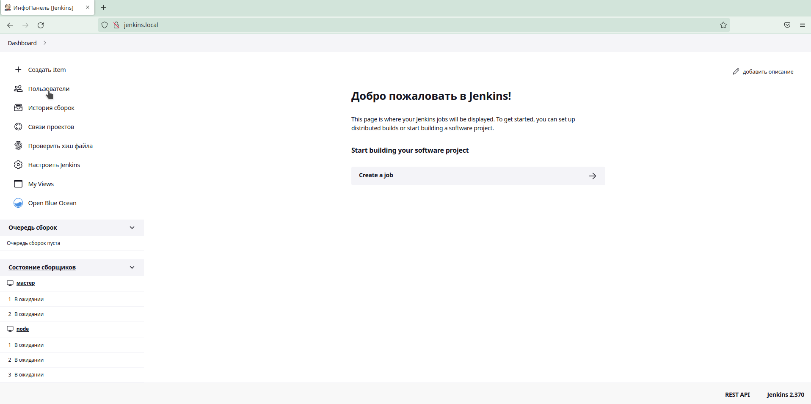
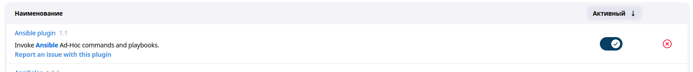
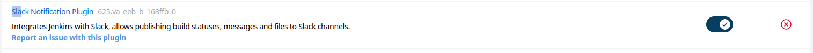
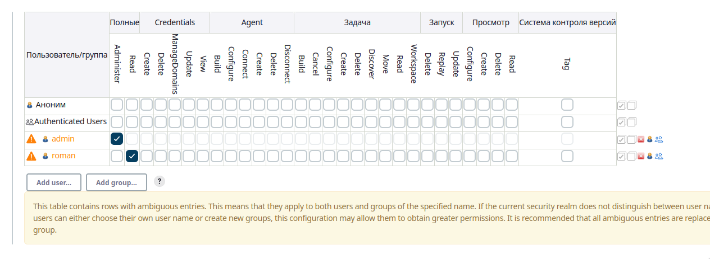

# 18. Jenkins. Start

Running Jenkins behind Apache Reverse Proxy with name http://jenkins.local/.
jenkins.local add to file hosts in local mashine with ip-address from VagrantFile.
Running and add node with 3 executors.

## Screenshot Jenkins with node

## Screenshot Ansible plugin

## Screenshot Slack plugin

## Add user Roman with read permissions.
File "03_addUser.groovy" - add this user.

