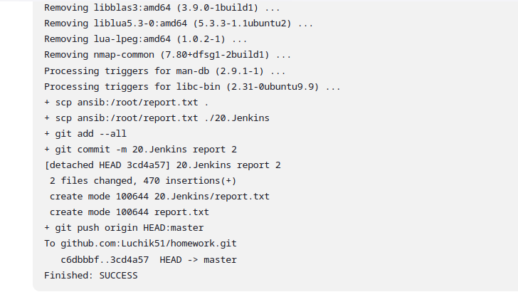

# 20. Jenkins. As code

Использована простая задача со свободной конфигурацией. 
Гит репозиторий SSH git@github.com:Luchik51/homework.git

## Jenkins standart config 
In file [config.xml](config.xml) 

## Report scan 
In file [report.txt](report.txt) 

## Jenkins end job:

