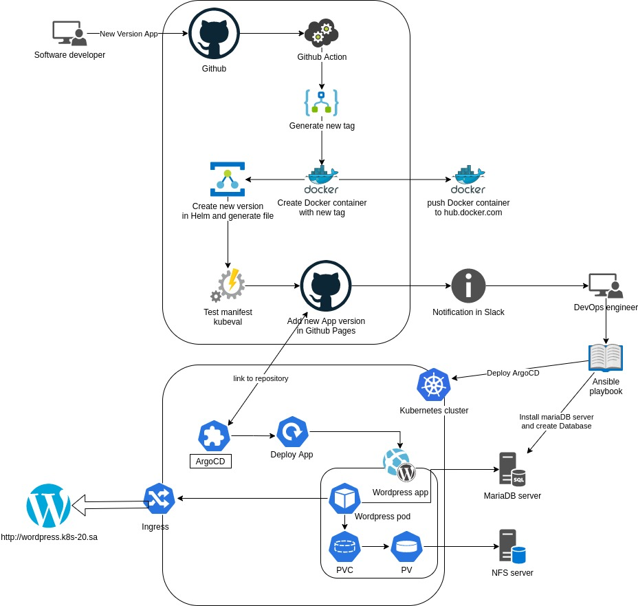

# Project report

Project's reporter: **Andrei Luchanok** \
Group number: **md-sa2-21-22**
---
### Description of application for deployment
- **Application**: Wordpress
- **Programimg language**: PHP
- **DB**: MariaDB
---
## Pipeline. High Level Design

---
## Technologies which were used in project
- **Orchestration:** Kubernetes
- **Automation tools:** Github actions, ArgoCD, Ansible
- **SCM:** GitHub
- **Notification:** Slack
- **Other tools:** Docker, Helm, Argo Rollouts
---

## Links: 
Project repository: https://github.com/Luchik51/wordpress-academy \
Helm chart repository: https://luchik51.github.io/wordpress-academy/ \
Docker repository: https://hub.docker.com/r/luchik/project2022 \
Official git repository link: https://github.com/WordPress/WordPress
