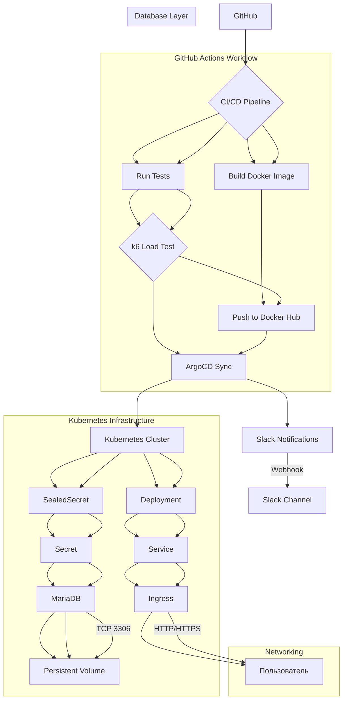

# Drupal-like CMS на Python

1. Цель проекта
Создать отказоустойчивое веб-приложение для управления пользователями с интеграцией в Kubernetes и автоматизированными пайплайнами CI/CD.
Основные требования :

    Версионирование : Использование SemVer для Docker-образов и Helm-чартов.
    База данных : MariaDB с сохранением данных между обновлениями.
    CI/CD : Автоматизация сборки, тестирования и деплоя через GitHub Actions и ArgoCD.
    Уведомления : Slack-оповещения при успешном/неудачном деплое.
    Откат : Возможность автоматического и ручного отката через Helm и ArgoCD.

2. Архитектура проекта
Компоненты :

    Frontend : Веб-интерфейс на Flask (Python) с Bootstrap для стилизации.
    Backend : MariaDB для хранения пользователей (таблица users).
    Инфраструктура :
    Kubernetes-кластер на 3 нодах (node1 — control-plane, node2 — БД, node3 — worker).
    Service : LoadBalancer (MetalLB) для доступа к приложению.
Ingress : Nginx Ingress Controller для маршрутизации по домену drupal.local.
Persistent Storage : NFS-сервер на node2 для сохранения данных БД.

3. Реализация приложения
Код :

    Flask-приложение (app.py):
    Роуты: / (список пользователей), /add (форма добавления), /version (проверка версии).
    Подключение к БД : Используются переменные окружения (например, DB_HOST, DB_USER), которые передаются через Kubernetes Secrets.

4. CI/CD-пайплайны
GitHub Actions :

    Триггеры : Запуск при каждом git push в main.

5. Безопасность и надежность
SealedSecrets :
    Зашифрованные данные БД хранятся в Git.
    Расшифровка происходит только в кластере через контроллер.
Откат :
    Helm : helm rollback drupal-app 3 (откат на ревизию 3).
    ArgoCD : Автоматический откат при ошибке в образе.

6. Итог
Достижения :

        Приложение доступно по http://drupal.local.
        Данные сохраняются в MariaDB между обновлениями.
    Автоматизация :
        Сборка Docker-образов → тестирование → деплой в Kubernetes.
        Откат при ошибках через ArgoCD и Helm.
    Безопасность :
        Нет хардкода паролей в коде.
        Шифрование секретов через SealedSecrets.

Пояснение схемы:
1. GitHub:
    Исходный код приложения и манифесты хранятся в репозитории.
    Триггеры: git push, merge, commit.
2. CI/CD Pipeline (GitHub Actions):
    Сборка образа :
        Используется Dockerfile из директории app/.
        Образ публикуется в Docker Hub как andrewfreak/project:{{ tag }}.
    Тестирование :
        Юнит-тесты : Проверка логики приложения.
        Нагрузочные тесты : k6 тестирует / и /add эндпоинты.
3. ArgoCD:
    Автоматический деплой :
        Следит за изменениями в Helm-чарте (helm/drupal-app).
        Применяет манифесты в кластере при каждом git push.
    Откат :
        Если новый образ падает, ArgoCD возвращает предыдущую версию.
4. Kubernetes
    Deployment :
        2 реплики приложения.
        Использует образ из Docker Hub.
    Service :
        LoadBalancer (MetalLB) с внешним IP 192.168.56.200.
    Ingress :
        Маршрутизация запросов на drupal.local.
5. Безопасность
    SealedSecret :
        Шифрует данные MariaDB (DB_HOST, DB_USER, DB_PASSWORD).
        Расшифровывается только в кластере.
6. MariaDB
    Внешняя БД :
        Запущена на node2 (192.168.56.101).
        Данные сохраняются в Persistent Volume (NFS).
7. Уведомления
    Slack :
    Сообщения при успешном деплое (SyncSucceeded) или ошибке (SyncFailed).

### My repo
[github](https://github.com/AndrewBulah/project)