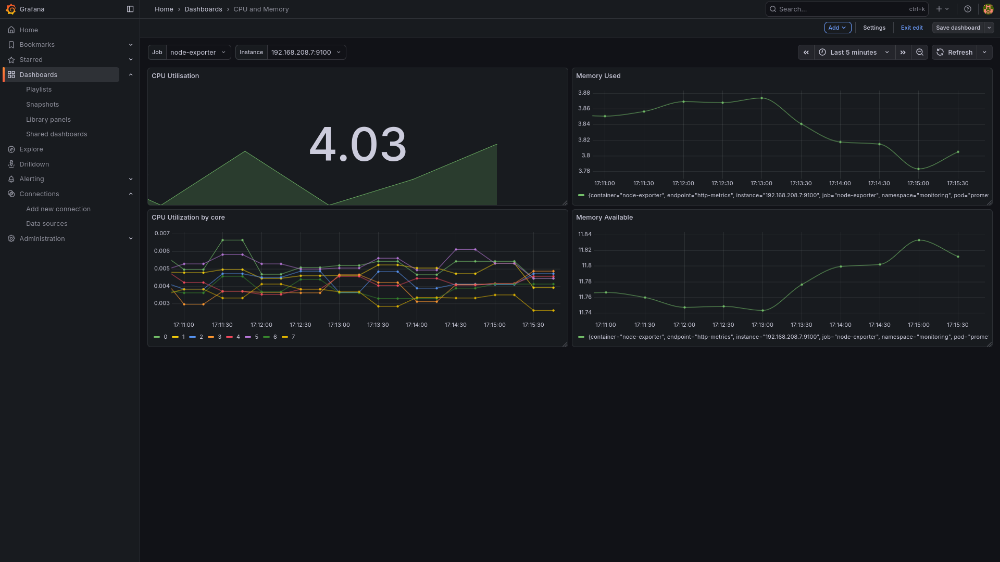
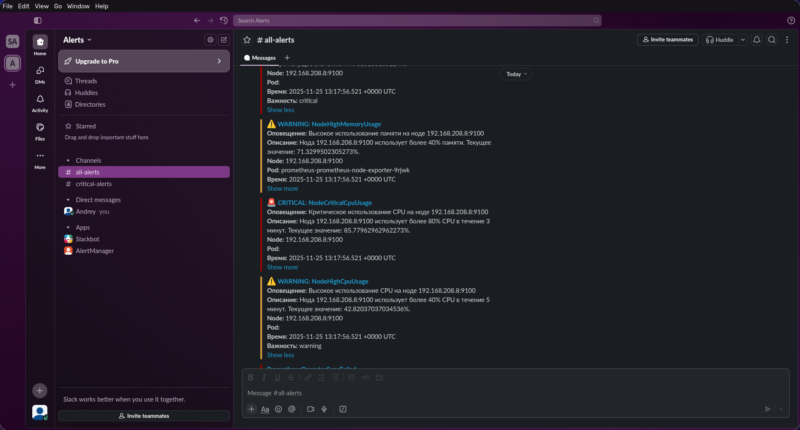

# Install and use
```
helm upgrade --install prometheus prometheus-community/kube-prometheus-stack -f values.yaml -n monitoring
kubectl apply -f ingress.yaml
kubectl apply -f alertmanager.yaml
kubectl apply -f stress-test.yaml
```



