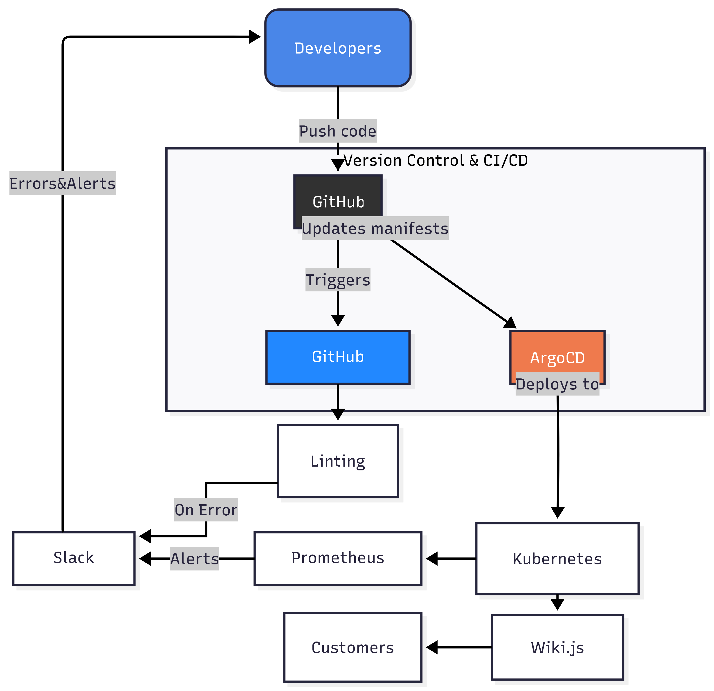

**Project Reporter:** Andrey Kaputerko
**Group Number:** md-sa2-33-25  

---

### 1. Application Description

- **Application name:** `Wiki.js`  
- **Programming language(s):** `JavaScript, Node.js`  
- **Database type:** `PostgreSQL`  
- **Repository / site / package link:**  [Site](https://js.wiki/)  [Repository](https://github.com/Requarks/wiki) 

---

### 2. Pipeline – High-Level Design

---

### 3. Technologies Used

- **Orchestration:** Github Runner  
- **Automation tools:** Ansible, Bash. 
- **CI implementation:** GitHub Action(Linter)
- **Deployment flows:**  
  - New deployment  
  - Upgrade deployment  

- **Rollback strategy:**  
  - Manually from ArgoCD  
  - Details:
	  - Login to ArgoCD
	  - Click on "History and Rollback" button
	  - Rollback to any stable version

---

### 4. References & Links

- [Pipeline code repository](https://github.com/Andreykkin/Project_Kubernetes)  
- [Wiki.js Site](https://js.wiki/)
- [Prometheus Stack](https://github.com/prometheus-community/helm-charts)  
- [ArgoCD](https://argo-cd.readthedocs.io/en/stable/)
