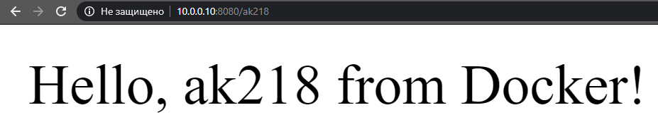

## 13.Docker.Lading
#### dockerhub:
https://hub.docker.com/r/ak218/testflask)
#### Dockerfile listing
````
FROM python:3-alpine
MAINTAINER ak218

RUN apk update && \
    apk upgrade && \
    python -m pip install --upgrade pip && \
    pip3 install flask

RUN mkdir /server

COPY server.py /server/server.py

CMD ["python3","/server/server.py"]

EXPOSE 8080 
````
#### server.py
````py
from flask import Flask
app = Flask(__name__)

@app.route("/<username>", methods=['GET'])
def index(username):
    return "Hello, %s from Docker!" % username

if __name__ == "__main__":
    app.run(host='0.0.0.0', port=8080)
````
#### build container output
````
vagrant@localhost ~/03 $ docker build -t testflask:v1.0 .
Sending build context to Docker daemon  3.072kB
Step 1/7 : FROM python:3-alpine
3-alpine: Pulling from library/python
89d9c30c1d48: Already exists
910c49c00810: Already exists
66564da92047: Already exists
bb0265c0d9a9: Already exists
b86dfbfbb035: Already exists
Digest: sha256:7f465d82a49e092b609fa97cea8ea761c9aa4fa6cab05f4876150e28bf16bcc3
Status: Downloaded newer image for python:3-alpine
 ---> 59acf2b3028c
Step 2/7 : MAINTAINER ak218
 ---> Running in 02401830cf5d
Removing intermediate container 02401830cf5d
 ---> 2f72c74894da
Step 3/7 : RUN apk update &&     apk upgrade &&     python -m pip install --upgrade pip &&     pip3 install flask
 ---> Running in ef5e0f3392da
fetch http://dl-cdn.alpinelinux.org/alpine/v3.10/main/x86_64/APKINDEX.tar.gz
fetch http://dl-cdn.alpinelinux.org/alpine/v3.10/community/x86_64/APKINDEX.tar.gz
v3.10.3-78-g5888be48a4 [http://dl-cdn.alpinelinux.org/alpine/v3.10/main]
v3.10.3-79-gf2fada1a2a [http://dl-cdn.alpinelinux.org/alpine/v3.10/community]
OK: 10342 distinct packages available
(1/2) Upgrading busybox (1.30.1-r2 -> 1.30.1-r3)
Executing busybox-1.30.1-r3.post-upgrade
(2/2) Upgrading ssl_client (1.30.1-r2 -> 1.30.1-r3)
Executing busybox-1.30.1-r3.trigger
OK: 18 MiB in 35 packages
Requirement already up-to-date: pip in /usr/local/lib/python3.8/site-packages (19.3.1)
Collecting flask
  Downloading https://files.pythonhosted.org/packages/9b/93/628509b8d5dc749656a9641f4caf13540e2cdec85276964ff8f43bbb1d3b/Flask-1.1.1-py2.py3-none-any.whl (94kB)
Collecting itsdangerous>=0.24
  Downloading https://files.pythonhosted.org/packages/76/ae/44b03b253d6fade317f32c24d100b3b35c2239807046a4c953c7b89fa49e/itsdangerous-1.1.0-py2.py3-none-any.whl
Collecting click>=5.1
  Downloading https://files.pythonhosted.org/packages/fa/37/45185cb5abbc30d7257104c434fe0b07e5a195a6847506c074527aa599ec/Click-7.0-py2.py3-none-any.whl (81kB)
Collecting Jinja2>=2.10.1
  Downloading https://files.pythonhosted.org/packages/65/e0/eb35e762802015cab1ccee04e8a277b03f1d8e53da3ec3106882ec42558b/Jinja2-2.10.3-py2.py3-none-any.whl (125kB)
Collecting Werkzeug>=0.15
  Downloading https://files.pythonhosted.org/packages/ce/42/3aeda98f96e85fd26180534d36570e4d18108d62ae36f87694b476b83d6f/Werkzeug-0.16.0-py2.py3-none-any.whl (327kB)
Collecting MarkupSafe>=0.23
  Downloading https://files.pythonhosted.org/packages/b9/2e/64db92e53b86efccfaea71321f597fa2e1b2bd3853d8ce658568f7a13094/MarkupSafe-1.1.1.tar.gz
Building wheels for collected packages: MarkupSafe
  Building wheel for MarkupSafe (setup.py): started
  Building wheel for MarkupSafe (setup.py): finished with status 'done'
  Created wheel for MarkupSafe: filename=MarkupSafe-1.1.1-cp38-none-any.whl size=12629 sha256=5eaf2845531c3bc662bbeeda0b4c6b846b5a9ab83419f4171f3fd79d42b2a62e
  Stored in directory: /root/.cache/pip/wheels/f2/aa/04/0edf07a1b8a5f5f1aed7580fffb69ce8972edc16a505916a77
Successfully built MarkupSafe
Installing collected packages: itsdangerous, click, MarkupSafe, Jinja2, Werkzeug, flask
Successfully installed Jinja2-2.10.3 MarkupSafe-1.1.1 Werkzeug-0.16.0 click-7.0 flask-1.1.1 itsdangerous-1.1.0
Removing intermediate container ef5e0f3392da
 ---> 272d7f7a4e74
Step 4/7 : RUN mkdir /server
 ---> Running in d8722d9c66ca
Removing intermediate container d8722d9c66ca
 ---> a31af929b550
Step 5/7 : COPY server.py /server/server.py
 ---> 238dfd63692b
Step 6/7 : CMD ["python3","/server/server.py"]
 ---> Running in c7daf4b8d35e
Removing intermediate container c7daf4b8d35e
 ---> aecc66c3433e
Step 7/7 : EXPOSE 8080
 ---> Running in 2478f16a3de1
Removing intermediate container 2478f16a3de1
 ---> 2e78a20f1009
Successfully built 2e78a20f1009
Successfully tagged testflask:v1.0

vagrant@localhost ~/03 $ docker images
REPOSITORY          TAG                 IMAGE ID            CREATED             SIZE
testflask           v1.0                2e78a20f1009        13 seconds ago      124MB
python              3-alpine            59acf2b3028c        4 weeks ago         110MB
````
#### run container output
````
pawelk@HP-4535s ~/it-ac/docker $ docker run -d -p 8080:8080 testflask:v1.0
1dbb29414967243c1f40afe6eb1244dfbcd287710a5571af8333b505fc0695f0

vagrant@localhost ~/03 $ docker run -d -p 8080:8080 testflask:v1.0
1652b4c713043b140573ae19e6758012f75224186deed861a635da59b37744ff
vagrant@localhost ~/03 $ docker ps -a
CONTAINER ID        IMAGE               COMMAND                  CREATED             STATUS                     PORTS                    NAMES
1652b4c71304        testflask:v1.0      "python3 /server/ser…"   8 seconds ago       Up 7 seconds               0.0.0.0:8080->8080/tcp   jovial_boyd
````
#### curl
````
vagrant@localhost ~ $ curl localhost:8080/ak218
Hello, ak218 from Docker!
````

#### browser

#### push to dockerhub
````
vagrant@localhost ~ $ docker push ak218/testflask:v1.0
The push refers to repository [docker.io/ak218/testflask]
f8acfa5e982b: Pushed
f7b85c3ce421: Pushed
97b9432944f5: Pushed
609efbb4f02d: Mounted from library/python
21c8a084cb74: Mounted from library/python
a6faf3350bb2: Mounted from library/python
dcd185b843c6: Mounted from library/python
77cae8ab23bf: Mounted from library/python
v1.0: digest: sha256:a549d4a8bb58b1d969dd4f2080c891d31d98a40f106e92dae423ea2e1250c680 size: 1993
````
