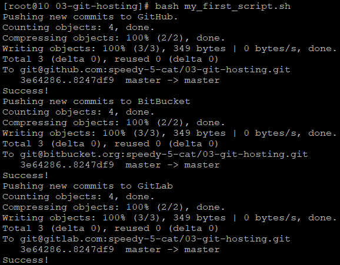
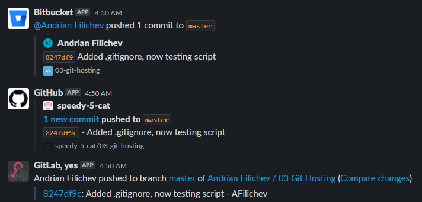

# 03. Git Hosting.

## Remote repo links:
1) [GitHub](https://github.com/speedy-5-cat/03-git-hosting)
2) [BitBucket](https://bitbucket.org/speedy-5-cat/03-git-hosting/src/master/)
3) [GitLab](https://gitlab.com/speedy-5-cat/03-git-hosting)

## Automatization script:
```
#!/bin/bash

echo "Pushing new commits to GitHub."
git push "github" "master" -f && echo "Success!"


echo "Pushing new commits to BitBucket"
git push "bitbucket" "master" -f && echo "Success!"

echo "Pushing new commits to GitLab"
git push "gitlab" "master" -f && echo "Success!"
```



## Push notifications:


