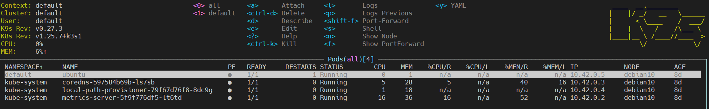
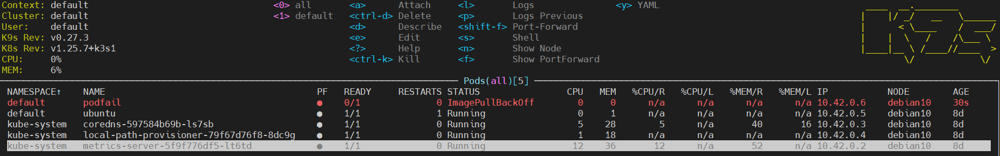
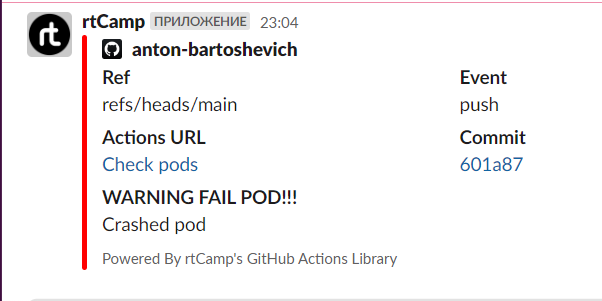

```bash
name: Check pods
on:
  push:
    branches:
      - 'main'
jobs:
  check:
    env:
       output: output.log
       fail_report: fail_report.log
    runs-on: ubuntu-latest
    steps:
    - name : Connect to remote host and get pods
      run: |
        which ssh-agent
        mkdir ~/.ssh
        eval `ssh-agent -s`
        ssh-add - <<< "${{secrets.SSH_KEY}}"
        ssh-keyscan ${{ secrets.JUMP_HOST }} >> ~/.ssh/known_hosts
        ssh ${{ secrets.JUMP_USERNAME }}@${{ secrets.JUMP_HOST }} ssh-keyscan ${{ secrets.K3S_HOST }} >> ~/.ssh/known_hosts
        ssh -o ProxyCommand="ssh -W %h:%p ${{ secrets.JUMP_USERNAME }}@${{ secrets.JUMP_HOST }}" ${{ secrets.K3S_USERNAME }}@${{ secrets.K3S_HOST }} "kubectl get pods -A" >> ${{ env.output }}
    - name: Checking fail pods
      id: check-pods
      run: |
        echo "pods-failed=$(cat output.log | grep -v Running | wc -l)" >> $GITHUB_OUTPUT
    - name: Output pod's
      uses: actions/upload-artifact@v3
      with:
        path: output.log
    - name: Slack notification
      uses: rtCamp/action-slack-notify@v2
      env:
        SLACK_CHANEL: general
        SLACK_COLOR: '#FF0000'
        SLACK_ICON: https://github.com/rtCamp.png?size=48
        SLACK_MESSAGE: 'Crashed pod'
        SLACK_TITLE: 'WARNING FAIL POD!!!'
        SLACK_USERNAME: rtCamp
        SLACK_WEBHOOK: ${{ secrets.SLACK_WEBHOOK }}
```
## Running pods

## Failed pod was added

## Slack notification

