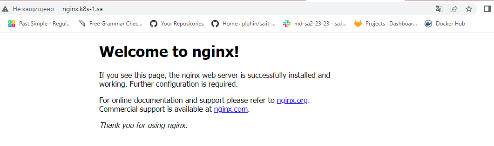
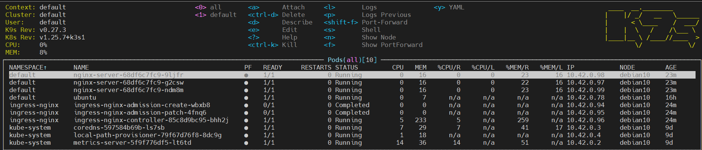
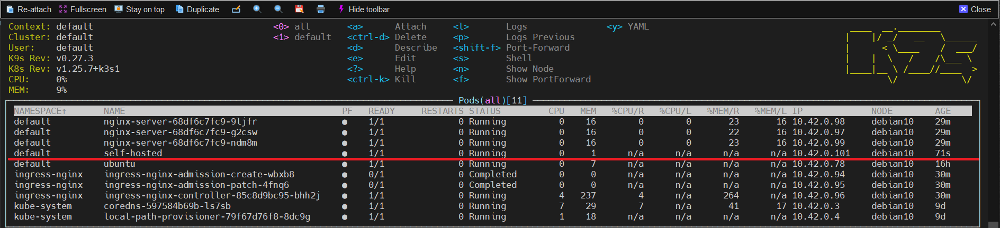

## Create deployment of nginx service


### .yaml
```bash
---
apiVersion: apps/v1
kind: Deployment
metadata:
  name: nginx-server
  labels:
    app: nginx
spec:
  replicas: 3
  selector:
    matchLabels:
      app: nginx
  template:
    metadata:
      labels:
        app: nginx
    spec:
      containers:
      - name: nginx
        image: nginx:latest
        ports:
        - containerPort: 80
        resources:
          requests:
            cpu: 70m
            memory: 75Mi
          limits:
            cpu: 100m
            memory: 100Mi
---
apiVersion: v1
kind: Service
metadata:
  name: nginx
  labels:
    run: nginx
spec:
        #type: LoadBalancer
  ports:
  - port: 80
    protocol: TCP
  selector:
    app: nginx
---
apiVersion: networking.k8s.io/v1
kind: Ingress
metadata:
  name: ingress-sa
  annotations:
    kubernetes.io/ingress.class: nginx
    nginx.ingress.kubernetes.io/server-alias: "nginx-server.k8s-1.sa"
spec:
  rules:
    - host: nginx.k8s-1.sa
      http:
        paths:
          - path: /
            pathType: Prefix
            backend:
              service:
                name: nginx
                port:
                  number: 80

```
## Deploy pod inside k8s which should be connected to github as self-hosted runner

### .yaml
```bash
---
apiVersion: v1
kind: Pod
metadata:
  name: self-hosted
spec:
  containers:
  - name: test-pod
    image: k8s.gcr.io/busybox
    command: ["/bin/sh", "-c"]
    args:
      - mkdir actions-runner && cd actions-runner;
        curl -o actions-runner-linux-x64-2.303.0.tar.gz -L https://github.com/actions/runner/releases/download/v2.303.0/actions-runner-linux-x64-2.303.0.tar.gz;
        echo "e4a9fb7269c1a156eb5d5369232d0cd62e06bec2fd2b321600e85ac914a9cc73  actions-runner-linux-x64-2.303.0.tar.gz" | shasum -a 256 -c;
        tar xzf ./actions-runner-linux-x64-2.303.0.tar.gz;
        export RUNNER_ALLOW_RUNASROOT='1';
        ./config.sh --url https://github.com/anton-bartoshevich/gitOPS_learn --token AOIISKXKL6YDRFDVUYOWGZ3EEAOCO;
        ./run.sh;
        sleep 10000
    imagePullPolicy: IfNotPresent
  restartPolicy: Always
```