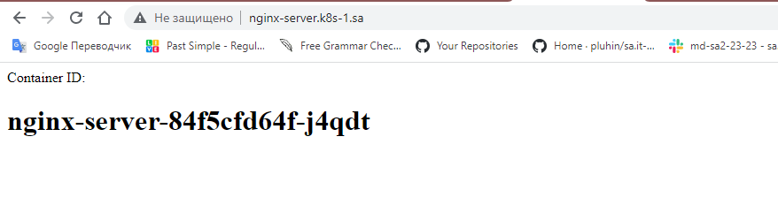
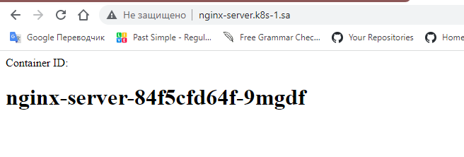
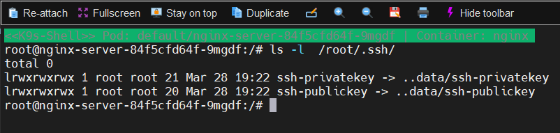

## Manifest file
```bash
---
apiVersion: v1
kind: Namespace
metadata:
  name: nginx-server
---
apiVersion: bitnami.com/v1alpha1
kind: SealedSecret
metadata:
  creationTimestamp: null
  name: my-secret
  namespace: default
spec:
  encryptedData:
    id_rsa: <data>
    id_rsa.pub: <data>
  template:
    metadata:
      creationTimestamp: null
      name: my-secret
      namespace: default
    type: Opaque
---
apiVersion: apps/v1
kind: Deployment
metadata:
  name: nginx-server
  labels:
    app: nginx
spec:
  replicas: 3
  selector:
    matchLabels:
      app: nginx
  template:
    metadata:
      labels:
        app: nginx
    spec:
      containers:
      - name: nginx
        image: nginx:latest
        ports:
        - containerPort: 80
        volumeMounts:
        - name: config
          mountPath: /usr/share/nginx/html
        - name: my-secret
          mountPath: /root/.ssh/

      initContainers:
      - name: init
        image: busybox:1.28
        command: ['sh', '-c']
        securityContext:
          readOnlyRootFilesystem: false
        args:
            - echo "<html><head>Container ID:</head><body><h1>$HOSTNAME</h1></body></html>">/usr/share/nginx/html/index.html
        volumeMounts:
        - name: config
          mountPath: /usr/share/nginx/html
          readOnly: false
        - name: my-secret
          mountPath: /root/.ssh/
      volumes:
      - name: config
        emptyDir: {}
      - name: my-secret
        secret:
          secretName: my-secret
          defaultMode: 0600
---
apiVersion: v1
kind: Service
metadata:
  name: nginx
  labels:
    run: nginx
spec:
  ports:
  - port: 80
    protocol: TCP
  selector:
    app: nginx
---
apiVersion: networking.k8s.io/v1
kind: Ingress
metadata:
  name: ingress-sa
  annotations:
    kubernetes.io/ingress.class: nginx
    nginx.ingress.kubernetes.io/server-alias: "nginx-server.k8s-1.sa"
spec:
  rules:
    - host: nginx.k8s-1.sa
      http:
        paths:
          - path: /
            pathType: Prefix
            backend:
              service:
                name: nginx
                port:
                  number: 80
```
## Page which displays hostname of pod as first level header:


## Added to the pod public and private keys:
