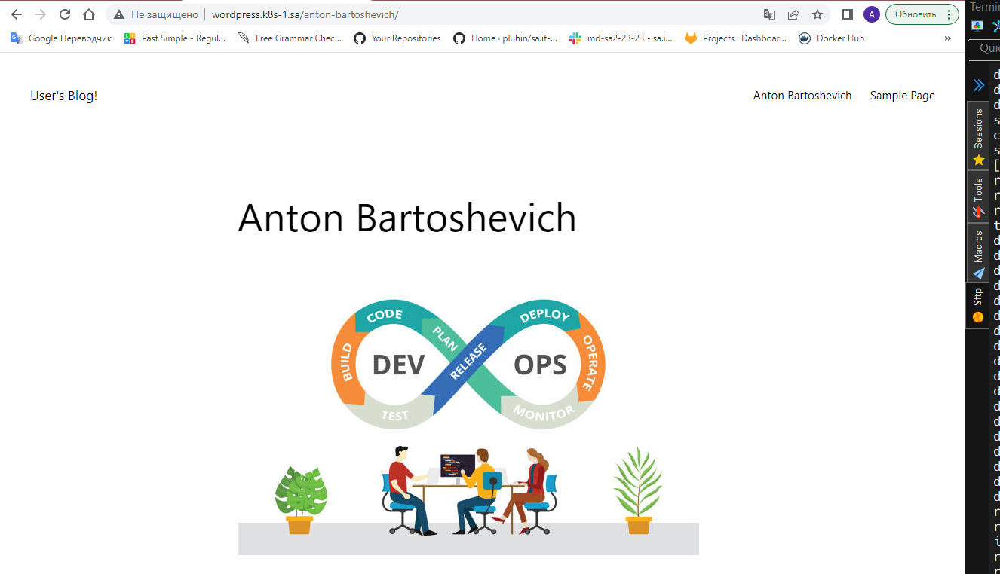
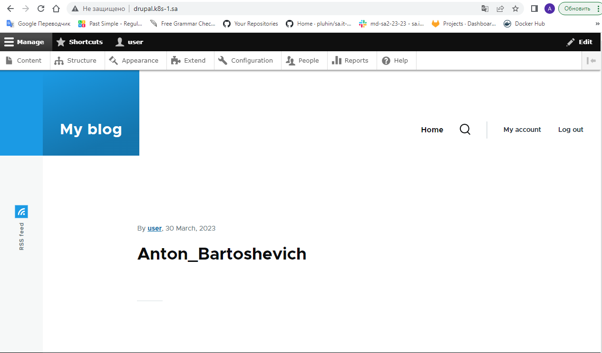

## History of commands:
```bash
990  vi ingress.yaml
991  kubectl apply -f ingress.yaml
992  vi nfs.yaml
993  kubectl apply -f nfs.yaml
994  helm repo add bitnami https://charts.bitnami.com/bitnami
995  helm install wordpress --set mariadb.enabled=false,externalDatabase.host=192.168.202.2,externalDatabase.user=wordpress_user,externalDatabase.password=wordpress_pass,externalDatabase.database=wordpress_db,readinessProbe.periodSeconds=60,livenessProbe.periodSeconds=600,global.storageClass=nfs-wordpress,wordpressUsername=admin,wordpressPassword=pass123 bitnami/wordpress
996 helm install drupal bitnami/drupal
```
